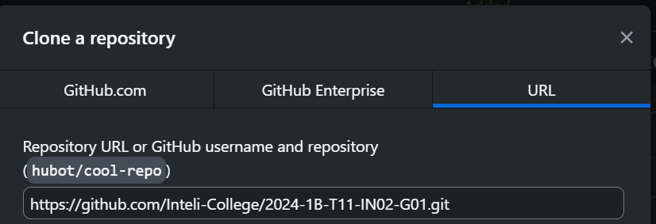
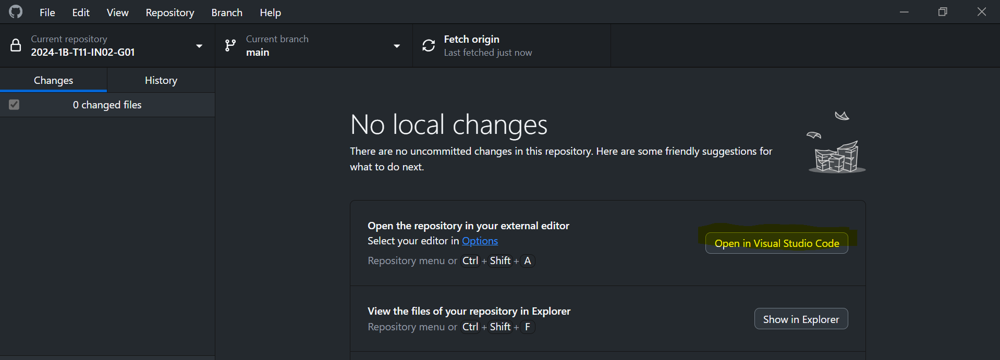
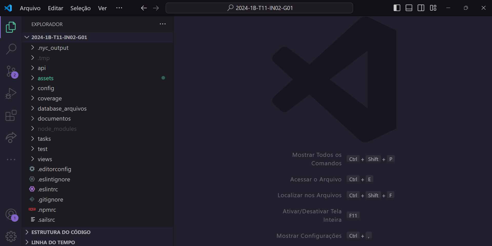

<p align="center">
<a href= "https://www.inteli.edu.br/"></a>
</p>

# Oportoniza

## Tripulação Voluntária

## 👨‍🎓 Integrantes: 
- <a href="https://www.linkedin.com/in/cec%C3%ADlia-galv%C3%A3o">Cecília Beatriz Melo Galvão</a>
- <a href="https://www.linkedin.com/in/davi-nascimento-de-jesus/">Davi Nascimento de Jesus</a>
- <a href="https://www.linkedin.com/in/kethlenmartins">Kethlen Martins da Silva</a> 
- <a href="https://www.linkedin.com/in/lucas-paiva-brasil-335624233/">Lucas Paiva Brasil</a> 
- <a href="https://www.linkedin.com/in/lucas-periquito-costa-2982552b3/">Lucas Periquito Costa</a> 
- <a href="https://www.linkedin.com/in/nataly-cunha">Nataly de Souza Cunha</a>
- <a href="https://www.linkedin.com/in/pabloazevedo">Pablo de Azevedo</a> 
- <a href="https://www.linkedin.com/in/yasmim-passos/">Yasmim Marly Passos</a>

## 👩‍🏫 Professores:
### Orientador(a) 
- <a href="https://www.linkedin.com/in/juliastateri/">Prof.ª Dr.ª Júlia Stateri</a>
### Instrutores
- <a href="https://www.linkedin.com/in/bruna-mayer-00a556174/">Prof.ª Me.ª Bruna Mayer</a>
- <a href="https://www.linkedin.com/in/cristiano-benites-687647a8/">Prof. Me. Cristiano Benites</a> 
- <a href="https://www.linkedin.com/in/filipe-gon%C3%A7alves-08a55015b/">Prof. Me. Filipe Gonçalves</a>
- <a href="https://www.linkedin.com/in/ricardo-missori/">Prof. Dr. Ricardo José Missori</a>
- <a href="https://www.linkedin.com/in/egondaxbacher/">Prof. Dr. Egon Daxbacher</a> 

## 📝 Descrição

&nbsp;&nbsp;&nbsp;&nbsp;A Parceiros Voluntários é uma Organização Não Governamental (ONG) sem fins lucrativos que surgiu em 1997, em Caxias do Sul (RS), com o objetivo de fomentar a transformação social no Brasil através da implementação da cultura do voluntariado, do protagonismo juvenil e de metodologias customizadas. Para a Parceiros, toda pessoa solidária tem potencial de se tornar um voluntário, todavia, tem observado obstáculos para a atração de novos colaboradores, como a descentralização das ações sociais e a falta de incentivo ao voluntário autônomo, aquele que tem vontade e disposição para ajudar, mas não sabe por onde começar e como mobilizar pessoas.<br>
&nbsp;&nbsp;&nbsp;&nbsp;Como primeira tentativa de resolução desse problema, foi-se desenvolvido um site chamado <a href="https://sejavoluntario.org.br/">Seja Voluntário</a>, porém, a plataforma ainda não atende a todas as funcionalidades desejadas e não oferece uma experiência de usuário satisfatória, evidenciando, assim, a necessidade do desenvolvimento de uma nova plataforma *web*, acessível para *desktop* e *mobile*. Para a idealização dessa nova solução, dados provenientes de documentos disponibilizados pela organização foram coletados, como o Termo de Abertura de Projeto do Inteli (TAPI), o Relatório de 2023, o Manual de Marca e demais materiais. Além disso, rodas de conversação com representantes legais da organização acarretaram a dissolução de questões.<br>
&nbsp;&nbsp;&nbsp;&nbsp;Por fim, concretizou-se o Oportoniza, uma plataforma simplificada, intuitiva e atraente que atua como um ponto de encontro da comunidade voluntária, na qual voluntários podem buscar por organizações, oportunidades e outros agentes, além de que representantes de organizações da sociedade civil (OSC's) também podem pesquisar por novos perfis de colaboradores e ações sociais em andamento. Ao ter liberdade de criar uma conta na plataforma, cadastrar oportunidades, organizações e/ou se inscrever em atividades sociais, o usuário é é colocado como protagonista de sua própria jornada. Com isso, espera-se que a plataforma auxilie na centralização das atividades sociais no Brasil, aprimore a usabilidade dos colaboradores e inspire-os a tentarem novas experiências.<br>

## 📝 Link de demonstração

🖥️| O projeto foi deployado no seguinte link: https://oportuniza.onrender.com

📺| O vídeo de demonstração do projeto pode ser encontrado no link a seguir: https://abre.ai/video-demonstracao

## 📁 Estrutura de pastas

Dentre os arquivos e pastas presentes na raiz do projeto, definem-se:

- <b>api:</b> armazena os arquivos que definem a lógica de negócios da sua plataforma, contendo os controladores, modelos, *helpers*, políticas, serviços, etc.
- <b>assets:</b> aqui estão os arquivos relacionados a elementos não-estruturados deste repositório, como imagens.
- <b>config:</b> contém arquivos de configuração do projeto, como configurações de banco de dados, configurações de rotas, configurações de autenticação, entre outras.
- <b>coverage:</b> extensão instalada que produz relatórios que mostram quais partes do código foram testadas. Ajuda a identificar áreas do código que precisam de mais testes.
- <b>database_arquivos:</b> aqui estão os arquivos de estruturação da modelagem lógico-relacional e física do banco de dados.
- <b>documentos:</b> aqui estão todos os documentos do projeto, como o Web Application  Document (WAD) bem como documentos complementares, na pasta "other".
- <b>test:</b> onde estão armazenados os arquivos de testes unitários da plataforma.
- <b>views:</b> onde estão armazenados as páginas da plataforma.
- <b>README.md:</b> arquivo que serve como guia introdutório e explicação geral sobre o projeto e a aplicação (o mesmo arquivo que você está lendo agora).
- <b>package-lock.json:</b>  arquivo que especifica as dependências do projeto, scripts de execução, metadados do projeto e configurações diversas.
- <b>package.json:</b> arquivo que registra as versões exatas das dependências instaladas, garantindo que o ambiente de desenvolvimento seja reproduzível exatamente como originalmente configurado.
- Os arquivos e pastas <b>tasks</b>, <b>.nyc_output</b>, <b>Gruntfile.js</b>, <b>app.js</b>, <b>.sailsrc</b>, <b>.gitignore</b>, <b>.npmrc</b>, <b>.eslintrc</b>, <b>.eslintrc</b>, <b>.eslintignore</b>, <b>.editorconfig</b> tratam-se de arquivos pré-definidos e configurados automaticamente na geração inicial do projeto sails, e não foram manipulados manualmente durante o desenvolvimento da plataforma.

## 💻 Configuração para desenvolvimento e execução do código

1. *GitHub*

&nbsp;&nbsp;&nbsp;&nbsp;O *GitHub* é uma plataforma *web* de armazenagem e gerenciamento de projetos em repositórios compartilháveis, possibilitando o versionamento de código e o desenvolvimento colaborativo. O recurso é disponível em forma de *site* e *software* para *desktop*.<br>

- **Clonando o repositório no *GitHub Desktop*:**

&nbsp;&nbsp;&nbsp;&nbsp;Ao acessar o seguinte <a href="https://desktop.github.com/">link</a> de *download* do *Github Desktop*, deve-se baixar a versão mais adequada e atualizada para o seu sistema operacional, seja *Windows* ou *macOS*.  Feito isso, deve-se executar o arquivo do programa e finalizar a instalação.<br>

&nbsp;&nbsp;&nbsp;&nbsp;Dentro do *GitHub Desktop*, após realizar o login ou o cadastro da conta GitHub, tem-se acesso à página inicial. Clicando em *File* (Arquivo) nas opções do canto superior esquerdo (Figura 1) e em "Clone new repository" (Clonar novo depositório), deve-se inserir o <a href="https://github.com/Inteli-College/2024-1B-T11-IN02-G01.git">link do repositório</a> do *Oportoniza* (Figura 2), dando prosseguimento com a clonagem dos arquivos da plataforma. Dessa forma, é possível iniciar a utilização do código-fonte.<br>


<div align="center">
   <sub> Figura 1 - Passos para a clonagem de repositório </sub><br>
    
   
   <sup>Fonte: Material produzido pelos autores (2024)</sup>
   
</div>

<div align="center">
   <sub> Figura 2 - Passos para a clonagem de repositório </sub><br>
    
   
   <sup>Fonte: Material produzido pelos autores (2024)</sup>
   
</div>

2. *Visual Studio Code*:

O *Visual Studio Code*, ambiente de desenvolvimento integrado (IDE) desenvolvido pela Microsoft, oferece diversos recursos para a construção de software. Entre suas funcionalidades estão o realce de sintaxe, que facilita a visualização dos componentes do código, o *feedback* de erros e alterações, além do controle de versões. Ademais, conta com uma vasta biblioteca de extensões que aumentam suas capacidades, proporcionando otimização e personalização no desenvolvimento.<br>

- **Editando o código**

Dentro do GitHub Desktop, após a clonagem do repositório, é possível visualizar algumas funcionalidades (Figura 3). Clicando no botão *"Open With Visual Studio Code"* (Abrir com o Visual Studio Code) a pasta do projeto é aberta dentro do *Visual Studio Code*, podendo-se ter acesso a seus arquivos e códigos (Figura 4).


<div align="center">
   <sub> Figura 3 - Funcionalidades do repositório </sub><br>
    
   
   <sup>Fonte: Material produzido pelos autores (2024)</sup>
   
</div>

<div align="center">
   <sub> Figura 4 - Pasta do projeto no Visual Studio Code </sub><br>
    
   
   <sup>Fonte: Material produzido pelos autores (2024)</sup>
   
</div>

3. *Node.js*:

&nbsp;&nbsp;&nbsp;&nbsp;O Node.js* é um recurso que permite a execução de *JavaScript* fora do navegador, diretamente na máquina local. Na utilização do *framework* Sails.js para a construção da plataforma web, tal recurso se demonstra essencial, tendo visto a necessidade de execução e testagem concomitante ao desenvolvimento.

&nbsp;&nbsp;&nbsp;&nbsp;Para a instalação do *Node.js*, deve-se visitar a sua <a href="https://nodejs.org/en/download">página de *download*</a> e baixar a versão correspondente à máquina em questão, disponível para os sistemas operacionais *Windows* e *macOS*. Com isso, deve-se abrir o arquivo executável e seguir as instruções internas.

4. *Instalação de dependências*

&nbsp;&nbsp;&nbsp;&nbsp;Tendo-se clonado o repositório, é possível se visualizar sua estrutura interna de pastas, contendo os arquivos e pacotes necessários, entretanto, primeiramente, é preciso instalar o gerenciador de pacotes "npm" e, com isso, as dependências do projeto. Para isso, no menu superior do Visual Studio Code, deve-se clicar em "Ver" e clicar na opção do "Terminal". Após isso, deve-se executar o comando:<br>

```javascript
npm i // Comando para instalar as dependências através do gerenciador de pacotes
```

&nbsp;&nbsp;&nbsp;&nbsp;Isso feito, é possível se executar o projeto digitando o próximo comando:

```javascript
sails lift // Comando para executar o projeto na máquina local
```
&nbsp;&nbsp;&nbsp;&nbsp;Dessa forma, após a execução do código anterior, irá aparecer ao final o link <http://localhost:1337>, clicando nele, a plataforma *web* será aberta no navegador padrão da máquina, podendo ser utilizada.

<h3>Versões utilizadas</h3>

&nbsp;&nbsp;&nbsp;&nbsp;Na Tabela X, estão expostas as versões de cada software utilizado para o desenvolvimento e execução do *Oportoniza*.

<div align="center">
   
   <sub>Tabela 1 - Versões dos softwares para execução da plataforma</sub><br>
Recurso | Versão  
--- | ---
GitHub Desktop | 3.4.1 (x64)
Visual Studio Code | 1.90.1 (user setup)
Node.js | 20.11.0
Sails.js | 1.5.10
<br>
</div>
<div align="center">
<sup>Fonte: Material produzido pelos autores (2024)</sup>
</div>

## 🗃 Histórico de lançamentos

* 0.5.0 - 21/06/2024
    * Sprint 5 - refinamentos da aplicação *web*, relatório e ajustes de usabilidade.
* 0.4.0 - 07/06/2024
    * Sprint 4 - segunda versão da aplicação *web* e relatório de testes.
* 0.3.0 - 24/05/2024
    * Sprint 3 - primeira versão da aplicação *web*, implementação de lógicas proposicionais e atualização do banco de dados.
* 0.2.0 - 10/05/2024
    * Sprint 2 - modelagem do banco de dados.
* 0.1.0 - 26/04/2024
    * Sprint 1 - entendimento do negócio e idealização da plataforma.

## 📋 Licença/License

<p xmlns:cc="http://creativecommons.org/ns#" xmlns:dct="http://purl.org/dc/terms/"><a property="dct:title" rel="cc:attributionURL" href="https://github.com/Inteli-College/2024-1B-T11-IN02-G01">G01</a> by <a rel="cc:attributionURL dct:creator" property="cc:attributionName" href="https://www.inteli.edu.br/">INTELI,</a> <a rel="cc:attributionURL dct:creator" property="cc:attributionName" href="https://github.com/ceciliagalvaoo">CECÍLIA BEATRIZ MELO GALVÃO, </a> <a rel="cc:attributionURL dct:creator" property="cc:attributionName" href="https://github.com/nDaviii">DAVI NASCIMENTO DE JESUS,</a> <a rel="cc:attributionURL dct:creator" property="cc:attributionName" href="https://github.com/kethlenmartins">KETHLEN MARTINS DA SILVA,</a> <a rel="cc:attributionURL dct:creator" property="cc:attributionName" href="https://github.com/lucasbrasil9">LUCAS PAIVA BRASIL,</a> <a rel="cc:attributionURL dct:creator" property="cc:attributionName" href="https://github.com/cucapcosta">LUCAS PERIQUITO COSTA,</a> <a rel="cc:attributionURL dct:creator" property="cc:attributionName" href="https://github.com/nataly-cunha-inteli">NATALY DE SOUZA CUNHA,</a> <a rel="cc:attributionURL dct:creator" property="cc:attributionName" href="https://github.com/zzaved">PABLO DE AZEVEDO,</a> <a rel="cc:attributionURL dct:creator" property="cc:attributionName" href="https://github.com/yasmimpassos">YASMIM MARLY PASSOS</a> is licensed under <a href="https://creativecommons.org/licenses/by/4.0/?ref=chooser-v1" target="_blank" rel="license noopener noreferrer" style="display:inline-block;">Creative Commons Attribution 4.0 International</a></p>
