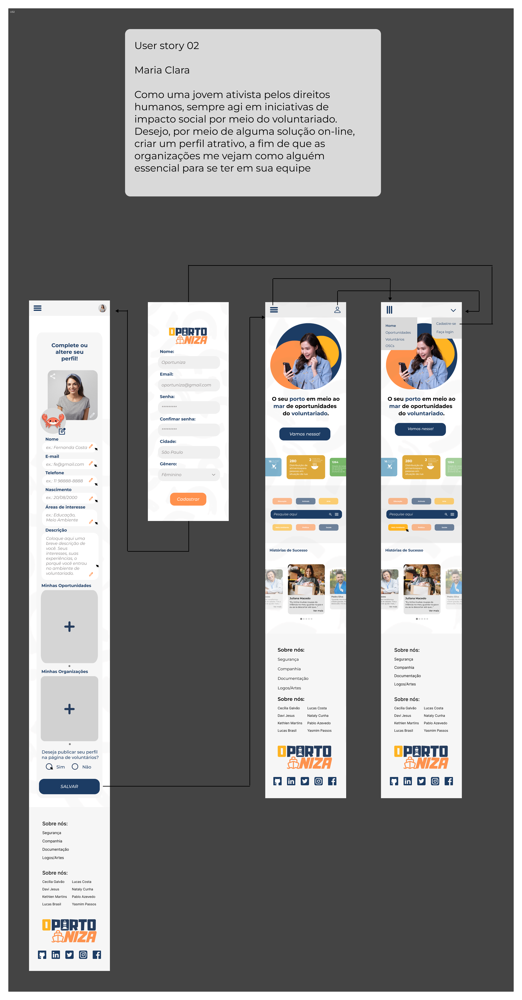
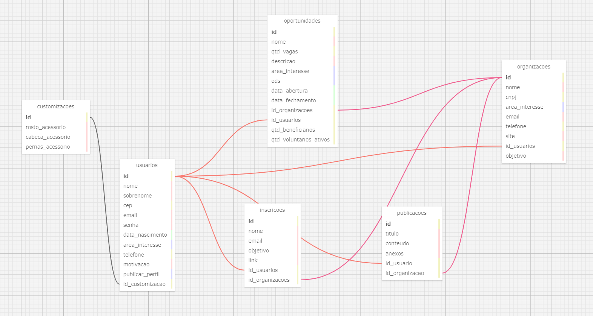

# WAD - Web Application Document - Módulo 2 - Inteli

## Tripulação Voluntária

- **Cecília Beatriz Melo Galvão**
- **Davi Nascimento de Jesus**
- **Kethlen Martins da Silva**
- **Lucas Paiva Brasil** 
- **Lucas Periquito Costa**
- **Nataly de Souza Cunha**
- **Pablo de Azevedo**
- **Yasmim Marly Passos**

## Sumário

[1. Introdução](#c1)

[2. Visão Geral da Aplicação Web](#c2)

[3. Projeto Técnico da Aplicação Web](#c3)

[4. Desenvolvimento da Aplicação Web](#c4)

[5. Testes da Aplicação Web](#c5)

[6. Conclusões e trabalhos futuros](#c6)

[7. Referências](#c7)

[Anexos](#c8)

<br>


# <a name="c1"></a>1. Introdução 

&nbsp;&nbsp;&nbsp;&nbsp;A Parceiros Voluntários é uma instituição sem fim lucrativos voltada à criação de uma rede entre as Organizações de Sociedade Civil (OSCs), nova denominação atribuída às Organizações Não-Governamentais (ONGs), integrando as instituições que desejam trazer a cultura de voluntariado para seu ambiente e as pessoas que desejam assumir uma posição de voluntariado.

&nbsp;&nbsp;&nbsp;&nbsp;Com 27 anos de história, a Parceiros vem intervindo significativamente na popularização e divulgação das atividades voluntárias pelo Brasil, porém, entre os desafios que a instituição enfrenta desde sua formação, destacam-se a ausência da identificação dos brasileiros como voluntários — apesar de desenvolverem um trabalho social sem benefício individual —, bem como a dificuldade de engajamento de uma maior parte da população do país nessas atividades. Esse panorama se mantém, já que, segundo a Pesquisa Voluntariado no Brasil 2021, embora 57% da população — aproximadamente 95 milhões de pessoas— diz fazer ou já ter feito uma atividade de voluntariado, uma baixa parcela dessa porcentagem se identificou como voluntário e continua ativamente desenvolvendo essas ações sociais (12%, 20 milhões). Essa porcentagem de 57% alcançada, entretanto, é extremamente relevante, tendo em consideração que, em 2011, esse público era de menos da metade, apenas 25%.

&nbsp;&nbsp;&nbsp;&nbsp;Nessa lógica, a solução proposta pelo grupo visa potencializar a divulgação dessas oportunidades através da criação de uma plataforma do Voluntariado Transformador Massivo, aplicação *web* que deseja, através da criação de um sistema de gamificação através da progressão de nível, bem como a centralização de oportunidades de voluntariado remotas e presenciais na plataforma, trazer a cultura de voluntariado de forma cada vez mais enfática no Brasil.

&nbsp;&nbsp;&nbsp;&nbsp;Portanto, o desenvolvimento dessa plataforma visa desestruturar diretamente a dificuldade de acesso ao conhecimento dessas oportunidades, já que, segundo a Pesquisa Voluntariado no Brasil (2021), é apontado que cerca de 84% dos voluntários desconhecem as plataformas/sites de promoção de voluntariado e, principalmente, as oportunidades digitais. Além disso, a solução pretende fomentar a conexão cada vez maior entre as organizações de sociedade civil, as instituições sociais e os indíviduos.


# <a name="c2"></a>2. Visão Geral da Aplicação _Web_ 

&nbsp;&nbsp;&nbsp;&nbsp;A seção 2, Visão Geral da Aplicação _Web_, relata o entendimento do negócio e do usuário e demonstra como que as análises desenvolvidas serão aplicadas de maneira a garantir o desenvolvimento eficiente do projeto.

## 2.1. Escopo do Projeto 

&nbsp;&nbsp;&nbsp;&nbsp;O escopo de projeto descreve o que acontecerá em um projeto, bem como as ideias principais que serão seguidas no mesmo, sejam de ordem acadêmica, tecnológica ou de negócios. Assim, é esperado que esta seção contemple os limites do projeto, a quem ele se dirige, suas principais metas e datas.

### 2.1.1. Contexto da indústria 

&nbsp;&nbsp;&nbsp;&nbsp;A *Parceiros Voluntários* é uma organização não governamental fundada em 1997 no Rio Grande do Sul que promove a cultura de voluntariado entre instituições variadas e indivíduos. Com alcance nacional, a *Parceiro Voluntários* se encontra no terceiro setor - nome dado à classificação de instituições que não fazem parte do Estado ou do mercado - e disputa espaço de atuação com outras organizações que também conectam voluntários a oportunidades, como a *Atados*, *Conecta Brasil*, *Freehelpers* e *World Packers*. <br> 

&nbsp;&nbsp;&nbsp;&nbsp; Estas outras organizações, por sua vez, tendem a ter o foco voltado para o voluntariado; Isto é, as plataformas se baseiam em anunciar as posições necessárias em organizações de voluntariado, e o interessado se conectando com essa para participar.<br>

&nbsp;&nbsp;&nbsp;&nbsp;Apesar de sem fins lucrativos, a *Parceiros Voluntários* mantém sua captação de recursos por meio de 2 dinâmicas principais: patrocínios de outras empresas por meio de subsídios e assesoria para a criação de programas de voluntariado empresarial. Além disso, o atual terceiro setor se encontra em um momento que o leva a novas tendências, como a adição crescente de novas tecnologias em seus processos e a priorização de práticas ESG - critérios que determinam se um negócio traz bons resultados quanto à sustentabilidade e responsabilidade social - em empresas. <br>

&nbsp;&nbsp;&nbsp;&nbsp;Portanto, a *Parceiros Voluntários* é uma organização versátil, pois atua em todo o Brasil e com diferentes tipos de ONGs, voluntários e instituições, bem como possui grande potencial de crescimento por conta do crescimento do terceiro setor e alta procura dos serviços executados pela mesma. <br>


### 2.1.2. Modelo de 5 Forças de Porter

&nbsp;&nbsp;&nbsp;&nbsp;As 5 Forças de Porter, modelo desenvolvido por Michel Porter nos anos 70, oferecem um formato estratégico para examinar a dinâmica competitiva de um mercado específico. Este *framework*, voltado à contextualização setorial, permite uma análise abrangente dos concorrentes, fornecedores, consumidores e outros atores-chave (Casarotto, 2020). Nesse quesito, ele inclui cinco aspectos primordiais: rivalidade entre concorrentes, poder de negociação dos fornecedores, influência dos consumidores, ameaça de novos concorrentes e ameaça de produtos substitutos.

<div align="center">

<sub>Figura 1 - Modelo das 5 Forças de Porter</sub>


<sup>Fonte: Material produzido pelos autores (2024)</sup>

</div>

&nbsp;&nbsp;&nbsp;&nbsp;Confira a imagem exposta acima por meio do _link_: (<https://bit.ly/3Qmpsj8>). 

&nbsp;&nbsp;&nbsp;&nbsp;Diante desse contexto, é  de suma importância desenvolver essa análise para que seja possível observar o posicionamento de determinada empresa em relação ao setor que ela participa. Assim, no contexto da Parceiros Voluntários, que se vincula ao segmento de conscientização sobre a importância de se voluntariar e divulgação de oportunidades de voluntariado, tem-se que:

**Rivalidade entre concorrentes existentes**

&nbsp;&nbsp;&nbsp;&nbsp;No que concerne ao panorama obserado pela Parceiros Voluntários e seus concorrentes, a rivalidade entre eles é evidente no esforço para conquistar voluntários e organizações parceiras. A Parceiros Voluntários, com sua longa história e presença estabelecida, pode ter uma vantagem em termos de credibilidade e confiança da comunidade. No entanto, a Atados, a WorldPackers e a TransformaBrasil também estão ativamente  relevantemente envolvidas na mobilização de voluntários e na conexão com organizações.

&nbsp;&nbsp;&nbsp;&nbsp;A disputa se dá em diversos aspectos. Como exemplos, cita-se a competição que ocorre na diversidade e qualidade das oportunidades de voluntariado oferecidas, na eficácia da plataforma em centralizar as oportunidades, na capacidade de promover engajamento significativo entre voluntários e organizações, e até mesmo na inovação em termos de modelos de voluntariado. Essa concorrência leva, progressivamente, a uma melhoria contínua dos serviços oferecidos por todas as partes, beneficiando assim as comunidades atendidas.

**Poder de negociação dos fornecedores**

&nbsp;&nbsp;&nbsp;&nbsp;Para a Parceiros Voluntários e seus concorrentes, dentre o grupo de fornecedores se enquadram as organizações sociais que necessitam de voluntários e disponibilizam as oportunidades para exibição na plataforma. Nesse cenário, a Parceiros Voluntários, devido a sua história e alcance estabelecidos, pode ter mais facilidade em atrair organizações sociais como fornecedoras de oportunidades de voluntariado. No entanto, fornecedores especializados ou com demandas específicas podem ter mais poder de negociação.

&nbsp;&nbsp;&nbsp;&nbsp;Como instância, cita-se o exemplo de organizações que buscam voluntários com habilidades técnicas específicas, as quais podem ter uma influência maior na negociação com todas as partes envolvidas. Portanto, embora a Parceiros Voluntários tenha uma base de fornecedores estabelecida, e parcerias bem consolidadas, ela ainda precisa manter uma relação positiva e colaborativa com eles para garantir os direitos de exibição de uma ampla variedade de oportunidades de voluntariado.

**Poder de barganha dos consumidores**

&nbsp;&nbsp;&nbsp;&nbsp;Os consumidores, no que se refere à proposta da Parceiros Voluntários, são os próprios voluntários que desejam oferecer seu tempo e habilidades para causas sociais e que utilizam de plataformas, como a da instituição, para conhecê-las. Grandes empresas, inclusive, podem, também, ter um considerável poder de negociação, pois têm recursos e muitas vezes programas de voluntariado corporativo estruturados. No entanto, pequenas empresas e indivíduos contribuem no desempenho de um papel importante na oferta de voluntariado.

&nbsp;&nbsp;&nbsp;&nbsp;Como as oportunidades de voluntariado precisam ser extremamente atrativas para os consumidores para que eles dediquem, voluntariamente, o seu tempo, a Parceiros Voluntários e seus concorrentes precisam garantir que ofereçam uma ampla variedade de oportunidades de voluntariado que atendam às diferentes necessidades e interesses dos voluntários. Além disso, estratégias de marketing e engajamento podem ser empregadas para atrair e reter voluntários, demonstrando o impacto positivo do voluntariado e a importância do trabalho realizado.

**Ameaça de novos entrantes**

&nbsp;&nbsp;&nbsp;&nbsp;Embora a Parceiros Voluntários já tenha uma marca consolidada, a entrada de novos concorrentes na conjuntura de voluntariado, principalmente com a popularização de voluntariados remotos (Pesquisa de Voluntariado no Brasil, 2021). Isso se põe, tendo em vista que plataformas digitais e tecnologias emergentes podem facilitar o surgimento de novas iniciativas de voluntariado. Outrossim, organizações que apresentem um específico em certas seções da população ou causas sociais podem encontrar nichos não atendidos pelo mercado atual.

&nbsp;&nbsp;&nbsp;&nbsp;Em vistas a se manter competitiva, a Parceiros Voluntários busca continuar inovando, expandindo suas ofertas de serviços, melhorando a experiência do usuário e fortalecendo suas redes de parcerias. Isso pode incluir o uso de tecnologia para facilitar a conexão entre voluntários e organizações, a criação de programas de voluntariado mais flexíveis e adaptáveis, e o investimento em campanhas de conscientização e marketing. Isso se reflete na proposta da criação de um Voluntariado Transformador Massivo, processo atendido pelo presente projeto.

**Ameaça de produtos e seviços substitutos**

&nbsp;&nbsp;&nbsp;&nbsp;No campo do voluntariado, a ameaça de produtos e serviços substitutos pode vir na forma de outras formas de contribuição para a comunidade que não envolvam diretamente o trabalho voluntário. Por exemplo, doações financeiras para organizações de caridade ou participação em campanhas de sensibilização podem ser consideradas alternativas ao voluntariado tradicional.

&nbsp;&nbsp;&nbsp;&nbsp;Nesse sentido, embora a presença de plataformas com alto reconhecimento nesses nichos paralelos, como a Vakinha, a Parceiros Voluntários segue demonstrando o valor único do voluntariado e os benefícios tanto para os voluntários quanto para as comunidades atendidas. Incluindo tanto o compartilhamento de histórias de sucesso, quanto a criação de oportunidades de voluntariado significativas e a promoção de uma cultura de voluntariado, que agrega valor à identificação de ser voluntário. Ademais, é importante para essas organizações adaptarem-se às mudanças nas preferências e comportamentos dos voluntários, garantindo que continuem a oferecer experiências relevantes e gratificantes.

&nbsp;&nbsp;&nbsp;&nbsp;Portanto, o desenvolvimento da análise disposta é importante para não somente apresentar o mercado e o nicho setorial que é ocupado pela Parceiros Voluntários, mas também apresentar as suas únicas contribuições que a fazem ser relevante nesse setor.

### 2.1.3. Análise SWOT

&nbsp;&nbsp;&nbsp;&nbsp;A matriz SWOT é uma ferramenta de análise estratégica fundamental que permite examinar os pontos fortes e fracos internos, bem como as oportunidades e ameaças externas enfrentadas por uma empresa ou organização. É composta por quatro elementos principais, voltados ao ambiente empresarial e o contexto da organização, cada um representado por uma letra na sigla SWOT: Forças (*Strengths*), Fraquezas (*Weaknesses*), Oportunidades (*Opportunities*) e Ameaças (*Threats*). 

&nbsp;&nbsp;&nbsp;&nbsp;Nesse sentido, Bjorn (2008) atesta que as forças e fraquezas se referem ao ambiente interno do fator analisado, ou seja, aquilo que depende de ações internas para ser melhorado. Além disso, as ameaças e oportunidades dizem respeito a elementos que não estão sob controle direto dos gestores para aprimorar um projeto, pois são influenciados pelo ambiente externo. Nesse sentido, as forças e fraquezas são avaliadas em conjunto com as oportunidades e ameaças, a fim de identificar áreas de atuação e potenciais vantagens que possam ser exploradas para melhorar o desempenho do negócio. Esses elementos oferecem uma visão abrangente do ambiente em que a organização opera. 

&nbsp;&nbsp;&nbsp;&nbsp;Diante do exposto, é de suma importância desenvolver essa análise para que seja possível observar o posicionamento de determinada organização em relação aos seus aspectos internos e externos. Assim, no contexto da Parceiros Voluntários, tem-se esses aspectos delimitados conforme a imagem a seguir:

<div align="center" width="100%">
 
 <sub>Figura 2 - Análise SWOT da Parceiros Voluntários</sub><br>
 
 
 
 <sup>Fonte: Material produzido pelos autores (2024)</sup>

</div>

&nbsp;&nbsp;&nbsp;&nbsp;Confira a imagem exposta acima por meio do _link_: (<https://bit.ly/44jJ3Gr>). 

&nbsp;&nbsp;&nbsp;&nbsp;A seguir, são justificados cada um dos quatro pontos elucidados na figura acima, de modo a aprofundar a análise da parceira deste projeto. 

**Forças**

- Instituição descentralizada em todo o Brasil: No voluntariado da região, assim como em todo o país, desenvolvemos iniciativas que operam em formato descentralizado. Apesar da importância das ações específicas, para alcançar uma maior abrangência, o foco na descentralização ocorre para abrangir estratégias que potencializem a iniciativa do voluntário independente: aquele que deseja contribuir, possui energia para isso, mas pode não estar certo de como iniciar ou mobilizar outras pessoas;

- Marca consolidada - 27 anos de história com ações em todo o Brasil: A ONG Parceiros Voluntários foi estabelecida há 27 anos em Porto Alegre. E durante a sua trajetória, tem incentivado, promovido e apoiado a prática do voluntariado, bem como a disseminação da cultura do trabalho voluntário como um meio de promover mudanças sociais no Brasil;

- Cultura e objetivos bem delineados: A Parceiros Voluntários possui a missão bem definida de  “Potencializar a cultura do voluntariado e a educação para cidadania com o objetivo de gerar um impacto positivo nas comunidades”, buscando atribuir um novo significado à palavra e o conceito do voluntariado para algo atrativo que proporcione valor a quem se declara um voluntário.


**Oportunidades**

- Maior contato com possíveis parceiros: A abrangência nacional da instituição potencializa o contato com possíveis parceiros, enquanto permite à ONG expandir sua rede de apoio e recursos, propiciando uma maior eficácia na realização de seus projetos e iniciativas;

- Popularização dos voluntariados remotos pós período pandêmico: Com a popularização do voluntariado remoto, a ONG conseguiu alcançar um público mais amplo, incluindo pessoas que anteriormente não podiam se envolver devido a restrições geográficas ou de tempo. Isso resultou em uma base atual de voluntários mais diversificada e engajada, de forma a refletir, melhor, a pluralidade voluntária brasileira;

- Alta demanda da sociedade brasileira por iniciativas voluntárias: A crescente demanda por iniciativas voluntárias indica um forte apoio da sociedade civil a causas sociais. Isso significa que há um grande potencial para a ONG atrair voluntários e mobilizar recursos para suas atividades, aproveitando o interesse e a disposição das pessoas em se envolverem em ações de impacto social positivo.

**Fraquezas**

- Ausência de programas de *crowdfunding* (Financiamento coletivo): A Parceiros Voluntários não desenvolve nenhuma iniciativa que permite às OSCs parceiras desenvolver um sistema de arrecadação financeira pela plataforma de contato com voluntários;

- Ausência de curadoria das atividades de voluntariado exibidas: A organização não desenvolve mais a curadoria de oportunidades para os voluntários, o que compromete, em parte, a vinculação de um conteúdo direto e objetivo sobre alguma atividade específica que o voluntário poderia participar em sua comunidade;

- Dependência de subsídios de outras empresas para sustentação financeira: A instituição possui como uma das suas únicas estratégias de monetização a formação dos programas de voluntariado de empresas. Estratégia que, apesar de ser rentável, com a popularidade do trabalho voluntário entre as empresas de grande porte, pode gradativamente não encontrar mais público-alvo.

**Ameaças**

- Ausência de parcerias com OSCs em todos os estados do Brasil: Apesar da abrangência nacional da Parceiros Voluntários, a lacunar presença de parcerias com OSCs em todos os estados e munícipios acaba por restringir o acesso de pessoas que desejam se voluntariar de forma, exclusivamente, presencial;

- Indíviduos não se reconhecerem como voluntários: Tendo em vista a missão de atribuir valor à declaração individual sobre ser voluntário, a inviabilidade de se reconhecer como tal impacta significativamente no propósito e no desenvolvimento das ações da Parceiros Voluntários;

- Resistência social contra voluntariado. Predominantemente, em situações de vulnerabilidade social: A resistência contra ambientes em que há determinado tipo de vulnerabilidade social inviabiliza o protagonismo de pessoas para desenvolvimento de uma intervenção nesses espaços. O que é crítico, considerando que eles são contextos que realmente precisam de atividades voluntárias. Não somente isso, mas muitas vezes o voluntariado é visto como apenas vinculado a essa conjuntura. O que potencializa esse estigma e acaba por, também, inviabilizar o desenvolvimento de ações em outros nichos.


&nbsp;&nbsp;&nbsp;&nbsp;Portanto, o desenvolvimento da análise SWOT disposta é importante para contextualizar o cenário da organização tanto em relação aos âmbitos internos, com a atribuição de suas forças e fraquezas, como também o delineamento dos aspectos externos, que se destrincham em oportunidades e ameaças.

### 2.1.4. Solução: 

&nbsp;&nbsp;&nbsp;&nbsp;Tendo em vista a importância de se registrar os processos idealizados para a resolução do problema e realização da plataforma, descrever sucintamente a solução em resposta a 6 principais perguntas, dispostas abaixo, é uma estratégia que garante a esposição direta do que se pretende desenvolver a partir do entendimento do negócio exposto anteriormente.

1. **Qual é o problema a ser resolvido?**

&nbsp;&nbsp;&nbsp;&nbsp;O problema a ser resolvido pelo projeto é a dificuldade de acesso ao conhecimento de oportunidades de voluntariado no Brasil, que inviabiliza o desenvolvimento eficiente de atividades sociais para as problemáticas que existem ao redor do país. Outrossim, busca-se intervir, também, no abismo comunicativo que se expande entre as organizações de sociedade civil, as instituições sociais e os indivíduos voluntários.

2. **Quais os dados disponíveis?**

&nbsp;&nbsp;&nbsp;&nbsp;Segundo a Pesquisa Voluntariado no Brasil (2021), aponta-se que cerca de 84% dos voluntários desconhecem as plataformas/sites de promoção de voluntariado e as oportunidades digitais, mostrando a necessidade de potencialização do alcance da Parceiros. Outrossim, o alcance de 14 estados e 155 municípios, descrito pelo relatório institucional de 2022, colabora na significação do impacto buscado pela expansão da iniciativa.

3. **Qual a solução proposta?**

&nbsp;&nbsp;&nbsp;&nbsp;A solução proposta é a criação de uma plataforma, Oportuniza, que exiba oportunidades de atividades sociais, postadas por instituições e voluntários. E que, também, com um sistema de gamificação, apresente organizações, histórias de voluntários que impactaram através de suas ações, tanto individuais, quanto das ONGs cadastradas. Essas iniciativas seriam voltadas ao propósito de promoção de uma cultura de voluntariado.

4. **Como a solução proposta deverá ser utilizada?**

&nbsp;&nbsp;&nbsp;&nbsp;A plataforma Oportuniza poderá ser utilizada com três principais intuitos: encontrar e se conectar com voluntários para a sua ação, encontrar oportunidades para se voluntariar e encontrar organizações que tenham propostas de voluntariado que se assemelhem aos interesses cadastrados pelo voluntário. Apesar do foco de usuário ser o voluntário, a plataforma poderia abarcar também, assim, as ONGs e diferentes entidades.

5. **Quais os benefícios trazidos pela solução proposta?** 

&nbsp;&nbsp;&nbsp;&nbsp;A Oportuniza oferece uma maneira fácil e eficiente para conectar voluntários e organizações, propiciando que os voluntários encontrem oportunidades alinhadas aos seus interesses, simultaneamente, permitindo que ONGs e outras entidades encontrem voluntários para suas necessidades. O projeto, com a gamificação e a cultura de voluntariado, fortalece o engajamento à missão da Parceiros Voluntários e a expansão do voluntariado no Brasil.

6. **Qual será o critério de sucesso e qual medida será utilizada para o avaliar ?**

&nbsp;&nbsp;&nbsp;&nbsp;As medidas e os critérios de sucesso são baseadas, principalmente, nos dados voltados ao engajamento dos voluntários na plataforma, já que espera que a plataforma potencialize o crescimento do alcance da Parceiros Voluntários ao redor do Brasil e a divulgação da cultura de voluntariado. Nesse contexto, algumas das métricas observadas irão consistir em:

&nbsp;&nbsp;&nbsp;&nbsp;• Quantidade de voluntários cadastrados;

&nbsp;&nbsp;&nbsp;&nbsp;• Quantidade de voluntários participando ativamente na plataforma;

&nbsp;&nbsp;&nbsp;&nbsp;• Quantidade de cidades brasileiras atingidas;

&nbsp;&nbsp;&nbsp;&nbsp;• Quantidade estimada de pessoas beneficiadas;

&nbsp;&nbsp;&nbsp;&nbsp;• Quantidade de ações desenvolvidas por voluntário;

&nbsp;&nbsp;&nbsp;&nbsp;• Quantidade de entidades atingidas pelo voluntariado.

&nbsp;&nbsp;&nbsp;&nbsp;Assim, o projeto buscará aplicar e desenvolver o que foi proposto nos tópicos de solução dessa seção, de forma a intervir significativamente na problemática disposta.


### 2.1.5. Proposta de Valor 

&nbsp;&nbsp;&nbsp;&nbsp;A proposta de valor de um produto é uma análise de como ele pode auxiliar o usuário, resolvendo problemas ou agregando à experiência do usuário em ocasiões de seu próprio dia a dia. Uma das formas de examinar esse aspecto é por meio do desenvolvimento de um Canvas Proposta de Valor, ou Value Proposition Canva, uma ferramenta visual criada por Alex Osterwalder e Yves Pigneur. O Canvas Proposta de Valor mostra o público alvo e tarefas diárias, bem como suas dores durante tais atividades e os ganhos que gostariam de obter durante suas experiências; e o produto ou funcionalidades, bem como esses aspectos podem gerar os ganhos que os clientes gostariam de obter ou aliviar as dores atuais do usuário.

<div align="center">

<sub>Figura 3 - Canvas Proposta de Valor</sub>


<sup>Fonte: Material produzido pelos autores (2024)</sup>

</div>

&nbsp;&nbsp;&nbsp;&nbsp;Confira a imagem exposta acima por meio do _link_: (<https://bit.ly/3QjA6au>). 

&nbsp;&nbsp;&nbsp;&nbsp;A seguir, são elucidados cada um dos pontos dispostos na figura acima, de modo a aprofundar a análise desenvolvida.

**Tarefas**

- A priori, as tarefas são as ações que o usuário precisa desempenhar diariamente ou problemas que estão tentando resolver. Nesse sentido, as tarefas identificadas para o público alvo - voluntários - são a inscrição em voluntariados, o convite a pessoas para ações sociais, o compartilhamento de experiências pessoais e a avaliação de organizações nas quais já trabalhou antes.

**Dores**

- Ademais, as dores são desafios ou obstáculos que o usuário encontra nas atividades e que o acompanham desde o início até o fim do processo pela falta de algo que as alivie. Com efeito, As dores das personas são a participação de um processo entendiante durante a inscrição em seus voluntariados, a necessidade de efetuar buscas complexas e demoradas por ONGs antes da decisão de se voluntariarem e a dificuldade em mobilizar outras pessoas para a ação voluntária.

**Ganhos**

- Além disso, os ganhos do cliente são vantagens ou facilidades que o usuário pode adquirir ao utilizar o produto e que agregariam à experiência vivida nas tarefas e atividades diárias. Os ganhos elencados são a conexão com outros voluntários, a facilidade na busca por ações sociais para voluntariado, a criação de senso de comunidade entre pessoas voluntárias e escolhas mais conscientes sobre as organizações nas quais se pode trabalhar.

**Produtos e serviços**

- Depois, são adicionadas as características do produto que podem aliviar as dores do cliente e gerar maiores ganhos para o mesmo. O produto escolhido foi a criação de uma aplicação _web_ que conecte voluntários entre si e com organizações sociais para que a cultura de voluntariado cresça no Brasil, desenvolvendo o chamado Voluntariado Transformador Massivo (VTM).

**Analgésicos**

- Os aspectos da solução que aliviam as dores da pessoa voluntária são funcionalidades da aplicação _web_, como sistema de avaliação em tempo real das organizações sociais por voluntários dentro das mesmas, de modo a avaliar como o tratamento e o trabalho ocorre; a gamificação da experiência de voluntariado, por meio do ganho de pontos a cada ação voluntária; e a linha do tempo com posts inspiradores e histórias de sucesso de outros voluntários, para que um maior engajamento social possa ser gerado.

**Criadores de ganhos**

- Por fim, os geradores de ganho são particularidades da solução que agregam à experiência que o usuário tem ao executar suas tarefas ou resolver problemas de seu contexto diário. Para o projeto, os geradores de ganho reconhecidos foram as funcionalidades de chat em grupo com outros usuários, facilitando o contato entre voluntários; os filtros presentes na busca por organizações e ações sociais, para otimização dos resultados; e o sistema de avaliação de voluntários, que mostra como pessoas em ações anteriores indicam pontos bons e ruins de cada organização.

&nbsp;&nbsp;&nbsp;&nbsp;O Canvas Proposta de Valor é, então, uma ferramenta de extrema relevância para o projeto, já que ele permite diretamente relacionar os aspectos da solução com as características do usuário, promovendo a descrição de uma relação de geração de ganhos e amenização de dores.

### 2.1.6. Matriz de Riscos 

&nbsp;&nbsp;&nbsp;&nbsp;A matriz de risco é uma ferramenta visual utilizada para elencar os principais riscos do projeto com base na probabilidade de ocorrência e seus impactos no projeto, de modo que prevenções sejam planejadas para cada um dos possíveis impasses. Para tal, é necessário identificar todos os possíveis problemas que podem acontecer durante o projeto sem a classificação de impacto ou probabilidade, para depois realizar a categorização de forma mais clara. Nesse sentido, os riscos encontrados para o presente projeto são:

1. Desenvolvimento de _design_ não intuitivo;
2. Mau desenvolvimento da persona;
3. Baixo engajamento dos integrantes por motivos exteriores ao grupo;
4. Atraso nas entregas esperadas para cada sprint;
5. Falta de voluntários para testes de aplicação;
6. Falta de ONGs para testes de aplicação;
7. Necessidade de refatorar funcionalidades já desenvolvidas nas sprints futuras;
8. Falta de conhecimento técnico dos integrantes.

&nbsp;&nbsp;&nbsp;&nbsp;Dessa forma, ao utilizar a matriz de risco, é possível entender como os desafios supracitados podem afetar o projeto e delimitar planos de ação para cada um dos mesmos.

<div align="center">

<sub>Figura 4 - Matriz de Risco</sub>


<sup>Fonte: Material produzido pelos autores (2024)</sup>

</div>

&nbsp;&nbsp;&nbsp;&nbsp;Confira a imagem exposta acima por meio do _link_: (<https://bit.ly/3UewWG5>). 

&nbsp;&nbsp;&nbsp;&nbsp;Além disso, é possível olhar individualmente para cada um dos riscos do projeto após classificá-los conforme sua chance de ocorrência e impacto e traçar um plano de ação, ou seja, como eles serão contornados ou evitados. Uma descrição mais detalhada dos riscos elencados e de seus planos de ação é encontrada abaixo.

**Desenvolvimento de _design_ não intuitivo** <br>

- *Plano de ação:* realizar testes de usabilidade com usuários do público alvo e realizar cursos propostos sobre a responsividade em aplicações _web_. Ademais, procurar orientações específicas com professores de _UX Design_ do Inteli para dúvidas sobre a navegação do usuário dentro da plataforma e outros aspectos da interatividade.

**Mau desenvolvimento da persona** <br>

- *Plano de ação:* desenvolver pesquisas qualitativas com pessoas dentro do público que se quer alcançar e coletar insights sobre as verdadeiras necessidades e dores do usuário.

**Baixo engajamento dos integrantes por motivos exteriores ao grupo** <br>

- *Plano de ação:* implementar nas daily meetings o costume de perceber os pares para além do projeto e manter a equipe avisada sobre as possíveis ausências de algum dos seus membros para reorganização de tasks.

**Atraso nas entregas esperadas para cada sprint** <br>

- *Plano de ação:* dividir as _User Stories_ em tasks de acordo com o SMART, _framework_ que designa características importantes para tarefas como a especificidade e a quantidade de tempo necessária. Também, priorizar as tasks durante a sprint com base nos critérios de urgência e importância.

**Falta de voluntários para testes de aplicação** <br>

- *Plano de ação:* criar banco de contatos a partir das pesquisas já realizadas com o público alvo para criação das personas com as pessoas dispostas a utilizar e testar a solução desenvolvida no projeto.

**Falta de ONGs para testes de aplicação** <br>

- *Plano de ação:* pedir referências de ONGs ao parceiro e encontrar organizações dentro do Inteli para a realização de testes, bem como efetuar pesquisas sobre organizações sociais dentro da Cidade Universitária, campus onde o Inteli se encontra.

**Necessidade de refatorar funcionalidades já desenvolvidas nas sprints futuras** <br>

- *Plano de ação:* realizar testes de qualidade e de erros para cada funcionalidade antes de tê-la como completada, além de estipular critérios técnicos e de usabilidade para tal.

**Falta de conhecimento técnico dos integrantes** <br>

- *Plano de ação:* validar com professores do Inteli sobre o entendimento dos integrantes e sobre a qualidade da solução em todos os seus aspectos (programação, _design_, documentação e negócios). Ademais, utilizar de recomendações dos professores sobre recursos extra para estudo próprio dos participantes.

&nbsp;&nbsp;&nbsp;&nbsp;Portanto, ao identificar e já propor planos de ações para o combate e minimização dos riscos atinentes ao desenvolvimento do projeto, é possível, através das previsões, preparar-se de antemão a qualquer impedimento e ação que inviabilize a sua continuação.

#### 2.1.6.1 Matriz de Oportunidades

&nbsp;&nbsp;&nbsp;&nbsp;Da mesma forma em que é possível e necessário conhecer os riscos de um projeto com base em suas possibilidades de acontecerem e o impacto que terão no andamento do trabalho, também é necessário conhecer quais oportunidades podem potencializar os resultados do projeto e como decidir quais devem ser buscadas com base na maior chance de ocorrerem e maiores efeitos positivos.

&nbsp;&nbsp;&nbsp;&nbsp;Para elencar as oportunidades do projeto, foi utilizada a *Matriz de Oportunidades*, uma ferramenta semelhante à *Matriz de Riscos*, mas utilizada com o intuito de saber como agir frente às oportunidades -  riscos positivos e com bons impactos no andamento do projeto. As oportundidades encontradas para o projeto são as seguintes:

1. Maior aprendizado dos integrantes da equipe sobre desenvolvimento _web_ e _back-end_;
2. Melhorias contínuas a partir da coleta de _feedback_ dos testes de usabilidade;
3. _Networking_ com lideranças sociais de todo o Brasil;
4. Criação de documentos de padronização para uso dos integrantes;
5. Experiências presenciais com atividades voluntárias;
6. Investimento financeiro do parceiro para a continuidade do projeto;
7. Aumento de parcerias entre o parceiro e o Inteli e entre o Inteli e ONGs. 


&nbsp;&nbsp;&nbsp;&nbsp;Assim, a categorização e escolha consciente das oportunidades a serem trabalhadas fica viável ao utilizar a Matriz de Oportunidades na figura abaixo (Figura 5).

<div align="center">

<sub>Figura 5 - Matriz de Oportunidades</sub>


<sup>Fonte: Material produzido pelos autores (2024)</sup>

</div> 

&nbsp;&nbsp;&nbsp;&nbsp;Confira a imagem exposta acima por meio do _link_: (<https://bit.ly/4ba3XKw>). 

&nbsp;&nbsp;&nbsp;&nbsp;É factível, ainda, fazer descrições mais específica de cada uma das oportunidades encontradas na matriz de oportunidades, as quais se encontram nos tópicos a seguir.

**Maior aprendizado dos integrantes da equipe sobre desenvolvimento web e back-end** 

- Com o andamento do projeto, os integrantes da equipe poderão ter contato mais direto com tecnologias relacionadas ao desenvolvimento de aplicações _web_ e _back-end_, possibilitando melhorias no próprio projeto por meio do aprendizado do grupo e novos interesses dos participantes pela área de atuação.

**Melhorias contínuas a partir da coleta de feedback dos testes de usabilidade** 

- Para validação da solução, é necessário que testes de usabilidade sejam feitos com o público alvo. Dessa maneira, será possível entender quais aspectos da aplicação _web_ não estão bem estruturados e corrigi-los antes da entrega final, além de trazer impacto positivo ao usuário.

 **Networking com lideranças sociais de todo o Brasil** 
 
 - Para conhecimento da dinâmica já existente nas organizações de voluntariado, é possível que integrantes da equipe tenham contato ainda mais próximos com líderes dos diferentes estados do país e entendam como a solução proposta pode se relacionar com suas realidades locais.

**Criação de documentos de padronização para uso dos integrantes** 

- Para fins de organização da equipe em suas trocas de funções durante as sprints, documentos organizacionais podem ser criados para as áreas de programação e documentação, de modo que a qualidade das entregas não caia, a consistência se mantenha igual e a consulta por referências seja mais rápida.

**Experiências presenciais com atividades voluntárias** 

- O contato com o parceiro pode proporcionar atividades presenciais em ações voluntárias para integrantes da equipe, o que aumenta o entendimento das necessidades do público e suas vivências.

**Investimento financeiro do parceiro para a continuidade do projeto** 

- Após a entrega final do projeto, é possível o investimento do parceiro para que o desenvolvimento e melhorias sejam contínuas e o lançamento da aplicação _web_ seja efetivado pela mesma equipe que a criou, trazendo facilidades ao processo.

**Aumento de parcerias entre o parceiro e o Inteli e entre o Inteli e ONGs** 

- A experiência do projeto pode servir para estreitar as relações entre o Inteli e a organização parceira, bem como o aumento de parcerias entre o Inteli e organizações sociais para futuros módulos. 

&nbsp;&nbsp;&nbsp;&nbsp;Dessa maneira, percebe-se a importância de relatar as oportunidades que podem surgir ao longo do desenvolvimento do projeto, já que, através delas, o rumo pode ser positivamente alterado ou potencializado, ditando mudanças significativas em seu andamento.

#### 2.1.6.2 Matriz de Riscos e Oportunidades atualizada em 23/05/2024

&nbsp;&nbsp;&nbsp;&nbsp;Para que o andamento do projeto seja acompanhado, é importante manter um processo iterativo referente à construção da matriz de riscos e de oportunidades, atualizando o preenchimento das ferramentas a cada ciclo ou _sprint_. 

&nbsp;&nbsp;&nbsp;&nbsp;Na presente _sprint_, foram identificados novos riscos e oportunidades, além de que a probabilidade de ocorrência de riscos e oportunidades antigas foram revistas e atualizadas:

##### Novos riscos e planos de ação:

<div align="center">

<sub>Figura 6 - Matriz de Riscos atualizada</sub>


<sup>Fonte: Material produzido pelos autores (2024)</sup>

</div> 

&nbsp;&nbsp;&nbsp;&nbsp;Confira a imagem exposta acima por meio do _link_: (<https://abre.ai/matrizderisco>). 

9. Dificuldade de desenvolvimento com o framework Sails;
  - *Plano de ação:* Buscar, junto dos professores de programação, recursos extras para entendimento do _framework Sails_, além de agendar sessões de monitoria com o monitor de programação e de validação com o professor de programação.

10. Parceiros impossibilitados de estarem nas entregas.
  - *Plano de ação:* manter a comunicação _on-line_ durante as _Sprint Reviews_ e validar as comunicações entre o parceiro e o grupo de desenvolvimento por meio do professor orientador para resolução de questões de forma eficiente.
  
##### Nova oportunidade:

<div align="center">

<sub>Figura 7 - Matriz de Oportunidades atualizada</sub>


<sup>Fonte: Material produzido pelos autores (2024)</sup>

</div> 

&nbsp;&nbsp;&nbsp;&nbsp;Confira a imagem exposta acima por meio do _link_: (<https://abre.ai/matrizdeoportunidades>). 

  8. Coleta de informações sobre as mobilizações no Rio Grande do Sul para melhorias da aplicação. 

&nbsp;&nbsp;&nbsp;&nbsp;Assim, com a atualização dos riscos e oportunidades do projeto, é possível seguir com o desenvolvimento levando em conta os planos de ações atualizados conforme a probabilidade de ocorrência dos mesmos.

## 2.2. Personas 

&nbsp;&nbsp;&nbsp;&nbsp; Personas são personagens fictícios, responsáveis por representar perfis de pessoas e públicos reais que interagem com um produto, serviço ou organização. Desse modo, elas são criadas por uma organização com o objetivo de entender as necessidades do seu público alvo, levando em consideração os seus dados demográficos, comportamentais e motivações, a fim do melhor desenvolvimento possível do seu produto, considerando tal estratégia de entendimento do cliente. Assim, as personas são uma ferramenta essencial para o _UX Design_, pois é centrada no usuário e na construção de experiências mais personalizadas e relevantes para os clientes.<br>

### 2.2.1. Voluntários

&nbsp;&nbsp;&nbsp;&nbsp;A definição da persona de um voluntário é necessária para compreendermos o público-alvo para o qual a plataforma será centrada. Dessa forma, nos permitindo entender as necessidades, desejos, expectativas e preocupações do nosso público de uma forma mais aprofundada.

**Criação de persona**

&nbsp;&nbsp;&nbsp;&nbsp;Para elaborar uma persona de voluntário, optamos por adotar uma abordagem qualitativa, que tem como objetivo coletar um número menor de respostas mas conta com perguntas mais profundas e dissertativas. O objetivo principal dessa pesquisa é aprofundar nossa compreensão sobre o interesse e as características dos indivíduos engajados em atividades voluntárias. 

&nbsp;&nbsp;&nbsp;&nbsp;Para alcançar esse propósito, criamos um formulário utilizando a plataforma "Google Forms". Com base nas informações coletadas, desenvolveremos uma persona detalhada que represente os voluntários. O formulário foi compartilhado em grupos focados em voluntariado no aplicativo "WhatsApp", resultando na coleta de 24 respostas distintas.

&nbsp;&nbsp;&nbsp;&nbsp;O questionário utilizado para a coleta de dados pode ser localizado no [Anexo I](#anexo1).

**Análise de resultados**

&nbsp;&nbsp;&nbsp;&nbsp;Com base nas 24 respostas coletadas pelo público geral, buscamos analisar os dados para formularmos uma persona qualitativa. Abaixo, podemos contar com a análise de todos os dados coletados:

&nbsp;&nbsp;&nbsp;&nbsp;Para uma análise inicial dos dados coletados, observamos as datas de nascimento dos respondentes. Conforme ilustrado no gráfico abaixo, mais de 50% dos participantes nasceram aproximadamente no ano 2000. Isso sugere que a maioria do nosso público tem cerca de 20 anos de idade. 

<div align="center" width="100%">
 
 <sub>Figura 8 - Datas de nascimento</sub><br>
 
 
 
 <sup>Fonte: Material produzido pelos autores (2024)</sup>
</div>

&nbsp;&nbsp;&nbsp;&nbsp;Confira a imagem exposta acima por meio do _link_: (<https://bit.ly/3UDqxpC>). 

&nbsp;&nbsp;&nbsp;&nbsp;Na análise dos dados dos nossos respondentes, observamos uma distribuição significativa em relação ao gênero. Dos participantes que preencheram o formulário, 16 pessoas, ou seja, 66,7%, identificaram-se como do gênero feminino. Esse dado é essencial para a construção da nossa persona, pois nos fornece insights valiosos sobre a composição de gênero do nosso público-alvo.

<div align="center" width="100%">
 
 <sub>Figura 9 - Análise de gênero</sub><br>
 
 
 
 <sup>Fonte: Material produzido pelos autores (2024)</sup>
</div>

&nbsp;&nbsp;&nbsp;&nbsp;Confira a imagem exposta acima por meio do _link_: (<https://bit.ly/4d92hCZ>). 

&nbsp;&nbsp;&nbsp;&nbsp;Na etapa seguinte da nossa análise, solicitamos aos participantes que fornecessem informações geográficas para melhor compreendermos a distribuição regional do nosso público. Conforme apresentado no gráfico abaixo, observamos uma concentração significativa no estado de São Paulo, tendo 8 pessoas representado 33,3% de todos os respondentes. 

&nbsp;&nbsp;&nbsp;&nbsp;Em segundo lugar, há um empate entre o Distrito Federal e os estados do Rio de Janeiro, Goiás, Rio Grande do Sul e Rio Grande do Norte, cada um com 2 pessoas, ou seja, uma participação equivalente de 8,3%. 

&nbsp;&nbsp;&nbsp;&nbsp;Essa análise revela uma diversidade geográfica interessante, mas destaca o protagonismo da região Sudeste em nossa pesquisa. Essa informação faz com que possamos compreender onde nosso público está predominantemente localizado, auxiliando na elaboração de estratégias de segmentação e comunicação mais eficazes e específicas. 

<div align="center" width="100%">
 
 <sub>Figura 10 - Análise de regionalidade</sub><br>
 
 
 
 <sup>Fonte: Material produzido pelos autores (2024)</sup>
</div>

&nbsp;&nbsp;&nbsp;&nbsp;Confira a imagem exposta acima por meio do _link_: (<https://bit.ly/49RRTwl>). 

&nbsp;&nbsp;&nbsp;&nbsp;Na sequência da nossa análise, investigamos o nível de formação acadêmica dos participantes. Em consonância com os dados que indicam uma concentração significativa de nascimentos em torno do ano 2000, observamos que a maioria dos respondentes possui graduação incompleta.

&nbsp;&nbsp;&nbsp;&nbsp;Essa informação sugere que nosso público-alvo está atualmente em processo de formação acadêmica. A compreensão deste perfil educacional é fundamental para a definição da nossa persona, que se caracteriza como um indivíduo em meio ao período de graduação, buscando crescimento e desenvolvimento profissional.

<div align="center" width="100%">
 
 <sub>Figura 11 - Análise de escolaridade</sub><br>
 
 
 
 <sup>Fonte: Material produzido pelos autores (2024)</sup>
</div>

&nbsp;&nbsp;&nbsp;&nbsp;Confira a imagem exposta acima por meio do _link_: (<https://bit.ly/3JyDw5o>). 

&nbsp;&nbsp;&nbsp;&nbsp;Prosseguindo com nossa análise, investigamos as experiências profissionais dos participantes. Observamos que a grande maioria indicou envolvimento com atividades extracurriculares de natureza empregatícia, como bolsas acadêmicas da Academia Latina-Americana de Liderança (LALA) e estágios. Esses dados sugerem que nosso público está ingressando no mercado de trabalho e busca por novas oportunidades que estejam relacionadas ao contexto acadêmico.

&nbsp;&nbsp;&nbsp;&nbsp;Além disso, abordamos a questão da experiência em voluntariado, visando entender o envolvimento dos respondentes nesse campo. Os resultados do questionário revelaram que mais de 90% dos participantes já realizaram trabalhos voluntários, sendo que a maioria deles já participou de mais de um serviço desta natureza, conforme destacado na resposta selecionada abaixo: 

&nbsp;&nbsp;&nbsp;&nbsp;_"Sim. Sou cofundador de uma ONG educacional que nasceu em 2021 e já impactou mais de 5000 estudantes de baixa renda. Fui diretor de marketing no GEDUC, ONG educacional que já impactou mais de 21000 estudantes da América Latina com suas iniciativas"._ 

&nbsp;&nbsp;&nbsp;&nbsp;Essas descobertas indicam um alto nível de engajamento da nossa audiência no universo do voluntariado e demais quesitos do universo acadêmico, demonstrando uma disposição para contribuir com a comunidade e adquirir novas experiências.

&nbsp;&nbsp;&nbsp;&nbsp;Para aprofundar nossa compreensão sobre as áreas de interesse dos respondentes em relação ao serviço voluntário, coletamos dados específicos sobre as preferências temáticas. Conforme demonstrado no gráfico abaixo, os resultados revelaram que a área de direitos humanos é a mais destacada, com 19 pessoas respondendo, contando com 79,2% dos votos. Em segundo lugar, encontram-se áreas relacionadas à educação, contando com 16 votos, totalizando uma porcentagem de 66,7%. Em terceiro lugar, as áreas focadas em equidade de gênero também apresentaram uma alta representatividade, tendo 15 votos, com 62,5% das respostas.

&nbsp;&nbsp;&nbsp;&nbsp;Essas informações nos auxiliam à interpretarmos quais áreas de impacto social são mais atrativas para os respondentes quando se trata de prestar serviço voluntário. A identificação dessas áreas prioritárias nos permite direcionar estratégias de engajamento, alinhando nossas ações às necessidades da persona.

<div align="center" width="100%">
 
 <sub>Figura 12 - Causas de interesse</sub><br>
 
 
 
 <sup>Fonte: Material produzido pelos autores (2024)</sup>
</div>

&nbsp;&nbsp;&nbsp;&nbsp;Confira a imagem exposta acima por meio do _link_: (<https://bit.ly/3xTtIR7>). 

&nbsp;&nbsp;&nbsp;&nbsp;Ao analisar as preferências dos respondentes quanto ao tipo de voluntariado desejado, observamos que as opções de voluntariado presencial e remoto são igualmente valorizadas, com 17 votos, ou seja, 70,8% das respostas. Além disso, os tipos de voluntariado a longo prazo apresentam um destaque significativo entre os participantes, conforme demonstrado abaixo.

<div align="center" width="100%">
 
 <sub>Figura 13 - Voluntariado desejado</sub><br>
 
 
 
 <sup>Fonte: Material produzido pelos autores (2024)</sup>
</div>

&nbsp;&nbsp;&nbsp;&nbsp;Confira a imagem exposta acima por meio do _link_: (<https://bit.ly/3xQAPcJ>). 

&nbsp;&nbsp;&nbsp;&nbsp;Ao investigar a disponibilidade de horários dos respondentes para realizar trabalhos voluntários, identificamos que mais de 90% deles têm os finais de semana livres, com uma ênfase particular no dia de sábado. Aqueles que indicaram disponibilidade durante a semana mencionaram que só podem participar no turno da noite. Esses dados são fundamentais para a construção de uma persona detalhada, permitindo-nos entender melhor as preferências e restrições relacionadas aos horários dos nossos potenciais usuários.

&nbsp;&nbsp;&nbsp;&nbsp;Na seção de "Motivações, Interesses e Preocupações", alinhada aos já altos índices de envolvimento dos respondentes com o voluntariado, questionamos as razões que os levaram a se engajar nessa atividade e também o que os motiva a serem voluntários. A maioria expressou que busca desenvolvimento profissional e acadêmico em áreas específicas, além de valorizarem a construção de um currículo robusto, apresentando um perfil de alto interesse em contribuir para o bem-estar das demais pessoas impactadas pelos serviços sociais. Essas motivações foram claramente refletidas na resposta coletada abaixo:

&nbsp;&nbsp;&nbsp;&nbsp;_"Sentir que algumas dificuldades que eu passei para conquistar o direito à educação, ou que foram vividas por pessoas próximas, poderiam ser prevenidas. Que eu poderia oportunizar esses acessos"._ 

&nbsp;&nbsp;&nbsp;&nbsp;Também incluímos no formulário uma questão sobre o nível de experiência anterior dos respondentes com o serviço social, visando compreender eventuais medos e anseios que possam influenciar a construção da persona e a estratégia de engajamento. Os resultados revelaram que mais de 90% das respostas indicaram experiências "muito boas" e "boas". Esses dados demonstram que a grande maioria possui uma percepção positiva em relação às suas experiências anteriores com o voluntariado. Isso nos permite inferir que nosso público-alvo está predisposto a se envolver em novas oportunidades de voluntariado, tendo em vista as experiências positivas que já tiveram. O gráfico supramencionado pode ser visualizado abaixo:

<div align="center" width="100%">
 
 <sub>Figura 14 - Qualidade do trabalho voluntário</sub><br>
 
 
 
 <sup>Fonte: Material produzido pelos autores (2024)</sup>
</div>

&nbsp;&nbsp;&nbsp;&nbsp;Confira a imagem exposta acima por meio do _link_: (<https://bit.ly/49Prrnf>). 

&nbsp;&nbsp;&nbsp;&nbsp;Para investigar possíveis receios e preocupações dos voluntários em relação ao trabalho social, coletamos respostas dissertativas que nos oferecem perspectivas sobre as suas apreensões. Notamos que muitos expressaram preocupações relacionadas à alta cobrança e ao desinteresse por parte da equipe com a qual estarão envolvidos, como evidenciado na citação a seguir:

&nbsp;&nbsp;&nbsp;&nbsp;_"Engajamento do time e ter certeza que alguém não está sendo sobrecarregado devido ao desinteresse de outros"._ 

&nbsp;&nbsp;&nbsp;&nbsp;Ao abordar a questão de possíveis experiências negativas relacionadas ao trabalho voluntário, os respondentes destacaram preocupações específicas que gostariam de evitar em suas participações futuras. Uma das principais preocupações expressas foi a relativa à necessidade de arcar com custos operacionais e o sentimento de sobrecarga, conforme ilustrado na citação a seguir:

&nbsp;&nbsp;&nbsp;&nbsp;_"Acredito que, principalmente em um trabalho voluntário de longo prazo, há vários momentos de desmotivação individual e coletivo e, muitas vezes, temos poucas ferramentas pra lidar com isso. Já me aconteceu algumas vezes estar em desânimo."_

&nbsp;&nbsp;&nbsp;&nbsp;As respostas coletadas foram fundamentais para o processo de criação de uma persona detalhada que represente o público-alvo principal da nossa plataforma de voluntariado. Ao compreendermos os entusiasmos, atitudes, hábitos, medos e preocupações dos potenciais voluntários, conseguimos formular uma idealização mais precisa e alinhada às necessidades e expectativas desse grupo.

**Formulação final**

&nbsp;&nbsp;&nbsp;&nbsp; Com todo os dados analisados no tópico acima, formulamos um perfil feminino, universitário e dedicado a prestar serviços sociais, uma maior e mais detalhada visualização da persona pode ser conferida abaixo:

<div align="center" width="100%">
 
 <sub>Figura 15 - Formulação de persona de um voluntário</sub><br>
 
 
 
 <sup>Fonte: Material produzido pelos autores (2024)</sup>
</div>

&nbsp;&nbsp;&nbsp;&nbsp;Confira a imagem exposta acima por meio do _link_: (<https://bit.ly/4dcnpbp>). 

<div align="center" width="100%">
 
 <sub>Figura 16 - Mapa da empatia da persona de um voluntário</sub><br>
 
 
 
 <sup>Fonte: Material produzido pelos autores (2024)</sup>
</div>

&nbsp;&nbsp;&nbsp;&nbsp;Confira a imagem exposta acima por meio do _link_: (<https://bit.ly/3JDEaie>). 

&nbsp;&nbsp;&nbsp;&nbsp;Ao apresentarmos detalhamentos a respeito da persona e o seu mapa de empatia, podemos compreender de uma forma extremamente detalhada todas as suas demandas, metas e anseios, para que assim possamos formular soluções para problemáticas mais evidentes.

&nbsp;&nbsp;&nbsp;&nbsp;Ao apresentarmos detalhamentos a respeito da persona e o seu mapa de empatia, podemos compreender de uma forma extremamente detalhada todas as suas demandas, metas e anseios, para que assim possamos formular soluções para problemáticas mais evidentes.

### 2.2.2. Não-Voluntários

&nbsp;&nbsp;&nbsp;&nbsp; Desenvolver a persona de uma pessoa que nunca se envolveu anteriormente com um serviço de voluntariado, ou como nomeada no tópico, "Não-voluntários", é necessário para compreendermos o potencial público que poderíamos atrair para a nossa plataforma, atendendo às suas necessidades, desejos e expectativas.

**Criação de persona**

&nbsp;&nbsp;&nbsp;&nbsp;Para a criação de uma persona que represente um não-voluntário, adotamos a abordagem de desenvolvimento de uma proto-persona. Este método envolve a construção de um perfil fictício, baseado em dados qualitativos e insights coletivos, destinado a representar um segmento específico de nosso público potencial. 

&nbsp;&nbsp;&nbsp;&nbsp;Durante um momento de brainstorming e discussão com a equipe da Tripulação Voluntária, exploramos diversas características relevantes, como desejos, comportamentos, falas, medos, entre outros elementos críticos que influenciam a definição precisa de nosso usuário alvo de um não-voluntário.

&nbsp;&nbsp;&nbsp;&nbsp; Como resultado, a proto-persona que emergiu desse processo é a de um(a) jovem de 22 anos, sem gênero específico, atualmente cursando graduação. Este indivíduo mostra interesse em atividades que possam agregar valor à sua área de estudo e desenvolvimento profissional e acadêmico. Todavia, devido a seu cronograma escolar e ao foco acadêmico, ele nunca considerou o voluntariado como uma opção viável, principalmente por atrelar esse tipo de serviço a uma falta de relevância imediata para seus objetivos individuais.

&nbsp;&nbsp;&nbsp;&nbsp;Geograficamente, optamos formular uma proto-persona residente da região do Pernambuco, mais especificamente na capital, Recife. A cidade é conhecida por suas marcantes desigualdades sociais, criando um contexto em que as organizações não governamentais (ONGs) são grandes promotores de suporte e melhorias às comunidades em situação de vulnerabilidade social. Acreditamos que, ao compreender e abordar os medos e anseios desta persona, podemos realizar melhores análises de como o fazer se juntar ao voluntariado.

**Formulação final**

&nbsp;&nbsp;&nbsp;&nbsp;Com os dados expostos acima pela equipe, podemos criar uma persona de um não-voluntário que também é um público importante para a nossa organização, já que precisamos analisar pessoas que não possuem experiência na área e que seriam atraidas a se juntarem a serviços em prois sociais.

<div align="center" width="100%">
 
 <sub>Figura 17 - Formulação de persona de um não-voluntário</sub><br>
 
 
 
 <sup>Fonte: Material produzido pelos autores (2024)</sup>
</div>

&nbsp;&nbsp;&nbsp;&nbsp;Confira a imagem exposta acima por meio do _link_: (<https://bit.ly/3y1vCik>). 

<div align="center" width="100%">
 
 <sub>Figura 18 - Mapa da empatia da persona de um não-voluntário</sub><br>
 
 
 
 <sup>Fonte: Material produzido pelos autores (2024)</sup>
</div>

&nbsp;&nbsp;&nbsp;&nbsp;Confira a imagem exposta acima por meio do _link_: (<https://bit.ly/3Ujanjt>). 

&nbsp;&nbsp;&nbsp;&nbsp;Ao formularmos a persona e o seu mapa de empatia, é possível para a equipe compreender com detalhes todas as demandas, necessidades e medos do usuário.

### 2.2.3. Responsável por organizações

&nbsp;&nbsp;&nbsp;&nbsp; É essencial que criemos uma persona centrada em uma organização que necessita de serviços voluntários, ou seja, baseada em um representante de uma organização específica. Neste contexto, essa persona servirá como um estímulo para as discussões sobre as organizações que se cadastrarão na plataforma para publicar vagas ou solicitar serviços relacionados.

**Criação de persona**

&nbsp;&nbsp;&nbsp;&nbsp; Para desenvolver um perfil de persona para um representante de organização, escolhemos usar uma abordagem qualitativa. Essa abordagem busca obter um número menor de respostas, porém com perguntas mais detalhadas e descritivas. O foco principal dessa pesquisa é aprofundar nossa compreensão sobre o interesse e as características das organizações envolvidas em atividades voluntárias.Para alcançar esse propósito, criamos um formulário utilizando a plataforma "Google Forms". 

&nbsp;&nbsp;&nbsp;&nbsp;Com base nas informações coletadas, desenvolveremos uma persona detalhada que represente tais organizações. O formulário foi compartilhado em redes sociais, tais como o “LinkedIn”, facilitando o acesso a corporações que trabalham com voluntariado, resultando na coleta de 4 respostas distintas - um número relativamente baixo, mas compreensível, considerando o curto prazo de tempo e a difícil conexão do público em questão.

&nbsp;&nbsp;&nbsp;&nbsp;O questionário utulizado para a coleta das respostas desta pesquisa pode ser encontrado no [Anexo II](#anexo2).

**Análise de resultados**

&nbsp;&nbsp;&nbsp;&nbsp;Com base nas seis respostas coletadas pelo público geral, buscamos analisar os dados para formularmos uma persona qualitativa. Abaixo, podemos contar com a análise de todos os dados coletados:

&nbsp;&nbsp;&nbsp;&nbsp;Iniciando pelo setor de informações básicas, espaço, esse, que foi focado para coletarmos dados essenciais dos representantes de cada instituição, notamos, primeiramente, que todos os envolvidos nasceram entre o ano de 2002 e entre o ano de 2004, conforme apresentado abaixo no gráfico. Isso caracteriza que o nosso público tem em média 20 anos de idade. 


<div align="center" width="100%">
 
 <sub>Figura 19 - Datas de Nascimento</sub><br>
 
 
 
 <sup>Fonte: Material produzido pelos autores (2024)</sup>
</div>

&nbsp;&nbsp;&nbsp;&nbsp;Confira a imagem exposta acima por meio do _link_: (<https://bit.ly/44oyP80>). 

&nbsp;&nbsp;&nbsp;&nbsp;Prosseguindo, no estudo dos dados dos nossos respondentes, observamos uma distribuição significativa em relação ao gênero. Dos participantes que preencheram o formulário, três se identificam como do gênero feminino, enquanto os outros três como do gênero masculino, construindo uma equidade em relação à persona.

<div align="center" width="100%">
 
 <sub>Figura 20 - Análise de Gênero</sub><br>
 
 
 
 <sup>Fonte: Material produzido pelos autores (2024)</sup>
</div>

&nbsp;&nbsp;&nbsp;&nbsp;Confira a imagem exposta acima por meio do _link_: (<https://bit.ly/3WfaoHS>). 

&nbsp;&nbsp;&nbsp;&nbsp;Na etapa seguinte da nossa análise, solicitamos aos participantes que fornecessem informações geográficas para melhor compreendermos a distribuição regional do nosso público. Conforme apresentado no gráfico abaixo, observamos uma concentração significativa no estado de São Paulo, tendo duas pessoas, representando 33,3% de todos os respondentes. 

&nbsp;&nbsp;&nbsp;&nbsp;De restante, tivemos respondentes localizados na Bahia, no Mato Grosso, no Rio Grande do Sul e em Sergipe, caracterizando uma variação regional interessante, tendo a participação de todas as regiões, menos a região Norte, em razão do baixo compartilhamento do formulário em questão. Essa informação é essencial para entendermos onde nossa audiência está principalmente localizada, o que ajuda na criação de estratégias de segmentação e comunicação mais eficazes e direcionadas.

<div align="center" width="100%">
 
 <sub>Figura 21 - Análise de Estado</sub><br>
 
 
 
 <sup>Fonte: Material produzido pelos autores (2024)</sup>
</div>

&nbsp;&nbsp;&nbsp;&nbsp;Confira a imagem exposta acima por meio do _link_: (<https://bit.ly/49Psbc1>). 

&nbsp;&nbsp;&nbsp;&nbsp;Continuando nossa análise, examinamos o nível educacional dos participantes. Em linha com os dados que apontam uma concentração significativa de nascimentos por volta do ano 2000, notamos que a maioria dos respondentes possui ensino superior incompleto.

&nbsp;&nbsp;&nbsp;&nbsp;Esses dados indicam que nossa audiência está atualmente em fase de formação acadêmica. Assim, compreender esse perfil educacional é essencial para definir nossa persona, que é um indivíduo em meio à sua graduação, buscando crescimento e desenvolvimento por meio do desenvolvimento de uma organização social.

<div align="center" width="100%">
 
 <sub>Figura 22 - Análise de Escolaridade</sub><br>
 
 
 
 <sup>Fonte: Material produzido pelos autores (2024)</sup>
</div>

&nbsp;&nbsp;&nbsp;&nbsp;Confira a imagem exposta acima por meio do _link_: (<https://bit.ly/4b4tuVC>). 

&nbsp;&nbsp;&nbsp;&nbsp;Ampliando, agora, a interpretação dos dados, focando nesse momento na organização, todos os respondentes apresentam datas distintas da fundação de suas instituições, variando de um período de tempo de seis meses até dez anos - como pode ser visto no gráfico abaixo. 

<div align="center" width="100%">
 
 <sub>Figura 23 - Datas de Fundação da Organização</sub><br>
 
 
 
 <sup>Fonte: Material produzido pelos autores (2024)</sup>
</div>

&nbsp;&nbsp;&nbsp;&nbsp;Confira a imagem exposta acima por meio do _link_: (<https://bit.ly/4bfxItx>). 

&nbsp;&nbsp;&nbsp;&nbsp; Todavia, tal variação não ocorre apenas em relação ao tempo de atuação da organização, tendo em vista que elas também apresentam variação no número de indivíduos impactados, indo de quatorze até cinquenta mil pessoas impactadas pelas atividades sociais, segundo o gráfico a seguir. 

<div align="center" width="100%">
 
 <sub>Figura 24 - Quantidade de Indivíduos Impactados</sub><br>
 
 
 
 <sup>Fonte: Material produzido pelos autores (2024)</sup>
</div>

&nbsp;&nbsp;&nbsp;&nbsp;Confira a imagem exposta acima por meio do _link_: (<https://bit.ly/3Ub22hU>). 

&nbsp;&nbsp;&nbsp;&nbsp;Além disso, foi analisado que metade das organizações possuem espaço físico de atuação, todos situados em uma ou mais cidades brasileiras, enquanto a outra metade atua de maneira remota, configurando uma diferença de metodologia de atividade, fator que é agravado pela diferença dos propósitos e missões de cada organização, a julgar que enquanto uma é focada em combater o analfabetismo digital, outra visa trabalhar com o acesso à ciência no Brasil.


&nbsp;&nbsp;&nbsp;&nbsp;Em seguida, compreendendo os dados presentes no setor "Trabalho Voluntário", observamos que maioria das organizações possuem seus métodos próprios de desenvolvimento de atividades, como workshops, aulas preparatórias para o vestibular e, principalmente, através do compartilhamento de informações pelas redes sociais. Além disso, grande parte das organizações visam conseguir voluntários com habilidades focadas em comunicação e proatividade, visando captar aqueles que possuem interesse em causas sociais e tem o desejo de ajudar o próximo.


&nbsp;&nbsp;&nbsp;&nbsp; Ademais, a persona também é caracterizada pela busca de voluntários que tenham disponibilidade em trabalhar 4 horas semanais, a julgar que 66,7% dos respondentes buscam indivíduos que possam oferecer tal quantidade de horas para a realização de suas atividades. Todavia, não é somente a quantidade de horas livres que será um requisito, em razão de que metade das organizações mostraram interesse em uma faixa etária específica, tendo algumas delas especificações em relação a habilidades linguísticas e a educação.


&nbsp;&nbsp;&nbsp;&nbsp; Em sequência, os voluntários podem se candidatar para as vagas de voluntário por meio de muitos métodos. A forma mais presente de obtenção de voluntários, segundo a análise dos dados das instituições, é através do contato direto com as mesmas através de redes de contato, como por meio do envio de e-mails e mensagens em redes sociais, como  o Instagram, e formulários de perguntas. Ademais, é interessante pontuar que após dentro da organização, a maioria das instituições relataram que monitoram o desenvolvimento desses voluntários por meio de um mapeamento, fazendo uso de formulários de feedbacks e atividades internas. Dessa maneira, tudo isso configura uma persona que procura cuidar dos indivíduos que atuam nos seus projetos, caracterizando um cenário de cuidado e empatia.


<div align="center" width="100%">
 
 <sub>Figura 25 - Horas de Trabalho dos Voluntários</sub><br>
 
 
 
 <sup>Fonte: Material produzido pelos autores (2024)</sup>
</div>

&nbsp;&nbsp;&nbsp;&nbsp;Confira a imagem exposta acima por meio do _link_: (<https://abre.ai/horas-organizacao>). 

&nbsp;&nbsp;&nbsp;&nbsp; Por fim, analisando agora as motivações, interesses e preocupações das organizações, foi observado que maioria das organizações criaram interesse no trabalho voluntário, em razão de uma frustração envolvendo um setor da sociedade, como é observado pelo depoimento a seguir:


&nbsp;&nbsp;&nbsp;&nbsp;_"Nossa organização surgiu totalmente como uma atividade voluntária a partir da frustração a respeito do sistema de ensino brasileiro, sendo esse muito teórico e pouco atrativo aos jovens.[...]"_


&nbsp;&nbsp;&nbsp;&nbsp; Assim, visando resolver tal problema existente, muitas organizações encontram motivação para seguirem com o seu trabalho, como também é pontuado no seguinte relato:


&nbsp;&nbsp;&nbsp;&nbsp;_"A vontade de tornar a internet uma ferramenta poderosa e segura de desenvolvimento pessoal e profissional."_


&nbsp;&nbsp;&nbsp;&nbsp; Todavia, ainda existe muitas preocupações dessas organizações envolvendo trabalho voluntário, considerando que maioria das instituições pontuaram questões, como a falta de verba para estruturação de atividades, falta de comprometimento de alguns voluntários e a dificuldade em acompanhar o engajamento das atividades. Além disso, algumas organizações ainda pontuaram algumas experiências ruins, que justificam tais preocupações, como pode ser visto no depoimento abaixo:


&nbsp;&nbsp;&nbsp;&nbsp;_"[...] Um ex-voluntário não cumpria com as suas obrigações e foi desligado da equipe, pois também atrapalhava a produtividade dos demais. [...]"_


&nbsp;&nbsp;&nbsp;&nbsp; Logo, esses são alguns dos pontos que caracterizam a nossa persona de organização, considerando o seu representante. Assim, observamos que a persona em questão é alguém que visa o bem-estar dos seus voluntários, trabalhando a fim de erradicar um problema estrutural da nossa sociedade. Portanto, as informações coletadas foram essenciais para criar uma persona detalhada que representasse um dos nossos principais público-alvo na plataforma de voluntariado. Desse modo, ao entender os interesses, atitudes, hábitos, medos e preocupações das potenciais organizações, pudemos idealizar de forma mais precisa e alinhada com as necessidades e expectativas do grupo.


**Formulação final**

&nbsp;&nbsp;&nbsp;&nbsp;Com base em toda a análise de dados que aconteceu no tópico acima, interpretamos que a persona de um representante de uma organização atende a um perfil feminino dedicado a prestar serviços voluntários e com medos que se destacam pela ausência de voluntários, um maior detalhamento pode ser visto abaixo:

<div align="center" width="100%">
 
 <sub>Figura 26 - Persona do representante de uma organização que dispõe de trabalhos voluntários</sub><br>
 
 
 
 <sup>Fonte: Material produzido pelos autores (2024)</sup>
</div>

&nbsp;&nbsp;&nbsp;&nbsp;Confira a imagem exposta acima por meio do _link_: (<https://bit.ly/3UfKdhM>). 

<div align="center" width="100%">
 
 <sub>Figura 27 - Mapa da empatia da persona do representante de uma organização que dispõe de trabalhos voluntários</sub><br>
 
 
 
 <sup>Fonte: Material produzido pelos autores (2024)</sup>
</div>

&nbsp;&nbsp;&nbsp;&nbsp;Confira a imagem exposta acima por meio do _link_: (<https://bit.ly/3UzeBow>). 


&nbsp;&nbsp;&nbsp;&nbsp;A formulação da persona de um representante de uma organização acompanha o seu mapa de empatia, fazendo dessa forma ser possível para a equipe compreender com detalhes todas as demandas de um público-alvo tão específico para a nossa plataforma.

## 2.3. _User Stories_

&nbsp;&nbsp;&nbsp;&nbsp;_User Stories_, ou em português, "Histórias de Usuário", são descrições detalhadas e centradas na persona que representam requisitos específicos em um projeto de desenvolvimento de alguma plataforma. As histórias são criadas tendo como objetivo fornecer uma compreensão mais contextualizada a respeito das demandas dos usuários, permitindo que a equipe de desenvolvimento visualize e interprete soluções de acordo com as interações diárias dos usuários com o sistema.

&nbsp;&nbsp;&nbsp;&nbsp;As _User Stories_ devem ser dinâmicas e estar sempre em constante atualização ao longo do ciclo de vida do projeto. Conforme medidas e demandas dos usuários evoluem, é essencial revisar e adaptar as _User Stories_ para garantir que continuem refletindo de forma precisa as expectativas das personas.

<div align="center">

<sub>Tabela 1 - User Story 01: Maria Clara</sub>

</div>

Identificação | 01
--- | ---
Persona | Maria Clara
User Story | "Como uma jovem ativista pelos direitos humanos, sempre agi em iniciativas de impacto social por meio do voluntariado. Desejo, por meio de alguma solução on-line, poder me conectar com voluntários espalhados por todo o Brasil, fazendo o meu cadastro em uma plataforma que me conecte a esses perfis"
Critério de aceite 1 | CR1: Maria Clara deseja que o seu processo de cadastro na plataforma seja o mais simplificado possível, dessa forma, ela acessa a plataforma Oportuniza.
Critério de aceite 2 | CR2: Ao entrar na plataforma Oportuniza, ela entra na página de cadastro, pelo botão situado na barra de navegação, inserindo informações como seu nome, senha, CPF, idade e cidade, clicando, posteriormente, no botão de cadastrar.

<div align="center">

<sup>Fonte: Material produzido pelos autores (2024)</sup>

</div>

<div align="center">

<sub>Tabela 2 - User Story 02: Maria Clara</sub>

</div>

Identificação | 02
--- | ---
Persona | Maria Clara
User Story | "Como uma jovem ativista pelos direitos humanos, sempre agi em iniciativas de impacto social por meio do voluntariado. Desejo, por meio de alguma solução on-line, criar um perfil atrativo, a fim de que as organizações me vejam como alguém essencial para se ter em sua equipe"
Critério de aceite 1 | CR1: Maria Clara, após realizar seu cadastro na plataforma Oportuniza, entra na aba “Perfil”.
Critério de aceite 2 | CR2: Ao entrar na aba de perfil, ela insere informações sobre si própria, como causas de interesse, experiências passadas e o porquê do seu interesse em trabalhos voluntários.

<div align="center">

<sup>Fonte: Material produzido pelos autores (2024)</sup>

</div>

<div align="center">

<sub>Tabela 3 - User Story 03: Maria Clara</sub>

</div>

Identificação | 03
--- | ---
Persona | Maria Clara
User Story | "Como uma jovem ativista pelos direitos humanos, sempre agi em iniciativas de impacto social por meio do voluntariado. Desejo, por meio de alguma solução on-line, encontrar oportunidades de voluntariado em organizações."
Critério de aceite 1 | CR1: Maria Clara, após realizar seu cadastro na plataforma Oportuniza, entra na aba “Oportunidades”.
Critério de aceite 2 | CR2: Ao entrar na aba de oportunidades, ela tem acesso a vagas abertas para trabalhos voluntários de várias instituições, podendo se inscrever naquelas que ela possui interesse, clicando no botão “Inscrever’

<div align="center">

<sup>Fonte: Material produzido pelos autores (2024)</sup>

</div>

<div align="center">

<sub>Tabela 4 - User Story 04: Maria Clara</sub>

</div>

Identificação | 04
--- | ---
Persona | Maria Clara
User Story | "Como uma jovem ativista pelos direitos humanos, sempre agi em iniciativas de impacto social por meio do voluntariado. Desejo, por meio de alguma solução on-line, poder pesquisar sobre organizações sobre as quais ouvi falar"
Critério de aceite 1 | CR1: Maria Clara deseja pesquisar sobre uma organização, dessa forma, ela acessa a plataforma Oportuniza.
Critério de aceite 2 | CR2: Ao entrar na plataforma Oportuniza, ela desce um pouco na tela principal e acessa a barra de pesquisa.
Critério de aceite 3 | CR3: Ao pressionar enter, ela é direcionada para a página de resultados de sua pesquisa

<div align="center">

<sup>Fonte: Material produzido pelos autores (2024)</sup>

</div>

<div align="center">

<sub>Tabela 5 - User Story 05: Maria Clara</sub>

</div>

Identificação | 05
--- | ---
Persona | Maria Clara
User Story | "Como uma jovem ativista pelos direitos humanos, sempre agi em iniciativas de impacto social por meio do voluntariado. Desejo, por meio de alguma solução on-line, conhecer mais sobre organizações que realizam trabalhos voluntários, a fim de fomentar meu interesse por novas causas"
Critério de aceite 1 | CR1: Maria Clara, após realizar seu cadastro na plataforma Oportuniza, entra na aba “OSC”.
Critério de aceite 2 | CR2: Ao entrar na aba de OSC, ela tem acesso a uma grande gama de organizações, já inscritas no Oportuniza, podendo conhecer um pouco sobre suas histórias e vagas abertas.

<div align="center">

<sup>Fonte: Material produzido pelos autores (2024)</sup>

</div>

<div align="center">

<sub>Tabela 6M - User Story 06M: Maria Clara</sub>

</div>

Identificação | 6M
--- | ---
Persona | Maria Clara
User Story | "Como uma jovem ativista pelos direitos humanos, sempre agi em iniciativas de impacto social por meio do voluntariado. Desejo ter, no meu perfil, acesso a um campo de publicação de oportunidades que me permita compartilhar ações de organizações que não possuem tanta presença na internet, a fim de chamar a atenção de mais voluntários para as mesmas."
Critério de aceite 1 | CR1: Maria Clara, após realizar seu cadastro na plataforma Oportuniza, entra na aba “perfil”.
Critério de aceite 2 | CR2: Ao entrar na aba de perfil, ela rola a página para baixo e acessa o botão "Minhas oportunidades".
Critério de aceite 3 | CR3: Ao clicar no botão "Minhas oportunidades", Maria Clara aciona a janela pop-up e preenche as informações da oportunidade de voluntariado. Ao término, ela pressiona o botão "Salvar".

<div align="center">

<sup>Fonte: Material produzido pelos autores (2024)</sup>

</div>


<div align="center">

<sub>Tabela 6 - User Story 06: Carlos Souza</sub>

</div>

Identificação | 06
--- | ---
Persona | Carlos Souza
User Story | "Como estudante de direito que nunca se envolveu com trabalho voluntário devido à percepção de falta de relevância imediata para meus objetivos individuais, desejo me inscrever em oportunidades de voluntariado relacionadas à minha área por meio de uma plataforma específica, para potencializar meu currículo e contribuir de forma significativa."
Critério de aceite 1 | CR1: Carlos Souza, após realizar seu cadastro na plataforma Oportuniza, entra na aba “Oportunidades”.
Critério de aceite 2 | CR2: Ao entrar na aba de oportunidades, ele tem acesso a vagas abertas para trabalhos voluntários de várias instituições, filtrando-as, na barra de filtros em cima da página, de acordo com os seus critérios, como causas ou localização, tendo acesso a um número mais restrito de vagas.
Critério de aceite 3 | CR3: Após entrar apenas as vagas de interesse para Carlos, considerando suas restrições, ele aperta do botão “Inscrever”.

<div align="center">

<sup>Fonte: Material produzido pelos autores (2024)</sup>

</div>

<div align="center">

<sub>Tabela 7 - User Story 07: Carlos Souza</sub>

</div>

Identificação | 07
--- | ---
Persona | Carlos Souza
User Story | "Como estudante de direito que nunca se envolveu com trabalho voluntário devido à percepção de falta de relevância imediata para meus objetivos individuais, desejo primeiro ter uma ideia de que organizações estão recrutando voluntários."
Critério de aceite 1 | CR1: Carlos Souza, após realizar seu cadastro na plataforma Oportuniza, entra na aba “Oportunidades”.
Critério de aceite 2 | CR2: Ao entrar na aba de oportunidades, ele consulta a seção OSCs recrutando

<div align="center">

<sup>Fonte: Material produzido pelos autores (2024)</sup>

</div>

<div align="center">

<sub>Tabela 8 - User Story 08: Carlos Souza</sub>

</div>

Identificação | 08
--- | ---
Persona | Carlos Souza
User Story | "Como estudante de direito que nunca se envolveu com trabalho voluntário devido à percepção de falta de relevância imediata para meus objetivos individuais, desejo conhecer organizações que trabalhem no ramo do direito, a fim de procurar por novas vagas de voluntariado"
Critério de aceite 1 | CR1: Carlos Souza, após realizar seu cadastro na plataforma Oportuniza, entra na aba “OSC”.
Critério de aceite 2 | CR2: Ao entrar na aba de OSC, ele filtra apenas aquelas do seu interesse, na barra de filtros em cima da página, de acordo com os seus critérios, como causas ou localização, tendo acesso a um número mais restrito de organizações.
Critério de aceite 3 | CR3: Carlos Souza, após filtrar as organizações, começa a visualizar apenas as OSC 's do seu interesse, conhecendo mais sobre suas histórias e vagas abertas.

<div align="center">

<sup>Fonte: Material produzido pelos autores (2024)</sup>

</div>

<div align="center">

<sub>Tabela 9 - User Story 09: Júlia Maia</sub>

</div>

Identificação | 09
--- | --- 
Persona | Júlia Maia
User Story | “Como fundadora de uma organização que visa democratizar o acesso à educação, desejo me cadastrar em uma plataforma para conhecer voluntários e aumentar o impacto da minha organização social.”
Critério de aceite 1 | CR1: Júlia acessa a plataforma Oportuniza e vai para a página de cadastro ao clicar no botão de _login_ no cabeçalho da *homepage*.
Critério de aceite 2 | CR2: Júlia realiza seu cadastro com as informações de e-mail, nome, senha, CPF, idade e cidade.

<sup>Fonte: Material produzido pelos autores (2024)</sup>

</div>

<div align="center">

<sub>Tabela 10 - User Story 10: Júlia Maia</sub>

</div>

Identificação | 10
--- | --- 
Persona | Júlia Maia
User Story | “Como fundadora de uma organização que visa democratizar o acesso à educação, desejo cadastrar minha organização social em uma plataforma para conseguir novos voluntários para a mesma.”
Critério de aceite 1 | CR1: Ao terminar o cadastro, Júlia é redirecionada à homepage, onde consegue, por meio de uma aba pop-up, clicar no botão “Quero cadastrar uma organização social”.
Critério de aceite 2 | CR2: Júlia é direcionada à criação de páginas, aba em que pessoas físicas podem criar páginas para suas organizações, e preenche com os dados nome, missão, valores, cidade e ações sociais já desenvolvidas.
Critério de aceite 3 | CR3: Ao fim do preenchimento de informações, Júlia clica no botão “Cadastrar”.

<div align="center">

<sup>Fonte: Material produzido pelos autores (2024)</sup>

</div>


<div align="center">

<sub>Tabela 11 - User Story 11: Júlia Maia</sub>

</div>

Identificação | 11
--- | --- 
Persona | Júlia Maia
User Story | “Como fundadora de uma organização que visa democratizar o acesso à educação, desejo publicar as ações nas quais minha organização precisa de voluntários, a fim de que pessoas interessadas possam entrar em contato comigo.”
Critério de aceite 1 | CR1: Júlia clica no botão “Oportunidades” e é direcionada à página onde as vagas são mostradas. 
Critério de aceite 2 | CR2: Júlia clica no botão “Criar vaga” e aciona uma página pop-up, onde preenche a vaga com informações como explicação da ação, foto de capa, carga horária, local e responsabilidades do voluntário.
Critério de aceite 3 | CR3: Após preencher todas as informações, Júlia clica no botão “Concluir” e sua vaga aparece na página de oportunidades.

<div align="center">

<sup>Fonte: Material produzido pelos autores (2024)</sup>
</div>

<div align="center">

<sub>Tabela 12 - User Story 12: Júlia Maia</sub>

</div>

Identificação | 12
--- | --- 
Persona | Júlia Maia
User Story | “Como fundadora de uma organização que visa democratizar o acesso à educação, desejo receber notificações sempre que um voluntário se candidatar a uma vaga criada por mim, a fim de que eu possa respondê-lo de forma mais rápida.”
Critério de aceite 1 | CR1: Ao receber uma notificação, Júlia consegue ver um sinal vermelho no ícone de seu perfil.
Critério de aceite 2 | CR2: Júlia clica no ícone de perfil e vê a aba de seleção. Depois, clica no botão “Notificações”.
Critério de aceite 3 | CR3: Júlia consegue enxergar suas últimas notificações com as informações de quem se candidatou e para qual vaga, com a possibilidade de contatar o voluntário por meio do botão “Entre em contato”

<div align="center">

<sup>Fonte: Material produzido pelos autores (2024)</sup>

</div>

<div align="center">

<sub>Tabela 13 - User Story 13: Júlia Maia</sub>

</div>

Identificação | 13
--- | --- 
Persona | Júlia Maia
User Story | “Como fundadora de uma organização que visa democratizar o acesso à educação, desejo procurar por voluntários que estejam no perfil necessário à minha organização, a fim de encontrar pessoas mais rápido para as ações que são mais urgentes.”
Critério de aceite 1 | CR1: Júlia clica no botão “Voluntários” e é direcionada à página de banco de pessoas, onde consegue ver perfis de diferentes pessoas em cards.
Critério de aceite 2 | CR2: Ao escolher uma pessoa, Júlia clica no card do voluntário e é direcionada ao perfil da pessoa.
Critério de aceite 3 | CR3: Júlia entra em contato com o voluntário por meio de algum dos meios de comunicação já definidos pela pessoa voluntária e que está à mostra em seu perfil.

<div align="center">

<sup>Fonte: Material produzido pelos autores (2024)</sup>

</div>

<div align="center">

<sub>Tabela 14 - User Story 14: Júlia Maia</sub>

</div>

Identificação | 14
--- | --- 
Persona | Júlia Maia
User Story | “Como fundadora de uma organização que visa democratizar o acesso à educação, desejo procurar os candidatos em destaque da plataforma, para entender o perfil dos usuários.”
Critério de aceite 1 | CR1: Júlia clica no botão “Voluntários” e é direcionada à página de banco de pessoas, onde consegue ver perfis de diferentes pessoas em cards.
Critério de aceite 2 | CR2: No topo da tela, Júlia encontra os principais voluntários cadastrados no site e suas participações em diferentes áreas

<div align="center">

<sup>Fonte: Material produzido pelos autores (2024)</sup>

</div>

<div align="center">

<sub>Tabela 15 - User Story 15: Maria Clara</sub>

</div>

Identificação | 15
--- | ---
Persona | Maria Clara
User Story | "Como uma jovem ativista pelos direitos humanos, sempre agi em iniciativas de impacto social por meio do voluntariado. Assim, desejo, por meio de alguma solução on-line,ter acesso a um mascote para customização, para divertir e tornar mais leve a minha experiência na plataforma de voluntariado"
Critério de aceite 1 | CR1: Maria Clara faz o _login_ da sua conta na plataforma Oportuniza, através da aba de “Entrar”, inserindo suas informações pessoais.
Critério de aceite 2 | CR2: Ao entrar na plataforma Oportuniza, ela entra na aba de “Perfil”, tendo acesso a vários dados, e clica no botão que contém a imagem do Oppo - o caranguejo, mascote da plataforma Oportunizada.
Critério de aceite 3 | CR3: Após clicar no botão que possui a figura do Oppo, Maria Clara tem acesso a vários tipos de customização, podendo colocar acessórios no mascote, focando em três partes do corpo do mesmo: cabeça, braços e pernas.

<div align="center">

<sup>Fonte: Material produzido pelos autores (2024)</sup>

</div>

&nbsp;&nbsp;&nbsp;&nbsp;Portanto, ressalta-se que prever as necessidades das personas, que refletem os possíveis posteriores comportamentos dos usuários reais, é um instrumento essencial para desenvolver um produto ou serviço que realmente se adeque ao usuário. Desenvolvê-las para todas as personas elencadas é essencial para que todos os segmentos de usuários sejam considerados conforme o seu nível de prioridade de escopo.

&nbsp;&nbsp;&nbsp;&nbsp;Além disso, é importante relembrar a característica iterativa do desenvolvimento de _User Stories_. Já que, conforme o andamento do projeto e desenvolvimento de etapas, pode-se descobrir novas possibilidades de interação por parte dos usuários com a plataforma.

# <a name="c3"></a>3. Projeto da Aplicação Web 

&nbsp;&nbsp;&nbsp;&nbsp;Um projeto de Aplicação _Web_ é um processo de criação digital que combina os setores de engenharia, _design_ e experiência do usuário para, por fim, desenvolver plataformas acessíveis, eficientes e com funcionalidades completas, que tem como objetivo a funcionalidade de funcionar na Internet. Desde a concepção até a implementação de um projeto, cada etapa é planejada para atender às necessidades específicas dos usuários, oferecendo soluções eficientes para as suas dores. Ao combinar tecnologia de ponta com uma abordagem centrada no usuário, os projetos de Aplicação _Web_ buscam não só fornecer funcionalidades, mas também experiências àqueles que os utilizam. 

## 3.1. Arquitetura 

&nbsp;&nbsp;&nbsp;&nbsp;"Arquitetura de software" é a nomeclatura que referencia o plano que orienta o desenvolvimento, a implementação e a evolução de um sistema de software, incluindo os componentes do sistema, suas relações, princípios de _design_ e diretrizes de organização.

&nbsp;&nbsp;&nbsp;&nbsp;De uma forma específica, essa arquitetura define:
 - Como diferentes partes de um sistema interagem entre si; 
 - Como os dados são processados e armazenados;
 - Como as tarefas são distribuídas; 
 - Como os componentes são organizados para atender aos requisitos funcionais e não funcionais do sistema.

&nbsp;&nbsp;&nbsp;&nbsp; Assim, a arquitetura de software desempenha um papel fundamental no desenvolvimento de sistemas eficientes e sustentáveis, sendo a base de uma aplicação, o que fornece a estrutura necessária para organizar e gerenciar os componentes do software de maneira coerente e escalável.

&nbsp;&nbsp;&nbsp;&nbsp; Um dos padrões arquiteturais mais conhecidos e amplamente utilizados é o MVC (Model-View-Controller). O MVC divide uma aplicação em três componentes principais: o Modelo (Model), que representa os dados e a lógica de negócios; a Visão (View), que é responsável pela apresentação dos dados ao usuário; e o Controlador (Controller), que atua como intermediário entre o Modelo e a Visão, gerenciando as interações do usuário e atualizando o Modelo conforme necessário.

&nbsp;&nbsp;&nbsp;&nbsp; O MVC oferece uma série de benefícios, incluindo uma clara separação de responsabilidades, o que facilita a manutenção e a extensão do código, além de promover a reutilização de componentes. Este padrão arquiteturial também facilita a colaboração entre equipes, uma vez que diferentes membros podem trabalhar em partes distintas da aplicação sem interferir no trabalho uns dos outros. Segue abaixo o diagrama MVC do projeto:

<div align="center">

<sub>Figura 28 - Diagrama MVC</sub><br>

<br>

<sup>Fonte: Material produzido pelos autores (2024)</sup>

</div>
<br>

&nbsp;&nbsp;&nbsp;&nbsp;Confira a imagem exposta acima por meio do _link_: (<https://bit.ly/49TTi5t>).

**Modelos (Models):**
- User
  - DB sobre dados do usuário, como nome, gênero, localização e roupas desbloqueadas para o caranguejo
- Post
  - DB para guardar postagens, com título, conteúdo, anexos e Id do usuário para reconhecimento
- Preferences
  - DB para guardar preferências de trabalho dos voluntários. Armazena UserId, Descrição, Interesses e Carga Horária

**Controladores (Controllers):**
- _Login_ do Usuário
  - Cadastrar: Entrada de nome, gênero, local, senha e email; Id gerado pelo sistema
  - Verificar: Entrada de email e senha, retorna Id do usuário e confirmação de _login_
  - Apresentar: Retorna todas as informações menos senha
- Publicações
  - Criar: Entrada de título, conteúdo, anexos pelo usuário, recebe UserID do cadastro, cria ID na database
  - Apresentar: Usa ID para retornar título, conteúdo, anexos e UserID
- Perfis
  - Atualizar: Atualiza todas as informações de preferência baseado na entrada do usuário
  - Apresentar: Apresenta as informações de preferência, no caso de procura de perfil de voluntário

**Views (Views):**
- Conta
  - Menu principal da conta. Apresenta tela de _login_ caso não esteja cadastrado, ou informações da conta segundo função de Apresentar do controlador
- Publicações
  - Visualização de uma publicação, com informações fornecidas pelo Apresentar do controlador Publicações
- Perfil
  - Visualização pessoal do perfil, com possibilidade de alterar as informações se perfil visto for o mesmo do logado  

&nbsp;&nbsp;&nbsp;&nbsp;Na figura abaixo, podemos ver também quais tecnologias estão presentes no projetos:

<div align="center">

<sub>Figura 29 - Tecnologias utilizadas</sub><br>

<br>

<sup>Fonte: Material produzido pelos autores (2024)</sup>

</div>
<br>

&nbsp;&nbsp;&nbsp;&nbsp;Confira a imagem exposta acima por meio do _link_: (<https://bit.ly/4dibOra>).

&nbsp;&nbsp;&nbsp;&nbsp;Essas tecnologias são separadas em grupos, que são eles: 

**Banco de dados relacionais:**
  - PostgreSQL
  - DBeaver
  - Render

**Backend:**
  - Sails
  - Node.js

**Frontend:**
  - CSS
  - HTML
  - Java Script
  - Bootstrap


&nbsp;&nbsp;&nbsp;&nbsp;Os modelos “_User_” e “_Post_” armazenam informações relevantes, enquanto os controladores gerenciam operações como cadastro, autenticação e apresentação de dados. As visualizações, como a tela de conta e a exibição de publicações, proporcionam uma experiência amigável ao usuário. Além disso, a figura que detalha as tecnologias utilizadas destaca o conjunto diversificado de ferramentas, desde o banco de dados _PostgreSQL_ até as linguagens de programação e _frameworks_.


### 3.1.1 Atualização da arquitetura realizada na _sprint_ 3

<div align="center">

<sub>Figura 30 - Diagrama MVC atualizado</sub><br>

<br>

<sup>Fonte: Material produzido pelos autores (2024)</sup>

</div>

&nbsp;&nbsp;&nbsp;&nbsp;Confira a imagem exposta acima por meio do _link_: (<https://abre.ai/arquitetura-mvc>).


## 3.2. _Wireframes_ 

&nbsp;&nbsp;&nbsp;&nbsp;Um *wireframe* é um esboço visual que representa a estrutura básica de uma página da *web* ou aplicativo. Ele é utilizado para organizar os elementos da interface, mostrando onde imagens, textos e outros componentes interativos serão posicionados, mas sem detalhar aspectos de *design* como cores ou estilos. A importância do *wireframe* no desenvolvimento do projeto é notória por se tratar de uma aplicação *web* e na sua capacidade de deixar evidente objetivos da interface, facilitar a comunicação entre membros da equipe, e permitir testes e ajustes de usabilidade antes do desenvolvimento detalhado. Essencialmente, ele é uma ferramenta para planejar a funcionalidade do site ou aplicativo de forma eficiente e econômica. A seguir, será apresentado o esboço inicial do *wireframe* no papel (Figura 28) e, posteriormente, a sua versão digitalizada (Figura 29), tornando mais claras as ideias da interface desejada.

<div align="center">

<sub>Figura 31 - Esboço inicial do _Wireframe_</sub>


<sup>Fonte: Material produzido pelos autores (2024)</sup>

</div>

&nbsp;&nbsp;&nbsp;&nbsp;Confira a imagem exposta acima por meio do _link_: (<https://bit.ly/3JzuMMz>).

&nbsp;&nbsp;&nbsp;&nbsp;No *wireframe* apresentado acima a aplicação *web* se inicia com uma tela de apresentação minimalista com uma barra de navegação na parte superior com logotipo no canto esquerdo, botão para ONG's, Voluntários, *login*, frase chamativa no centro da tela juntamente com uma foto. Na segunda tela é apresentado uma barra de pesquisa no centro e categorias de ações sociais no seu entorno. Na seção seguinte haverá um *feed* de comentários e relatos de quem já participou de uma ação voluntária. Por último, serão apresentadas algumas opções de ONG's relevantes.

**_Wireframe_ digital**

&nbsp;&nbsp;&nbsp;&nbsp;Na intenção de aprimorar a tangibilidade da idealização e do planejamento da plataforma VTM, a equipe realizou a digitalização do *wireframe* esboçado em papel. Para isso, optou-se pela utilização do *Figma*, ferramenta bastante implementada em processos de desenvolvimento *web* e de sistemas, especificamente nos passos de planejamento de *design*, experiência e interface de usuário, bem como prototipação. Através da utilização da plataforma em forma de *site* ou *software* nativo, é possível ter acesso a uma gama de recursos funcionais e visuais, que são também disponibilizados através de código em CSS, possibilitando serem diretamente replicados em uma programação, mantendo-se seu escopo original. Ademais, a solução fomenta a criação colaborativa ao permitir que vários usuários possam trabalhar no mesmo projeto.<br>

&nbsp;&nbsp;&nbsp;&nbsp;A versão digitalizada (Figura 29) abrange a versão desenhada em papel de uma forma mais elaborada, fornecendo maior detalhamento de seções, textos e *layout*, além de ser criada com base na usabilidade de usuários que estão buscando voluntários para atividades sociais, relacionando-se com a User Story X. Diferentemente do *wireframe* em papel que apresenta somente a tela principal, a digitalização expande a navegação desta primeira tela para a página de resultados de pesquisa de voluntários e de oportunidades.<br>

&nbsp;&nbsp;&nbsp;&nbsp;A página inicial contém uma barra de navegação, seguida de uma visualização inicial de uma arte de divulgação da Parceiros Voluntários e uma frase de efeito que contextualiza a plataforma. Abaixo, são apresentados dados sobre a organização, bem como uma seção rápida de filtragem de pesquisa. Na segunda tela, é simulada o acesso à página de Voluntários (Figura 29) que preserva a barra de navegação, contendo o título e os filtros de busca adaptados para a dialogar diretamente com o usuário que está procurando por colaboradores. Abaixo, há os resultados de pesquisa em forma de *cards* contendo informações sobre cada profissional sugerido e botões de "Saiba mais". Por fim, há o rodapé da página, contendo o logo e algumas redes sociais para melhor conhecimento sobre a ferramenta.

<div align="center">

<sub>Figura 32 - _Wireframe_ digitalizado - Página inicial e Voluntários (_desktop_) </sub>


<sup>Fonte: Material produzido pelos autores (2024)</sup>
</div>

&nbsp;&nbsp;&nbsp;&nbsp;Confira a imagem exposta acima por meio do _link_: (<https://bit.ly/4aOXxAK>). 

&nbsp;&nbsp;&nbsp;&nbsp;Além disso, o referido *wireframe* foi versionado para *mobile* (Figura 30), tendo em vista o enfoque *Mobile First* que o projeto tem como particularidade, demonstrando o planejamento de responsividade dos elementos e de adaptações de *design* necessárias, podendo-se citar a simplificação da barra superior de navegação em apenas um menu *dropdown* e o logo; ao clicar no ícone do menu, são dispostos os devidos caminhos para as páginas da plataforma.

<div align="center">

<sub>Figura 33 - Wireframe digitalizado - Página inicial e Voluntários (desktop) </sub>


<sup>Fonte: Material produzido pelos autores (2024)</sup>

</div>

&nbsp;&nbsp;&nbsp;&nbsp;Confira a imagem exposta acima por meio do _link_: (https://abre.ai/wfvoluntariosmob). <br>

&nbsp;&nbsp;&nbsp;&nbsp;Outra navegação simulada no *wireframe* é de Oportunidades (Figura 31), a partir da página inicial. Esta página preserva a barra de navegação, contendo o título e os filtros de busca adaptados para a dialogar diretamente com o usuário que está procurando por oportunidades em organizações, relacionando-se com a User Story X. Abaixo, há os resultados de pesquisa em forma de *cards* contendo informações sobre cada oportunidade, como descrição, necessidades, carga horária, nome da organização e botões de "Saiba mais". O referido modelo também foi adaptado para *mobile*, podendo ser observado na Figura 31. Por fim, há o rodapé da página, contendo o logo e algumas redes sociais para melhor conhecimento sobre a ferramenta.

<div align="center">

<sub>Figura 34 - Wireframe digitalizado - Página inicial e Oportunidades (desktop) </sub>


<sup>Fonte: Material produzido pelos autores (2024)</sup>

</div>

&nbsp;&nbsp;&nbsp;&nbsp;Confira a imagem exposta acima por meio do _link_: (https://abre.ai/wfoportunidadesdesk).

<div align="center">

<sub>Figura 35 - Wireframe digitalizado - Página inicial e Oportunidades (mobile) </sub>


<sup>Fonte: Material produzido pelos autores (2024)</sup>

</div>

&nbsp;&nbsp;&nbsp;&nbsp;Confira a imagem exposta acima por meio do _link_: (https://abre.ai/wfoportunidadesmob).

&nbsp;&nbsp;&nbsp;&nbsp;Confira o projeto das imagens expostas acima por meio do _link_: (https://bit.ly/4aOXxAK).

&nbsp;&nbsp;&nbsp;&nbsp;A imagem mostra um esquema de interface para um processo de *login* na aplicação _web_ (Figura 33). Na esquerda, observamos a visualização da tela de *login* em um _desktop_, com um grande logo no topo, seguido pelas opções "Oportunidades", "Voluntários", "OSC's" e "Login". Abaixo, um pop-up de *login* com campos para "Email" e "Senha", e botões para "Entrar" ou "Criar Conta" caso o usuário não possua uma conta. À direita, a imagem ilustra como o *pop-up* de *login* apareceria em um smartphone, mantendo um _design_ coeso e centrado, adaptado para a tela menor. Ao clicar no botão de *login*, o usuário vê esse pop-up onde pode inserir suas informações de *login* ou criar uma nova conta para acesso a plataforma.

<div align="center">

<sub>Figura 36 - Wireframe digitalizado - Página de *login* </sub>


<sup>Fonte: Material produzido pelos autores (2024)</sup>

</div>

&nbsp;&nbsp;&nbsp;&nbsp;Confira a imagem exposta acima por meio do _link_: (https://abre.ai/wireframe-login).

&nbsp;&nbsp;&nbsp;&nbsp;Através da Figura 37, é possível observar a visão geral do _Wireframe_ e o fluxo de usabilidade de suas páginas tanto em *desktop* quanto em *mobile*. O projeto de tal versão está disponível no seguinte _link_: (https://bit.ly/4aOXxAK).

<div align="center">

<sub>Figura 37 - Wireframe completo </sub>


<sup>Fonte: Material produzido pelos autores (2024)</sup>

</div>

&nbsp;&nbsp;&nbsp;&nbsp;Confira a imagem exposta acima por meio do _link_: (https://abre.ai/wireframe-completo).

&nbsp;&nbsp;&nbsp;&nbsp;Por fim, a digitalização do *wireframe* através do *Figma* representa uma escolha estratégica em prol da eficiência e na precisão do processo de desenvolvimento da plataforma VTM; ao optar por essa ferramenta, a equipe não apenas tornou a visualização do projeto mais acessível, mas também facilitou a colaboração e a iteratividade durante o desenvolvimento desse artefato.

## 3.3. Guia de estilos

&nbsp;&nbsp;&nbsp;&nbsp;A criação de um guia de estilos desempenha um papel essencial na consistência visual de um projeto. Ao estabelecer padrões e regras claras para os elementos de _design_, esse recurso será o responsável por auxiliar o time a compreender e implementar de forma consistente a identidade visual do produto final.

&nbsp;&nbsp;&nbsp;&nbsp;Além de fornecer diretrizes visuais, o guia de estilos também desempenha um papel na construção da credibilidade e confiança do produto da visão dos usuários. Ao apresentar uma imagem consistente, o produto transmite uma mensagem de confiabilidade, o que contribui para a familiarização e fidelização do cliente final da aplicação.

&nbsp;&nbsp;&nbsp;&nbsp;É importante ressaltar que, o guia na integra também pode ser visualizado pelo arquivo do Guia de Estilos da plataforma Oportoniza, disponível no _link_: (<https://bit.ly/3wEBDS4>).</a>

### 3.3.1 Cores

&nbsp;&nbsp;&nbsp;&nbsp;A definição clara e cuidadosa das cores principais a serem utilizadas no projeto é um passo fundamental na criação de uma identidade visual impactante e coesa. Quando as colorações são aplicadas de forma consistente, é possível transmitir a essência e a personalidade de uma marca, facilitando a familiarização e o reconhecimento por parte dos usuários.

&nbsp;&nbsp;&nbsp;&nbsp;Ao examinarmos o Manual de Marca da Parceiros Voluntários, é possível observar como o uso consistente de cores principais, como tons de azul, laranja e amarelo, contribui para a construção de uma identidade visual forte e reconhecível. Neste contexto, a equipe Tripulação Voluntária optou por essas três cores para serem as principais do projeto.

&nbsp;&nbsp;&nbsp;&nbsp;As cores principais escolhidas adicionam vibração visual à marca. É importante ressaltar que não houve especificações da utilização singular das cores, como: destaque de títulos, categorizar conteúdos ou chamar a atenção para informações importantes. Em contrapartida, a ideia da utilização delas é ser diversificada para realmente trazer à aplicação uma pluralidade de elementos, essa flexibilidade no uso dessas cores permite uma adaptação harmoniosa a diferentes contextos e tipos de conteúdo.

&nbsp;&nbsp;&nbsp;&nbsp;Além das cores principais, os subtons de cinza selecionados para a plataforma Oportoniza desempenham um papel importante na criação de contraste e legibilidade. Esses subtons mais neutros são especialmente úteis para textos e elementos de interface, proporcionando uma base sólida para a comunicação de informações sem competir com as cores principais. 

&nbsp;&nbsp;&nbsp;&nbsp;Todas as cores supramencionadas podem ser visualizadas abaixo:

<div align="center" width="100%">
 
  <sub>Figura 38 - Paleta de cores da solução</sub><br>
 
 
 
 <sup>Fonte: Manual de Marca da Parceiros Voluntários e Material produzido pelos autores (2024)</sup>
</div>

&nbsp;&nbsp;&nbsp;&nbsp;Confira a imagem exposta acima por meio do _link_: (<https://bit.ly/3WTFvZR>). 

&nbsp;&nbsp;&nbsp;&nbsp;Abaixo, é possível visualizar a titularidade dos tons escolhidos e seus códigos exadecimais:

<div align="center">

<sub>Tabela 16 - Paleta de cores da plataforma Oportoniza</sub>

</div>

| NOME DA COR  | CÓDIGO HEXADECIMAL | 
| ------  | ------ |  
| Azul Marinho |  #1C3C64 | 
| Laranja  |  #FF914D | 
| Amarelo  |  #FFB522 | 
| Branco  | #FFFFFF |  
| Tom de Cinza #1 |  #F6F6F6 | 
| Tom de Cinza #2 | #E6E6E6 | 
| Tom de Cinza #3 |  #CCCCCC | 
| Tom de Cinza #4 | #848484 | 
| Tom de Cinza #5 | #747474 |
| Preto | #000000 |
<div align="center">

<sup>Fonte: Material produzido pelos autores (2024)</sup>

</div>

&nbsp;&nbsp;&nbsp;&nbsp;Portanto, a incorporação cuidadosa dessas cores na identidade visual da plataforma Oportoniza não apenas a torna esteticamente atraente, mas também ajuda a construir uma conexão emocional com os usuários, reforçando sua identidade e propósito. Ao oferecer uma experiência visual coesa e memorável, as cores se tornam um elemento essencial na construção de uma marca forte e duradoura.

### 3.3.2 Tipografia

&nbsp;&nbsp;&nbsp;&nbsp;A escolha de uma tipografia específica para a construção de um guia de estilos é um importante fator para consolidar a identidade visual de um projeto. Letras e palavras acompanham todas as partes das plataformas, fornecendo informações extras, estando sempre em constante visualização pelo usuário. Por isso, optamos pelas escolhas que serão detalhadas a seguir.

&nbsp;&nbsp;&nbsp;&nbsp;A tipografia selecionada para a plataforma Oportoniza é a família _Montserrat_. Separamos diferentes estilos da família para situaçõoes diversas, conforme demonstrado abaixo para desktop:

<div align="center">

<sub>Tabela 17 - Escolhas tipográficas da plataforma Oportoniza</sub>

</div>

| NOME DO ESTILO  | FAMÍLIA | TAMANHO (PX) | 
| ------  | ------ | ------ | 
| Header 1  |  Bold | 32 | 
| Header 2  |  SemiBold | 24 | 
| Header 3  | Medium | 21 | 
| Botão  |  Medium Italic | 21 | 
| Parágrafo   | Regular | 19 | 
| Placeholder  |  Italic | 19 | 
| Informação Extra  |  Regular | 11 | 
| Descrição  | Medium | 12 | 
<div align="center">

<sup>Fonte: Material produzido pelos autores (2024)</sup>

</div>


&nbsp;&nbsp;&nbsp;&nbsp;Para um melhor detalhamento de como a tipografia será utilizada e informações como: nome do estilo, fonte, espaçamento entre letras, peso, tamanho da fonte em pixels e espaçamento de parágrafo em pixels, pode-se acessar o [Anexo III](#anexo3).

&nbsp;&nbsp;&nbsp;&nbsp;Uma das vantagens de utilizar a fonte _Montserrat_ em projetos de _design_ é sua legibilidade. A família tipográfica possui traços limpos e formas equilibradas, proporcionando uma leitura fácil e agradável para o usuário, sendo adequada para diferentes tamanhos e aplicações. Ademais, a _Montserrat_ oferece uma ampla variedade de pesos e larguras, como todas as versões que foram escolhidas para serem utilizadas no projeto do oportuniza, possibilitando a criação de hierarquias visuais interessantes e impactantes. Por fim, de uma forma mais detalhada, uma característica que torna a tipografia _Montserrat_ uma escolha popular é sua estética moderna e sofisticada, ao possuir linhas geométricas e um aspecto minimalista, a fonte transmite uma sensação de contemporaneidade e elegância, sendo uma opção ideal para projetos que buscam transmitir um visual moderno e atualizado (Awari by fluency, 2023).

### 3.3.3 Iconografia e imagens 

&nbsp;&nbsp;&nbsp;&nbsp;Ao abordarmos a consolidação de uma identidade visual robusta, é imprescindível considerar a utilização de ícones padronizados, imagens alinhadas a um estilo familiar e, se desejado pela equipe de desenvolvimento do projeto, a inclusão de texturas. Todos esses elementos desempenham um papel crucial na familiarização de uma marca.

**Iconografia** 

&nbsp;&nbsp;&nbsp;&nbsp;A utilização de ícones padronizados na criação de uma identidade visual é fundamental para garantir a coerência e a compreensão por parte dos usuários que interagem com uma plataforma. Os ícones são importantes por desempenharem um papel de facilitação por parte do usuário na interface de um sistema operacional.

&nbsp;&nbsp;&nbsp;&nbsp;O <a href="https://fonts.google.com/icons">_Google Fonts_</a> oferece uma vasta coleção de ícones gratuitos para uso em qualquer página da _web_. Além disso, a plataforma cuida da compatibilidade e da otimização do elemento, permitindo que você se concentre no conteúdo e no estilo do seu projeto. Neste contexto, optamos por integrar os ícones da plataforma _Google Fonts_ em nosso projeto. Todos os elementos estão disponíveis nos formatos SVG ou PNG (Dezaine).

&nbsp;&nbsp;&nbsp;&nbsp;Abaixo podemos conferir os ícones escolhidos pela equipe da Tripulação Voluntária para serem utilizados até este momento de desenvolvimento do projeto. Além disso, é importante observar que a margem de segurança dos ícones é de 2px para cada ícone de 30px. Caso o ícone seja maior, é necessário calcular a margem correspondente proporcionalmente.

<div align="center">

<sub>Figura 39 - Icones da plataforma Oportoniza </sub>


<sup>Fonte: Material produzido pelos autores (2024)</sup>

</div>

&nbsp;&nbsp;&nbsp;&nbsp;Confira a imagem exposta acima por meio do _link_: (<https://bit.ly/3ywVkvv>). 

&nbsp;&nbsp;&nbsp;&nbsp;Para um melhor detalhamento de como os ícones acima serão utilizados, pode-se acessar o [Anexo IV](#anexo4).

**Logo**

&nbsp;&nbsp;&nbsp;&nbsp;Além dos elementos mencionados no tópico anterior, é importante destacar o papel central que o logo da aplicação Oportoniza desempenhará em toda a plataforma. Desenvolvida com base nas cores primárias azul, laranja e amarelo, e elementos gráficos escolhidos para evocar a imagem de um porto de desembarque de navios, ele não apenas reflete visualmente o nome do projeto, mas também incorpora sua essência e propósito do mar de oportunidades do voluntariado. A presença consistente do logo ao longo da plataforma reforçará a identidade visual da marca, tornando-o instantaneamente reconhecível e associado com os valores e objetivos do Oportoniza.

&nbsp;&nbsp;&nbsp;&nbsp;O logo está prevista para três aplicações: colorida padrão, completamente preta e completamente branca. Não é permitida a utilização em outras versões além dessas. Além disso, a margem de segurança para o logo deve ser respeitada: para um logo de 100px de comprimento, a margem de segurança deve ser de 20px nas laterais horizontais e 10px nas verticais. Para logos com outras dimensões, a margem de segurança deve ser proporcional.

<div align="center">

<sub>Figura 40 - Aplicações do logo da plataforma Oportoniza </sub>


<sup>Fonte: Material produzido pelos autores (2024)</sup>

</div>

&nbsp;&nbsp;&nbsp;&nbsp;Confira a imagem exposta acima por meio do _link_: (<https://bit.ly/3yA8eJf>).

&nbsp;&nbsp;&nbsp;&nbsp;O logo da plataforma incorpora as cores dinâmicas da Parceiros Voluntários. A sua utilização será presente ao longo de toda a aplicação. Essa consistência visual garantirá uma experiência coesa e reconhecível para os usuários, consolidando assim a presença e a imagem do Oportoniza.

**Favicon**

&nbsp;&nbsp;&nbsp;&nbsp;O favicon é um pequeno ícone que identifica uma aplicação. Ele é exibido na aba e na tela inicial dos navegadores de internet, nos resultados mobile do Google e na seção de favoritos, por exemplo. Dessa forma, este elemento é essencial para reforçar a credibilidade de uma página, pois conecta o usuário com a respectiva marca.

&nbsp;&nbsp;&nbsp;&nbsp;Neste contexto, o favicon da plataforma Oportoniza é representado pelo navio presente no logotipo da plataforma. Ele pode ser utilizado nas cores primárias deste guia de estilos: azul marinho, laranja e amarelo, além das versões preta e branca. É importante ressaltar que o uso do navio como favicon é restrito a fins de patterns ou de favicons e jamais deve ser utilizado como logotipo.

<div align="center">

<sub>Figura 41 - Favicon Oportoniza </sub>


<sup>Fonte: Material produzido pelos autores (2024)</sup>

</div>

&nbsp;&nbsp;&nbsp;&nbsp;Confira a imagem exposta acima por meio do _link_: (<https://bit.ly/3yyDvMx>).

&nbsp;&nbsp;&nbsp;&nbsp;Em conclusão, o favicon desempenha um papel crucial na identificação visual de um site e na construção da confiança do usuário. Seguir as diretrizes de uso garante a consistência e a integridade da marca Oportoniza.

**Imagens**

&nbsp;&nbsp;&nbsp;&nbsp;A utilização de imagens na consolidação de uma plataforma é um processo imprescindível, desde que o banco de imagens utilizado siga um padrão conforme o guia de estilo específico daquela plataforma.

&nbsp;&nbsp;&nbsp;&nbsp;Para a construção do nosso banco de imagens, contaremos com o apoio do <a href="https://br.freepik.com/">_FreePik_</a>, um banco de imagens gratuito que nos auxiliará a garantir a padronização das imagens utilizadas. O FreePik oferece uma variedade de recursos, como imagens, backgrounds, vetores, e arquivos em diversos formatos como SVG, PNG e PSD. 

&nbsp;&nbsp;&nbsp;&nbsp;A licença de uso das imagens baixadas da plataforma inclui tanto o uso pessoal quanto o comercial, porém, o adendo que estas não podem ser vendidas ou disponibilizadas em outras plataformas semelhantes ao FreePik. Para uma melhor contextualização, se o usuário desejar fazer apenas um download rápido, ele terá o limite de três downloads diários. 

&nbsp;&nbsp;&nbsp;&nbsp;Ao utilizar a versão gratuita do _FreePik_, a plataforma irá requerer que você atribua as imagens baixadas por meio de um _link_ fornecido, podendo ser inserido em qualquer lugar da sua publicação ou cartaz, como rodapé ou diretamente no arquivo, mesmo que tenham sido feitas alterações.

&nbsp;&nbsp;&nbsp;&nbsp;Neste contexto, para um uso padronizado na plataforma Oportoniza, iremos utilizar imagens de pessoas com fundos de cores sólidas que podem facilmente serem modificadas para utilização no projeto, segue abaixo exemplo:

<div align="center">

<sub>Figura 42 - Imagem retirada do banco de imagens </sub>


<sup>Fonte: <a href="https://br.freepik.com/fotos-gratis/jovem-afro-americano-bonito-com-camiseta-caqui_10962007.htm#fromView=search&page=1&position=5&uuid=2ed902dc-cbe5-4c28-b103-dd84b1438311">Imagem de cookie_studio no Freepik</a> (2024)</sup>

</div>

&nbsp;&nbsp;&nbsp;&nbsp;Confira a imagem exposta acima por meio do _link_: (<https://bit.ly/4bS6R78>).

**Pattern**

&nbsp;&nbsp;&nbsp;&nbsp;Os patterns representam um recurso valioso para qualquer marca, oferecendo uma ferramenta incrivelmente poderosa e versátil para comunicar sua personalidade distintiva. Ao integrar patterns em sua identidade visual, sua marca se beneficia de várias maneiras significativas. Eles proporcionam um toque único que destaca sua marca da concorrência, criando um padrão exclusivo que ressoa com a essência do seu negócio. Além disso, os patterns são uma forma eficaz de adicionar uma dose extra de personalidade e entusiasmo às suas aplicações.

&nbsp;&nbsp;&nbsp;&nbsp;O pattern específico desenvolvido para a plataforma Oportoniza é derivado das repetições do favicon, dispostas em uma diagonal de -45 graus. Esses patterns são projetados para serem utilizados como background em uma variedade de materiais de divulgação da plataforma. Eles estão disponíveis nas três cores primárias da marca: azul, laranja e amarelo, além da versão em branco.

<div align="center">

<sub>Figura 43 - Pattern Oportoniza </sub>


<sup>Fonte: Material produzido pelos autores (2024)</sup>

</div>

&nbsp;&nbsp;&nbsp;&nbsp;Confira a imagem exposta acima por meio do _link_: (<https://bit.ly/4bvfZPl>).

&nbsp;&nbsp;&nbsp;&nbsp;Abaixo, é possível uma melhor visualização dos patterns que podem ser utilizados no projeto:

<div align="center">

<sub>Figura 44 - Pattern Azul </sub>


<sup>Fonte: Material produzido pelos autores (2024)</sup>

</div>

&nbsp;&nbsp;&nbsp;&nbsp;Confira a imagem exposta acima por meio do _link_: (<https://bit.ly/4btnNkq>).

<div align="center">

<sub>Figura 45 - Pattern Laranja </sub>


<sup>Fonte: Material produzido pelos autores (2024)</sup>

</div>

&nbsp;&nbsp;&nbsp;&nbsp;Confira a imagem exposta acima por meio do _link_: (<https://bit.ly/4bAXSaA>).

<div align="center">

<sub>Figura 46 - Pattern Amarelo </sub>


<sup>Fonte: Material produzido pelos autores (2024)</sup>

</div>

&nbsp;&nbsp;&nbsp;&nbsp;Confira a imagem exposta acima por meio do _link_: (<https://bit.ly/4by6Q8r>).

<div align="center">

<sub>Figura 47 - Pattern Branco </sub>


<sup>Fonte: Material produzido pelos autores (2024)</sup>

</div>

&nbsp;&nbsp;&nbsp;&nbsp;Confira a imagem exposta acima por meio do _link_: (<https://bit.ly/3V0qH9c>).

&nbsp;&nbsp;&nbsp;&nbsp;Como conclusão, a integração de patterns na identidade visual da marca Oportoniza reforça a mensagem da marca e promove consistência através de elementos visualmente reconhecíveis. Essa abordagem estratégica fortalece ainda mais a presença e o reconhecimento da marca para o usuário. 

**Textura**

&nbsp;&nbsp;&nbsp;&nbsp;De acordo com as diretrizes do Manual de Marca da Parceiros Voluntários, o uso de texturas é uma parte fundamental da sua identidade visual. Diante disso, o grupo Tripulação Voluntária reconhece que esse elemento específico se alinha perfeitamente com a proposta da plataforma. A textura será adotada como um recurso versátil, ideal para ser empregada como plano de fundo em diversos momentos da página. 

<div align="center" width="100%">
 
  <sub>Figura 48 - Aplicação de textura</sub><br>
 
 
 
 <sup>Fonte: Material produzido pelos autores (2024)</sup>
</div>

&nbsp;&nbsp;&nbsp;&nbsp;Confira a imagem exposta acima por meio do _link_: (<https://bit.ly/3Kietnu>).

&nbsp;&nbsp;&nbsp;&nbsp;Abaixo, é possível uma melhor visualização da textura:

<div align="center" width="100%">

  <sub>Figura 49 - Textura</sub><br>
 
 
 
 <sup>Fonte: Manual de Marca da Parceiros Voluntários (2024)</sup>
</div>

&nbsp;&nbsp;&nbsp;&nbsp;Confira a imagem exposta acima por meio do _link_: (<https://bit.ly/3WSO9YN>).

&nbsp;&nbsp;&nbsp;&nbsp;A inclusão dessa textura complementará o _design_ e reforçará a atmosfera bem consolidade que desejamos oferecer aos usuários da plataforma. 

&nbsp;&nbsp;&nbsp;&nbsp;Portanto, o guia de estilos proposto intenciona delimitar as diretrizes estílisticas a serem seguidas no caminhar do projeto. Através do delineamento exposto, entende-se que a adaptação e desenvolvimento de novas telas será um processo que não romperá a identidade visual já idealizada para a plataforma. Entretanto, postula-se que, apesar de ser uma ferramenta de referência, ela pode e será revisitada para possíveis microalterações, em vistas a corresponder, cada vez melhor, os objetivos do projeto. Isso se coloca em fatores como, principalmente, a adaptação para formatos diferentes, visando implementar um processo responsivo que não prejudique a exibição da aplicação em nenhum cenário.
### 3.3.4 Aplicação do mascote - Oppo

&nbsp;&nbsp;&nbsp;&nbsp;O mascote Oppo, com suas cores oficiais de laranja e seus subtons correspondentes, é uma representação emblemática da nossa marca, por isso, é muito importante que sejam estabelecidas diretrizes claras para a utilização do mascote integrado à identidade visual da plataforma Oportoniza. Portanto, é imprescindível que a imagem oficial divulgada pela equipe da plataforma seja a única autorizada para seu uso. Qualquer desvio das cores originais do laranja do mascote Oppo comprometeria sua identificação com a marca.

<div align="center" width="100%">
 
  <sub>Figura 50 - Aplicação do mascote Oppo</sub><br>
 
 
 
 <sup>Fonte: Material produzido pelos autores (2024)</sup>
</div>

&nbsp;&nbsp;&nbsp;&nbsp;Confira a imagem exposta acima por meio do _link_: (<https://bit.ly/4bS7Kwu>).

&nbsp;&nbsp;&nbsp;&nbsp;Ademais, é imprescindível destacar que as personalizações disponíveis para o mascote na plataforma devem ser restritas às opções oficiais fornecidas pela própria plataforma. Qualquer tentativa de utilizar personalizações não oficiais que não estejam integradas à plataforma Oportoniza pode distorcer a imagem do mascote e afetar negativamente a percepção da marca.

<div align="center" width="100%">
 
  <sub>Figura 51 - Aplicação das personalizações do mascote Oppo</sub><br>
 
 
 
 <sup>Fonte: Material produzido pelos autores (2024)</sup>
</div>

&nbsp;&nbsp;&nbsp;&nbsp;Confira a imagem exposta acima por meio do _link_: (<https://bit.ly/4dUfFLw>).

&nbsp;&nbsp;&nbsp;&nbsp;Em suma, ao seguir essas diretrizes rigorosas, garantimos uma consistência visual que fortalece a identidade do mascote Oppo para a identidade visual da plataforma Oportoniza.

### 3.3.5 Sistema de Grid

&nbsp;&nbsp;&nbsp;&nbsp;A implementação de um sistema de grid na criação do guia de estilos de uma aplicação web é um importante assegurador de que os elementos visuais sejam apresentados de maneira padronizada e organizada na tela. Dessa forma, proporcionando uma experiência visual mais agradável e consistente para o usuário e facilitando o trabalho dos desenvolvedores na localização e manipulação dos elementos da interface.

&nbsp;&nbsp;&nbsp;&nbsp;Com esse objetivo, a Tripulação Voluntária desenvolveu duas versões de grids: uma para desktop e outra para dispositivos móveis.

&nbsp;&nbsp;&nbsp;&nbsp;A versão desktop foi projetada com base em um layout de 1024 pixels de largura, consistindo em 10 colunas, cada uma com 66 pixels de largura e espaçamento de 20 pixels entre elas.

&nbsp;&nbsp;&nbsp;&nbsp;Por sua vez, a versão mobile foi elaborada para um layout de 414 pixels de largura, contendo 6 colunas, cada uma com 48 pixels de largura e espaçamento de 20 pixels entre elas.

&nbsp;&nbsp;&nbsp;&nbsp;A imagem abaixo ilustra essas configurações detalhadamente:

<div align="center">

<sub>Figura 52 - Sistema de Grid da plataforma Oportoniza </sub>


<sup>Fonte: Material produzido pelos autores (2024)</sup>

</div>

&nbsp;&nbsp;&nbsp;&nbsp;Confira a imagem exposta acima por meio do _link_: (<https://bit.ly/3VchuMp>).

&nbsp;&nbsp;&nbsp;&nbsp;Assim, a equipe está comprometida a seguir esta versão delimitada pelo guia de estilos para uma aplicação mais regular e mais agradável esteticamente.

### 3.3.6. Round-Borders, Sombras e Gradientes

&nbsp;&nbsp;&nbsp;&nbsp;A utilização de bordas arredondadas, sombras e gradientes em uma aplicação web são elementos que conferem personalidade e identidade visual ao design. No entanto, o guia de estilos da Tripulação Voluntária busca estabelecer diretrizes específicas para o uso desses elementos, visando manter a coerência e a sobriedade do visual da aplicação.

- Bordas Arredondadas (Round Borders):
Para todos os elementos geométricos quadrados ou retangulares, sejam eles botões, cartões, ou contêineres, deve-se aplicar uma borda arredondada (border-radius) de 25%. Essa especificação proporciona uma aparência suave e moderna, distinguindo a identidade visual da aplicação.

- Sombras:
Para manter um visual mais minimalista e sóbrio, a aplicação deve evitar o uso de sombras (box-shadow). Essa escolha estética contribui para um design mais limpo e focado, eliminando elementos que possam distrair ou sobrecarregar visualmente a interface.

- Gradientes:
A utilização de gradientes é permitida exclusivamente quando se destina a substituir uma imagem que tenha sido incorretamente posta ou que prejudique a legibilidade para os usuários. É fundamental que os gradientes sejam aplicados com discernimento, priorizando sempre a usabilidade e a experiência do usuário.

&nbsp;&nbsp;&nbsp;&nbsp;A imagem abaixo ilustra essas diretrizes em detalhe:

<div align="center">

<sub>Figura 53 - Regras de bordas arredondadas, sombras e gradientes </sub>


<sup>Fonte: Material produzido pelos autores (2024)</sup>

</div>

&nbsp;&nbsp;&nbsp;&nbsp;Confira a imagem exposta acima por meio do _link_: (<https://bit.ly/4bX5bt3>).

&nbsp;&nbsp;&nbsp;&nbsp;Essas diretrizes devem ser seguidas estritamente para manter a consistência e a clareza no design da aplicação. Qualquer desvio dessas normas deve ser evitado a menos que aprovado pela equipe de design.

### 3.3.7. Conclusão do Guia de estilos

&nbsp;&nbsp;&nbsp;&nbsp;O guia de estilos proposto intenciona delimitar as diretrizes estílisticas a serem seguidas no caminhar do projeto. Através do delineamento exposto, entende-se que a adaptação e desenvolvimento de novas telas será um processo que não romperá a identidade visual já idealizada para a plataforma. Entretanto, postula-se que, apesar de ser uma ferramenta de referência, ela pode e será revisitada para possíveis microalterações, em vistas a corresponder, cada vez melhor, os objetivos do projeto. Isso se coloca em fatores como, principalmente, a adaptação para formatos diferentes, visando implementar um processo responsivo que não prejudique a exibição da aplicação em nenhum cenário.

&nbsp;&nbsp;&nbsp;&nbsp;É importante ressaltar que, o guia na íntegra pode ser visualizado pelo arquivo do Guia de Estilos da plataforma Oportoniza, disponível no _link_: (<https://bit.ly/3wEBDS4>)</a>

## 3.4 Protótipo de alta fidelidade 

&nbsp;&nbsp;&nbsp;&nbsp;A elaboração de um protótipo de alta fidelidade é necessária para proporcionar à equipe e ao parceiro uma representação visual precisa do progresso do projeto. 

&nbsp;&nbsp;&nbsp;&nbsp;Nesta seção, será possível acompanhar as versões para _mobile_ e dekstop do modelo de alta fidelidade da plataforma Oportoniza, em suas versões com os itens _dropdown_ ativados e não ativados, desenvolvida pela Tripulação Voluntária, permitindo uma melhor compreensão do trabalho realizado. Lembra-se, nesse contexto, da preferência por priorização do formato _mobile_ expressada pelo parceiro. Entretanto, é notado que, no desenvolvimento do protótipo pela equipe, houve uma abordagem parcial desse princípio, já que a escolha exposta pelo cliente foi entendida, pela equipe, como forma de evitar a ausência de responsividade na aplicação. Tal perspectiva foi atendida.

&nbsp;&nbsp;&nbsp;&nbsp;Para uma melhor visualização ao longo da sessão, confira as imagens a seguir em maior resolução através do _link_ do projeto no figma: (https://bit.ly/3V4ELPk). Além disso, no _link_ proposto, consta-se também a visualização do fluxo das telas, bem como a apresentação das principais _User Stories_, descritas na seção 2.3, como interações já possíveis de serem esquematizadas na plataforma.

&nbsp;&nbsp;&nbsp;&nbsp;A seguir, apresentamos o desenvolvimento do modelo de alta fidelidade da página inicial. Optamos por criar uma aba que exiba o slogan do nosso projeto, "Seu porto seguro no vasto mar de oportunidades do voluntariado", juntamente com informações sobre os Objetivos de Desenvolvimento Sustentável (ODS), uma coleção de 17 metas globais vinculadas a projetos com impacto na comunidade. 

&nbsp;&nbsp;&nbsp;&nbsp;Além disso, incluímos uma aba de busca para oportunidades de voluntariado, com a menção de áreas específicas, como "educação", "animais", "arte", "meio ambiente", "política" e "saúde" que funcionam como filtros orientadores da pesquisa. Por fim, a página inicial apresenta uma seção com artigos sobre histórias de sucesso relacionadas ao voluntariado, destinados a promover o engajamento e inspirar a comunidade.

<div align="center">

<sub>Figura 54 - Protótipo de alta fidelidade da página central</sub>


<sup>Fonte: Material produzido pelos autores (2024)</sup>

</div>

&nbsp;&nbsp;&nbsp;&nbsp;Confira a imagem exposta acima por meio do _link_: (<https://bit.ly/4by5GK2>). 

&nbsp;&nbsp;&nbsp;&nbsp;Na seção de oportunidades, os usuários poderão acessar todas as vagas atualmente disponíveis e em busca de voluntários, além de poderem conhecer mais sobre as instituições que estão recrutando. A aba "Vagas com Maior Engajamento" foi pensada para destacar oportunidades que requerem uma atenção especial da comunidade, seja devido a prazos próximos ou a questões mais específicas relacionadas às Organizações da Sociedade Civil (OSCs).

<div align="center">

<sub>Figura 55 - Protótipo de alta fidelidade da aba de Oportunidades</sub>


<sup>Fonte: Material produzido pelos autores (2024)</sup>

</div>

&nbsp;&nbsp;&nbsp;&nbsp;Confira a imagem exposta acima por meio do _link_: (<https://bit.ly/4bzHAP8>). 

&nbsp;&nbsp;&nbsp;&nbsp;A seção de voluntários destaca todos os perfis conectados na plataforma, promovendo uma dinâmica de reconhecimento ao incluir os usuários mais engajados na categoria de "Voluntários em Destaque", em virtude de suas contribuições significativas para o impacto social positivo na comunidade. Essa exibição será desenvolvida para que os novos usuários sejam inspirados por pessoas que já tiveram a oportunidade de participar de ações voluntárias e, principalmente, proporcionar a ampliação da rede de contatos de todos os usuários da plataforma.

&nbsp;&nbsp;&nbsp;&nbsp;Além disso, oferecemos uma seção geral de perfis de voluntários já presentes na plataforma, juntamente com uma seção para novos usuários, permitindo que esses perfis recém-criados também sejam destacados. Com essa abordagem, buscamos facilitar a conexão entre os usuários, proporcionando-lhes a percepção de fazerem parte de uma vasta rede de apoio que é o voluntariado.

<div align="center">

<sub>Figura 56 - Protótipo de alta fidelidade da aba de voluntários</sub>


<sup>Fonte: Material produzido pelos autores (2024)</sup>

</div>

&nbsp;&nbsp;&nbsp;&nbsp;Confira a imagem exposta acima por meio do _link_: (<https://bit.ly/4dTIR5k>). 

&nbsp;&nbsp;&nbsp;&nbsp;A seção de Organizações da Sociedade Civil é semelhante à seção de Voluntários. Nela, é possível visualizar organizações em destaque que já estão presentes na plataforma, bem como contas recém-criadas, conforme demonstrado abaixo. Essas organizações em destaque, mediante ao deliberado com o parceiro, serão selecionadas com base em uma análise que preze por apontar as iniciativas que mais precisem de algum apoio.

<div align="center">

<sub>Figura 57 - Protótipo de alta fidelidade da aba de OSCs</sub>


<sup>Fonte: Material produzido pelos autores (2024)</sup>

</div>

&nbsp;&nbsp;&nbsp;&nbsp;Confira a imagem exposta acima por meio do _link_: (<https://bit.ly/3yCPGbh>). 

&nbsp;&nbsp;&nbsp;&nbsp;Seguindo o enfoque *Mobile First* do projeto, as telas de visualização dos cards, das seções de Oportunidades, Voluntários e OSCs, foram desenvolvidas, prioritariamente, para o dispositivo celular. Nelas, é possível visualizar as principais informações de cada um dos setores correspondentes e, também, há a possibilidade do usuário ser redirecionado para os links registrados na publicação do card. Estes links seriam referentes a o formulário de processo seletivo, para a seção oportunidade, e meios de contato para ambos voluntários e organizações.

<div align="center">

<sub>Figura 58 - Cards das seções Oportunidades, Voluntários e OSCs</sub>


<sup>Fonte: Material produzido pelos autores (2024)</sup>

</div>

&nbsp;&nbsp;&nbsp;&nbsp;Confira a imagem exposta acima por meio do _link_: (<https://bit.ly/3UWswEf>). 

&nbsp;&nbsp;&nbsp;&nbsp;Para participar da plataforma, o usuário precisará criar uma conta de cadastro. Para isso, solicitaremos algumas informações que serão direcionadas ao banco de dados da aplicação, como nome, e-mail, senha, cidade de residência e gênero.

<div align="center">

<sub>Figura 59 - Protótipo de alta fidelidade da aba de Cadastro</sub>


<sup>Fonte: Material produzido pelos autores (2024)</sup>

</div>

&nbsp;&nbsp;&nbsp;&nbsp;Confira a imagem exposta acima por meio do _link_: (<https://bit.ly/3yCPpoL>). 

&nbsp;&nbsp;&nbsp;&nbsp;Uma vez que a conta tenha sido criada com sucesso, o usuário poderá acessar a plataforma efetivamente por meio da tela de _login_. Neste momento, serão solicitados o e-mail e a senha cadastrados durante o processo de criação da conta.

<div align="center">

<sub>Figura 60 - Protótipo de alta fidelidade da aba de _Login_</sub>


<sup>Fonte: Material produzido pelos autores (2024)</sup>

</div>

&nbsp;&nbsp;&nbsp;&nbsp;Confira a imagem exposta acima por meio do _link_: (<https://bit.ly/3yAsRFa>). 

&nbsp;&nbsp;&nbsp;&nbsp;A seção de perfil do voluntário é totalmente personalizável, permitindo que o usuário faça o upload de sua foto, insira informações básicas e redija uma biografia. Para oferecer uma opção de privacidade, perguntamos ao usuário se deseja tornar seu perfil visível na seção de voluntários ou se prefere apenas navegar pela plataforma de forma anônima. Além disso, é nesta seção que o voluntário pode acessar a tela de personalização do mascote do Oportoniza, o Oppo.

&nbsp;&nbsp;&nbsp;&nbsp;Além disso, tendo em vista o enfoque *Mobile First* do projeto, na versão para celular, já foram idealizadas as telas de criação de oportunidades e publicação de organizações. Foi priorizado o formato *mobile* pela importância da portabilidade da plataforma e do fácil acesso ao registro desses itens, o que seria potencializado pelo uso dela, principalmente, nos navegadores no celular. 

<div align="center">

<sub>Figura 61 - Protótipo de alta fidelidade da aba de Perfil</sub>


<sup>Fonte: Material produzido pelos autores (2024)</sup>

</div>

&nbsp;&nbsp;&nbsp;&nbsp;Confira a imagem exposta acima por meio do _link_: (<https://bit.ly/4dYgoew>). 

&nbsp;&nbsp;&nbsp;&nbsp;A tela de personalização do mascote Oppo é um dos diferenciais marcantes da plataforma Oportoniza, seguindo a ideia de gamificação na nossa aplicação. Nesta seção, os usuários podem personalizar o Oppo em três áreas distintas:

1. **Rosto (destacado em azul):** Os usuários podem adicionar óculos, cílios, lábios e outros elementos para dar uma identidade única ao mascote.
  
2. **Topo da cabeça (destacado em laranja):** Nesta área, é possível adicionar chapéus, cabelos e acessórios extras para tornar o Oppo ainda mais original.

3. **Garra (destacada em amarelo):** Aqui, os usuários podem equipar o Oppo com instrumentos musicais, microfones, pipocas e outras _skins_ criativas.

&nbsp;&nbsp;&nbsp;&nbsp;Todas essas roupas personalizáveis ao caranguejo são obtidas ao completar tarefas específicas relacionadas ao número de serviços voluntários prestados na plataforma. Com essa abordagem de personalização, permitimos que os usuários expressem sua individualidade, recompensando o engajamento e a participação ativa na comunidade voluntária da plataforma.

<div align="center">

<sub>Figura 62 - Protótipo de alta fidelidade da aba de Personalização do Oppo</sub>


<sup>Fonte: Material produzido pelos autores (2024)</sup>

</div>

&nbsp;&nbsp;&nbsp;&nbsp;Confira a imagem exposta acima por meio do _link_: (<https://bit.ly/4dOXpTT>). 

&nbsp;&nbsp;&nbsp;&nbsp;Portanto, com este protótipo de alta fidelidade, nosso objetivo é fornecer à equipe e ao nosso parceiro, Parceiros Voluntários, uma visualização mais detalhada da aplicação da plataforma Oportoniza em desenvolvimento. Por fim, para examinar o protótipo separadamente nos formatos _mobile_ e _desktop_, os _links_ correspondentes estão disponíveis abaixo:

&nbsp;&nbsp;&nbsp;&nbsp;Confira a prototipação das telas, do formato _mobile_, através do _link_ a seguir: (https://bit.ly/4aD1Oq6)

&nbsp;&nbsp;&nbsp;&nbsp;Confira a prototipação das telas, do formato _desktop_, através do _link_ a seguir: (https://bit.ly/4bSfzSD)


### 3.4.1 Visualização das _User Stories_ no Protótipo

&nbsp;&nbsp;&nbsp;&nbsp;O enfoque do desenvolvimento do protótipo de alta fidelidade é trazer uma exibição visual do projeto, que seja condizente com os entendimentos de negócio e usuário desenvolvidos. Dessa maneira, faz-se imprescindível retomar as necessidades e comportamentos, descritos na seção 2.3, atribuídos às personas criadas na seção 2.2, em microfluxos de interação com as telas produzidas. 

&nbsp;&nbsp;&nbsp;&nbsp;Assim, é possível visualizar as interações que tornariam possível a validação dos principais comportamentos e necessidades supracitados. Novamente, ressalta-se o enfoque *Mobile First* do projeto, que se mostra no contexto de exibição dos microfluxos dispostos para cada User Story no aparato celular.

&nbsp;&nbsp;&nbsp;&nbsp;O primeiro microfluxo, a seguir, foi pensado para a User Story 01, da persona voluntária Maria Clara: "Como uma jovem ativista pelos direitos humanos, sempre agi em iniciativas de impacto social por meio do voluntariado. Desejo, por meio de alguma solução on-line, poder me conectar com voluntários espalhados por todo o Brasil, fazendo o meu cadastro em uma plataforma que me conecte a esses perfis". Dessa forma, vê-se que é possível satisfazer a necessidade da Maria Clara, com as telas de Home, Cadastro, Perfil e Voluntários.

<div align="center">

<sub>Figura 63 - Visualização da US1 no protótipo</sub>


<sup>Fonte: Material produzido pelos autores (2024)</sup>

</div>

&nbsp;&nbsp;&nbsp;&nbsp;Confira a imagem exposta acima por meio do _link_: (<https://bit.ly/3yC6MGl>). 

&nbsp;&nbsp;&nbsp;&nbsp;De modo similar, a User Story 02, também da Maria Clara, foi exibida em um fluxo de interação abaixo. A necessidade consiste em: "Como uma jovem ativista pelos direitos humanos, sempre agi em iniciativas de impacto social por meio do voluntariado. Desejo, por meio de alguma solução on-line, criar um perfil atrativo, a fim de que as organizações me vejam como alguém essencial para se ter em sua equipe". Dessarte, vê-se que é possível satisfazer a necessidade da Maria Clara, com as telas de Home, Cadastro e Perfil.

<div align="center">

<sub>Figura 64 - Visualização da US2 no protótipo</sub>



<sup>Fonte: Material produzido pelos autores (2024)</sup>

</div>

&nbsp;&nbsp;&nbsp;&nbsp;Confira a imagem exposta acima por meio do _link_: (<https://bit.ly/44V0IER>). 

&nbsp;&nbsp;&nbsp;&nbsp;A User Story 05, por sua vez, da mesma persona, Maria Clara, pode ser encontrada no diagrama de interação a seguir. A User Story se reflete em: "Como uma jovem ativista pelos direitos humanos, sempre agi em iniciativas de impacto social por meio do voluntariado. Desejo, por meio de alguma solução on-line, conhecer mais sobre organizações que realizam trabalhos voluntários, a fim de fomentar meu interesse por novas causas". Portanto, tal comportamento pode ser desenvolvido com as telas de Home, OSCs e o card de OSC.

<div align="center">

<sub>Figura 65 - Visualização da US5 no protótipo</sub>


<sup>Fonte: Material produzido pelos autores (2024)</sup>

</div>

&nbsp;&nbsp;&nbsp;&nbsp;Confira a imagem exposta acima por meio do _link_: (<https://bit.ly/451ZQOW>). 

&nbsp;&nbsp;&nbsp;&nbsp;A última User Story da Maria Clara que foi considerada uma das principais a serem visualizadas no protótipo é a US6M que é exibida no microfluxo de interação a seguir. A necessidade disposta consiste em: "Como uma jovem ativista pelos direitos humanos, sempre agi em iniciativas de impacto social por meio do voluntariado. Desejo ter, no meu perfil, acesso a um campo de publicação de oportunidades que me permita compartilhar ações de organizações que não possuem tanta presença na internet, a fim de chamar a atenção de mais voluntários para as mesmas.". Portanto, tal comportamento pode ser desenvolvido com as telas de Home, Perfil e o card com o formulário de criar oportunidade.

<div align="center">

<sub>Figura 66 - Visualização da US6M no protótipo</sub>


<sup>Fonte: Material produzido pelos autores (2024)</sup>

</div>

&nbsp;&nbsp;&nbsp;&nbsp;Confira a imagem exposta acima por meio do _link_: (<https://bit.ly/4dOce90>).

&nbsp;&nbsp;&nbsp;&nbsp;O quinto microfluxo, abaixo, foi idealizado para a User Story 06, da persona não-voluntária Carlos Souza: "Como estudante de direito que nunca se envolveu com trabalho voluntário devido à percepção de falta de relevância imediata para meus objetivos individuais, desejo me inscrever em oportunidades de voluntariado relacionadas à minha área por meio de uma plataforma específica, para potencializar meu currículo e contribuir de forma significativa". Dessa forma, vê-se que é possível satisfazer a necessidade do Carlos, com as telas de Home, Oportunidades e o card de oportunidade.

<div align="center">

<sub>Figura 67 - Visualização da US6 no protótipo</sub>


<sup>Fonte: Material produzido pelos autores (2024)</sup>

</div>

&nbsp;&nbsp;&nbsp;&nbsp;Confira a imagem exposta acima por meio do _link_: (<https://bit.ly/3ViJvCd>). 


&nbsp;&nbsp;&nbsp;&nbsp;A User Story 07, por sua vez, da mesma persona, Carlos Souza, pode ser encontrada no diagrama de interação a seguir. A User Story se reflete em: "Como estudante de direito que nunca se envolveu com trabalho voluntário devido à percepção de falta de relevância imediata para meus objetivos individuais, desejo primeiro ter uma ideia de que organizações estão recrutando voluntários." Portanto, tal comportamento pode ser desenvolvido com as telas de Home, OSCs e o card de OSC.

<div align="center">

<sub>Figura 68 - Visualização da US7 no protótipo</sub>


<sup>Fonte: Material produzido pelos autores (2024)</sup>

</div>

&nbsp;&nbsp;&nbsp;&nbsp;Confira a imagem exposta acima por meio do _link_: (<https://bit.ly/3VevMfz>). 

&nbsp;&nbsp;&nbsp;&nbsp;O sétimo microfluxo, abaixo, foi idealizado para a User Story 10, da persona representante de OSC Júlia Maia: "Como fundadora de uma organização que visa democratizar o acesso à educação, desejo cadastrar minha organização social em uma plataforma para conseguir novos voluntários para a mesma.". Dessa forma, vê-se que é possível satisfazer a necessidade disposta pela Júlia, com as telas de Home, Perfil e o card com o formulário de publicar Organização.

<div align="center">

<sub>Figura 69 - Visualização da US10 no protótipo</sub>


<sup>Fonte: Material produzido pelos autores (2024)</sup>

</div>

&nbsp;&nbsp;&nbsp;&nbsp;Confira a imagem exposta acima por meio do _link_: (<https://bit.ly/4e7dcgW>). 

&nbsp;&nbsp;&nbsp;&nbsp;Por fim, a User Story 14, por sua vez, também da Júlia Maia pode ser encontrada no diagrama de interação a seguir. A User Story consiste em: "Como fundadora de uma organização que visa democratizar o acesso à educação, desejo procurar os candidatos em destaque da plataforma, para entender o perfil dos usuários". Portanto, tal comportamento pode ser desenvolvido com as telas de Home, Voluntários e o card de Voluntários.

<div align="center">

<sub>Figura 70 - Visualização da US14 no protótipo</sub>


<sup>Fonte: Material produzido pelos autores (2024)</sup>

</div>

&nbsp;&nbsp;&nbsp;&nbsp;Confira a imagem exposta acima por meio do _link_: (<https://bit.ly/4dSM84P>). 

&nbsp;&nbsp;&nbsp;&nbsp;Portanto, visualizando as principais _User Stories_ descritas através dos fluxos de interação desenvolvidos no protótipo de alta fidelidade, faz-se possível garantir que os critérios de aceite propostos nas _User Stories_ para o projeto podem ser validados e há a asseguração do alinhamento entre o desenvolvimento da versão de alta fidelidade com os entendimentos e análises feitos anteriormente. 

### 3.4.2 Atualizações de Usabilidade e Acessibilidade 

&nbsp;&nbsp;&nbsp;&nbsp;Os critérios de usabilidade e acessibilidade são conjuntos de princípios e diretrizes usados para garantir que um produto, serviço ou interface (como um site ou aplicativo) seja fácil de usar e acessível para todas as pessoas.

&nbsp;&nbsp;&nbsp;&nbsp;Durante o desenvolvimento da plataforma em front-end, baseando-nos no protótipo de alta fidelidade desenvolvido, a equipe notou que algumas alterações poderiam ser realizadas para atender melhor aos critérios de usabilidade e acessibilidade entre as telas.

&nbsp;&nbsp;&nbsp;&nbsp;Tendo isso em vista, as telas principais que resolvemos adaptar são as de Oportunidades, Voluntários, e OSCs, tendo como principal foco da alteração os cards presentes na página.

**1. Oportunidades**

&nbsp;&nbsp;&nbsp;&nbsp; A página "Oportunidades" apresenta as opções de voluntariado disponíveis no momento. Ela inclui a aba "Vagas com Maior Engajamento", que destaca as oportunidades com maior participação, e a aba "OSCs Recrutando", que lista vagas adicionais. No entanto, essa tela enfrentava sérios problemas na exibição das informações. Ela não exibia o nome da OSC ou da pessoa responsável pelo recrutamento, informações extras, ou o número de vagas disponíveis. Além disso, devido à falta de texto e predominância de imagens, a página não é intuitiva para leitores de tela.

&nbsp;&nbsp;&nbsp;&nbsp;Seguindo algumas Diretrizes de Acessibilidade para o Conteúdo da Web (WCAG), podemos visualizar algumas com nível de criticidade A, como:

- **1.3.1 - Informações e Relações**: A organização estrutural de uma tela deve ser construída de forma que sua arquitetura de informação faça sentido tanto para quem vê, quanto para quem ouve o conteúdo.
- **1.3.2 - Sequência com Significado**: Independente do método de interação, a apresentação das informações na tela deve sempre seguir uma sequência lógica. 

&nbsp;&nbsp;&nbsp;&nbsp; Com base nesses critérios, a nova tela foi montada com mais informações visíveis e de maneira sequencial, evitando confundir o usuário.

**Aba "Vagas com Maior Engajamento"**

&nbsp;&nbsp;&nbsp;&nbsp;Nesta aba, além da imagem, são exibidos o nome do local da vaga e quem a publicou, proporcionando mais informação e confiabilidade sobre a vaga. Além disso, o número de vagas disponíveis também é exibido.

**Aba "Diversas oportunidades"**

&nbsp;&nbsp;&nbsp;&nbsp;Nesta aba, uma imagem ilustrativa é utilizada para tornar a vaga mais intuitiva. O nome da vaga é destacado em um box próprio, juntamente com o número de vagas disponíveis e a descrição específica da vaga, como, por exemplo, "Vaga para técnico em informática voluntário".

Dessa forma, a plataforma se torna mais intuitiva e acessível.

<div align="center">

<sub>Figura 71 - Visualização da tela de oportunidades</sub>


<sup>Fonte: Material produzido pelos autores (2024)</sup>

</div>

&nbsp;&nbsp;&nbsp;&nbsp;Confira a imagem exposta acima por meio do _link_: (<https://abre.ai/atualizacao-acessibilidade1>). 


**2. Organizações e Voluntários**

&nbsp;&nbsp;&nbsp;&nbsp;De acordo com a adaptação dos cards realizada acima, o mesmo ocorreu nos cards na tela de Voluntários e OSCs. As imagens foram ampliadas para uma melhor visualização e o nome e descrição daquele voluntário ou organização da sociedade civil foram apresentados de forma mais direta e clara.

<div align="center">

<sub>Figura 72 - Visualização da tela de voluntários com acessibilidade de leitura</sub>


<sup>Fonte: Material produzido pelos autores (2024)</sup>

</div>

&nbsp;&nbsp;&nbsp;&nbsp;Confira a imagem exposta acima por meio do _link_: (<https://abre.ai/atualizacao-acessibilidade2>). 


<div align="center">

<sub>Figura 73 - Visualização da tela de OSCs com acessibilidade de leitura</sub>


<sup>Fonte: Material produzido pelos autores (2024)</sup>

</div>

&nbsp;&nbsp;&nbsp;&nbsp;Confira a imagem exposta acima por meio do _link_: (<https://abre.ai/atualizacao-acessibilidade3>). 


**3. Perfil**

&nbsp;&nbsp;&nbsp;&nbsp;Além dos cards implementados nas abas de voluntários, organizações e oportunidades, a tela de perfil também sofreu alterações visando o aumento da usabilidade e acessibilidade na plataforma. Isso foi feito na decisão por manter o padrão vertifical do formulário de perfil mobile em seu formato desktop também, em vez da ideia anterior de ter mais de um campo de perfil em uma linha só.

&nbsp;&nbsp;&nbsp;&nbsp;Para a realização dessa escolha, tem-se que campos em linhas separadas facilitam a visualização e identificação de cada campo e seu rótulo correspondente. Isso reduz a carga cognitiva e torna o formulário mais intuitivo. Além disso, com menos informações por linha, há menos risco de o usuário se confundir ou inserir dados no campo errado.

<div align="center">

<sub>Figura 74 - Visualização da tela desktop do Perfil após mudanças desenvolvidas</sub>


<sup>Fonte: Material produzido pelos autores (2024)</sup>

</div>

&nbsp;&nbsp;&nbsp;&nbsp;Confira a imagem exposta acima por meio do _link_: (<https://abre.ai/atualizacao-acessibilidadee4>). 


&nbsp;&nbsp;&nbsp;&nbsp;A implementação dos critérios de usabilidade e acessibilidade na plataforma de voluntariado resultou em uma experiência mais intuitiva e inclusiva para todos os usuários.

## 3.5. Modelagem do banco de dados 

&nbsp;&nbsp;&nbsp;&nbsp;O banco de dados é um sistema organizado que tem como objetivo garantir o armazenamento seguro dos dados e informações relacionados a uma aplicação. Assim, cada tipo de banco de dados é adequado para diferentes sistemas e cenários de uso, dependendo dos requisitos de escalabilidade, desempenho, consistência e outros fatores (FILHO, 2002). Desse modo, o banco de dados aqui desenvolvido com *PostgreeSQL* e o *software* de modelagem *DbSchema* tem a função de conservar os dados dos usuários cadastrados na plataforma, considerando não somente os voluntários e as organizações, mas também as muitas ações que a aplicação *web* dispõe, como o ato de cadastrar oportunidades, de realizar inscrições e de fazer publicações.<br>

### 3.5.1. Modelo relacional

&nbsp;&nbsp;&nbsp;&nbsp;A modelagem conceitual trata-se da primeira etapa na elaboração de um banco de dados a ser associado a um *software*. Nesse passo, ocorre um levantamento e análise de que tipos de dados devem ser armazenados no banco, bem como a sua replicação visual, permitindo uma planejamento mais concreto da estrutura. Para a representação aplicada ao presente trabalho, é utilizado o Modelo Lógico-Relacional, um modelo de dados realístico em relação ao funcionamento e organização das informações de um projeto (ELMASRI et al., 2005).<br>

&nbsp;&nbsp;&nbsp;&nbsp;No banco de dados elaborado pela equipe, foram feitas cinco tabelas contendo, por padrão, uma chave primária *id* e demais atributos. Iniciando-se a análise pela de usuários, tem-se a responsável por armazenar os dados do público da plataforma, considerando tanto os voluntários quanto os representantes das organizações que oferecem os serviços de voluntariado. Assim, é nesse espaço que iremos encontrar, além da sua chave primária, os campos de preenchimento: nome, *e-mail*, senha, data de nascimento, cidade, gênero e telefone. Além disso, também são atributos a área de atuação na qual o usuário possui interesse, sua motivação de trabalho e um campo pelo qual poderá indicar se pretende ou não expor o seu perfil para os demais usuários que acessarem a plataforma. À vista disso, essa é uma das tabelas primordiais, pois ela está presente como uma chave estrangeira em todas as outras. Por fim, devido ao fato de que cada usuário possuirá uma customização do mascote *Oppo*, possui chave estrangeira da tabela de customizações e, como uma customização pode ser utilizada por nenhum ou um só usuário, e um usuário pode colecionar várias customizações, a cardinalidade do relacionamento é de 0:N (zero para muitos).<br>

&nbsp;&nbsp;&nbsp;&nbsp;Seguindo para a mencionada tabela de customizações, tem-se o armazenamento os registros de todas as customizações do carangueijo *Oppo*, o mascote da plataforma como elemento de gamificação. Além da chave primária id, possui campos para o registro do estilo de rosto, pernas e cabeça.

&nbsp;&nbsp;&nbsp;&nbsp;Em seguida, sobre a tabela de organizações, tem-se o espaço no qual os usuários, representantes das organizações, poderão cadastrar as suas respectivas instituições na plataforma, inserindo informações obrigatórias como nome, CNPJ (Cadastro Nacional da Pessoa Jurídica), *e-mail*, telefone, objetivo, área de atuação, além da possibilidade opcional da adição de um site próprio. Dessa forma, essa tabela possui uma relação 0:N (zero para muitos) com a tabela de usuários, pois todo usuário tem a oportunidade de cadastrar uma ou mais de uma organização, não sendo essa uma obrigatoriedade — justificando a relação com o zero. Entretanto, toda organização só será vinculada a um usuário, no caso, o seu representante. <br>

&nbsp;&nbsp;&nbsp;&nbsp;A seguir, a tabela de oportunidades armazena os dados referentes às postagens das atividades sociais disponíveis para os usuários se inscreverem. Nesta tabela, além da sua chave primária *id*, tem-se campos de preenchimento obrigatório para se armazenar a quantidade de vagas totais para a oportunidade, um texto de descrição, seus Objetivos de Desenvolvimento Sustentável (ODS's), as áreas de interesse relacionadas — por exemplo: saúde, sustentabilidade, comunidades periféricas, etc. —, bem como sua data de abertura e encerramento do recebimento de inscrições. Por se relacionar com o usuário que realizou a postagem da oportunidade, possui chave estrangeira da tabela de usuários e, como uma oportunidade pode ser cadastrada por apenas um usuário e um usuário pode postar várias oportunidades, a cardinalidade do relacionamento é de 1:N (um para muitos). Além disso, por possuir uma organização associada, possui chave estrangeira da tabela de organizações e, como uma oportunidade pode ser associada por apenas uma organização e uma organização pode estar associada a várias oportunidades, a cardinalidade do relacionamento também é de 1:N.<br>

&nbsp;&nbsp;&nbsp;&nbsp;A tabela de inscrições armazena os dados das inscrições feitas às oportunidades. Nesta tabela, além da sua chave primária *id*, tem-se campos de preenchimento obrigatório para o registro do nome, e-mail e descrição do objetivo do usuário com a vaga relacionada. Além disso, tem-se um campo não obrigatório de *link*, em que o usuário pode inserir o *link* para algo de sua preferência, como um currículo online, seu *Linkedin*, entre outros recursos. Por se relacionar com o usuário que submeteu a inscrição, possui chave estrangeira da tabela de usuários e, como uma inscrição pode ser feita por apenas um usuário e um usuário pode ter várias inscrições diferentes, a cardinalidade do relacionamento é de 1:N. Além disso, por possuir uma oportunidade associada, possui chave estrangeira da tabela de oportunidades e, como uma oportunidade pode possuir muitas inscrições e uma inscrição pode estar associada apenas a uma oportunidade, a cardinalidade do relacionamento também é de 1:N.<br>

&nbsp;&nbsp;&nbsp;&nbsp;Por fim, a tabela de publicações armazena os dados das publicações que os usuários poderão fazer dentro da plataforma, relacionadas às suas próprias experiências e pensamentos sociais, como contribuição à comunidade da plataforma. Nesta tabela, além da sua chave primária *id*, tem-se campos de preenchimento obrigatório para o registro do título da postagem, o texto do seu conteúdo e, opcionalmente, um campo de anexos para haver o armazenamento externo de arquivos multimídia, como fotos e vídeos. Por se relacionar com o usuário que realizou a postagem pessoal, possui chave estrangeira da tabela de usuários e, como uma publicação pode ser cadastrada por apenas um usuário e um usuário pode fazer várias publicações, a cardinalidade do relacionamento é de 1:N. Além disso, por poder ter uma organização associada, possui chave estrangeira da tabela de organizações e, como uma publicação pode ser associada com apenas uma organização e uma organização pode estar associada a várias publicações, a cardinalidade do relacionamento também é de 1:N.<br>

<div align="center">

<sub>Figura 75 - Modelo Lógico-Relacional </sub>


<sup>Fonte: Material produzido pelos autores (2024)</sup>

</div>

&nbsp;&nbsp;&nbsp;&nbsp;Confira a imagem exposta acima por meio do _link_: (<https://abre.ai/modelo-logico>). 

&nbsp;&nbsp;&nbsp;&nbsp; Prosseguindo para o desenvolvimento do modelo físico do banco de dados, as tabelas foram criadas através do *PostgreSQL*, um sistema de gerenciamento de banco de dados relacional (RDBMS) de código aberto e gratuito, garantindo confiabilidade e qualidade para o projeto em criação. Desse modo, foi feito um banco de dados por meio da plataforma *Render*, um espaço de hospedagem em nuvem que oferece serviços para armazenar aplicativos da *web* e API's de forma eficaz, contribuindo para a sua elaboração por meio do *DBeaver*, uma ferramenta de *software* de código aberto para gerenciamento de banco de dados relacional. Assim, após o desenvolvimento de tais tabelas, conseguimos conectar o banco de dados, presente no Render, com o nosso projeto, contido no editor de código fonte, *Visual Studio Code*, através do *Sails*, um *framework web Node.js* que segue a arquitetura *Model-View-Controller*,  responsável por facilitar a construção de aplicativos web. Logo, a partir dessas operações, o nosso banco de dados foi criado com sucesso, podendo ocorrer a sua análise de estrutura algorítmica pelo arquivo de produção do mesmo, presente nesse projeto na pasta “bd_aquivos”, tanto no formato XML [(clicando aqui)](../database_arquivos/bdXML.xml), quanto no SQL [(clique aqui)](../database_arquivos/bdSQL.sql)</a>, sendo esse último, apresentado e comentado logo abaixo. <br>


```sql
-- Tabela "usuarios": Armazena informações sobre os usuários do sistema.
CREATE TABLE usuarios (
    id SERIAL PRIMARY KEY, -- Identificador único do usuário
    nome VARCHAR(100) NOT NULL, -- Nome do usuário
    email VARCHAR(100) NOT NULL, -- E-mail do usuário
    senha VARCHAR(100) NOT NULL, -- Senha do usuário
    data_nascimento DATE NOT NULL, -- Data de nascimento do usuário
    telefone VARCHAR(100) NOT NULL, -- Número de telefone do usuário
    cidade VARCHAR(50) NOT NULL, -- Cidade do usuário
    genero VARCHAR(50) NOT NULL, -- Gênero do usuário
    area_interesse VARCHAR(100) NOT NULL, -- Área de interesse do usuário
    motivacao TEXT NOT NULL, -- Motivação do usuário
    publicar_perfil BOOLEAN NOT NULL -- Indica se o perfil do usuário pode ser público
    id_customizacoes INTEGER REFERENCES customizacoes(id) -- ID da customização do mascote do usuário
);

-- Tabela "organizacoes": Armazena informações sobre as organizações cadastradas no sistema.
CREATE TABLE organizacoes (
    id SERIAL PRIMARY KEY, -- Identificador único da organização
    nome VARCHAR(100) NOT NULL, -- Nome da organização
    cnpj VARCHAR(20) NOT NULL, -- CNPJ da organização
    area_interesse VARCHAR(100) NOT NULL, -- Área de interesse da organização
    email VARCHAR(100) NOT NULL, -- E-mail da organização
    telefone VARCHAR(100) NOT NULL, -- Número de telefone da organização
    site VARCHAR(150), -- Site da organização
    objetivo TEXT NOT NULL, -- Objetivo da organização
    id_usuarios INTEGER REFERENCES usuarios(id) -- ID do usuário responsável pela organização
);

-- Tabela "publicacoes": Armazena informações sobre as publicações feitas pelos usuários e organizações.
CREATE TABLE publicacoes (
    id SERIAL PRIMARY KEY, -- Identificador único da publicação
    titulo VARCHAR(100) NOT NULL, -- Título da publicação
    conteudo TEXT NOT NULL, -- Conteúdo da publicação
    anexos TEXT, -- Anexos da publicação (opcional)
    id_usuarios INTEGER REFERENCES usuarios(id), -- ID do usuário responsável pela publicação
    id_organizacoes INTEGER REFERENCES organizacoes(id) -- ID da organização responsável pela publicação
);

-- Tabela "oportunidades": Armazena informações sobre as oportunidades oferecidas pelas organizações.
CREATE TABLE oportunidades (
    id SERIAL PRIMARY KEY, -- Identificador único da oportunidade
    qtd_vagas INTEGER NOT NULL, -- Quantidade de vagas da oportunidade
    descricao TEXT NOT NULL, -- Descrição da oportunidade
    area_interesse VARCHAR(100) NOT NULL, -- Área de interesse da oportunidade
    data_abertura DATE NOT NULL, -- Data de abertura da oportunidade
    data_encerramento DATE NOT NULL, -- Data de encerramento da oportunidade
    obs VARCHAR(100) NOT NULL, -- ODS na qual a oportunidade atua
    id_usuarios INTEGER REFERENCES usuarios(id), -- ID do usuário responsável pela oportunidade
    id_organizacoes INTEGER REFERENCES organizacoes(id) -- ID da organização responsável pela oportunidade
);

-- Tabela "inscricoes": Armazena informações sobre as inscrições dos usuários em oportunidades.
CREATE TABLE inscricoes (
    id SERIAL PRIMARY KEY, -- Identificador único da inscrição
    nome VARCHAR(100) NOT NULL, -- Nome do candidato
    email VARCHAR(100) NOT NULL, -- E-mail do candidato
    objetivo TEXT NOT NULL, -- Objetivo do candidato
    link TEXT, -- Link relacionado à inscrição (opcional)
    id_usuarios INTEGER REFERENCES usuarios(id), -- ID do usuário candidato
    id_oportunidades INTEGER REFERENCES oportunidades(id) -- ID da oportunidade de inscrição
);

-- Tabela "customizacoes": Armazena acessórios de customização para o mascote do usuário.
CREATE TABLE customizacoes (
    id SERIAL PRIMARY KEY, -- Identificador único da customização
    rosto_acessorio TEXT NOT NULL, -- Acessórios para colocar no rosto do mascote
    cabeca_acessorio TEXT NOT NULL, -- Acessórios para colocar na cabeça do mascote
    pernas_acessorio TEXT NOT NULL -- Acessórios para colocar nas pernas do mascote
);

```
<div align="center">
<sup>Fonte: Material produzido pelos autores (2024)</sup>
</div>

&nbsp;&nbsp;&nbsp;&nbsp;Por fim, entende-se a modelagem lógica do banco de dados como um elemento imprescindível do planejamento inicial da nossa plataforma online, pois através dele que foram idealizados, delimitados e validados os tipos de dados a serem armazenados. Além disso, através da replicação do diagrama lógico-relacional no modelo físico, pôde-se associar e explorar os conhecimentos sobre as linguagens SQL abordadas no módulo 2. Nas próximas *Sprints*, pretende-se iterar essa modelagem conforme a escalabilidade do projeto e suas necessidades, de forma a manter o planejamento de dados organizado, acessível e atualizado.<br>

**Atualização das modelagens conceitual e lógica do banco de dados realizada na Sprint 3**

&nbsp;&nbsp;&nbsp;&nbsp;Durante a _sprint_ 3, a modelagem conceitual e lógica do banco de dados da aplicação foi revista, tendo como base os feedbacks e necessidades que o parceiro apresentou durante os momentos de _sprint review_ ou a partir de novas análises de como as tabelas deveriam se relacionar entre si.

&nbsp;&nbsp;&nbsp;&nbsp;A quantidade e tipo de tabelas continuou o mesmo, mas foi necessário adicionar ou deletar atributos, mudanças que serão vistas logo abaixo.

&nbsp;&nbsp;&nbsp;&nbsp;Na imagem a seguir, é possível ver a nova distribuição de atributos nas tabelas pré-existestes.

<div align="center">

<sub>Figura 76 - Modelo Lógico-Relacional atualizado </sub>



<sup>Fonte: Material produzido pelos autores (2024)</sup>

</div>

&nbsp;&nbsp;&nbsp;&nbsp;Confira a imagem exposta acima por meio do _link_: (<https://abre.ai/modelagem-logica-sprint3>). 

&nbsp;&nbsp;&nbsp;&nbsp;As mudanças que ocorreram nas tabelas foram as seguintes:
  - Deleção do atributo "cidade" na tabela "usuários";
  - Adição do atributo "cep" na tabela "usuários";
  - Mudança do tipo de dado dos atributos "area_interesse" e "ods" de _text_ para _set_.

&nbsp;&nbsp;&nbsp;&nbsp;Dessa forma, as mudanças supracitadas permitirão uma melhor dinâmica entre o banco de dados e a aplicação _web_. 

**Atualização da modelagem lógico-relacional e física do banco de dados realizada na Sprint 4**

&nbsp;&nbsp;&nbsp;&nbsp;Novamente, o banco de dados atualizado na Sprint 3 foi revisto, chegando-se à conclusão de que mais alterações eram necessárias para se corresponder às evoluções do protótipo de alta fidelidade. Para fins de utilização de uma ferramenta gratuita que permitisse ajustes futuros na modelagem com mais facilidade, escolheu-se a plataforma online *DrawSQL*(<https://drawsql.app>).<br>

&nbsp;&nbsp;&nbsp;&nbsp;Na figura a seguir, é possível visualizar a nova composição de atributos e relacionamentos nas tabelas pré-existestes.<br>

<div align="center">

<sub>Figura 77 - Modelo Lógico-Relacional atualizado </sub>


<sup>Fonte: Material produzido pelos autores (2024)</sup>

</div>

&nbsp;&nbsp;&nbsp;&nbsp;Confira a imagem exposta acima por meio do _link_: (<https://abre.ai/modelologicosprint4>). 

&nbsp;&nbsp;&nbsp;&nbsp;Nesta atualização, os seguintes atributos e relacionamentos foram adicionados:

**Tabela oportunidades**
- "link (TEXT NOT NULL)";
- "anexos (BYTEA NOT NULL)".
- "link_foto_destaque (TEXT NOT NULL)"

**Tabela usuários**
- Relacionamento com a tabela oportunidades, no sentido de que um usuário pode criar várias oportunidades e uma oportunidade pode ser criada por um usuário por vez (1:N). Esse relacionamento é representado pela chave estrangeira "id_oportunidades", referenciando a chave primária de oportunidades;
- Relacionamento com a tabela organizações, no sentido de que um usuário pode criar várias organizações e uma organização pode ser criada por um usuário por vez (1:N). Esse relacionamento é representado pela chave estrangeira "id_organizacoes", referenciando a chave primária de organizações.

**Tabela organizações**
- Atributo "ods (VARCHAR 100)".

&nbsp;&nbsp;&nbsp;&nbsp;Com estas alterações, o modelo físico foi atualizado, como exposto no seguinte código:

```sql

-- Tabela "usuarios": Armazena informações sobre os usuários do sistema.
CREATE TABLE usuarios (
    id SERIAL PRIMARY KEY, -- Identificador único do usuário
    nome VARCHAR(100) NOT NULL, -- Nome do usuário
    sobrenome VARCHAR(100) NOT NULL, -- Sobrenome do usuário
    email VARCHAR(100) NOT NULL, -- E-mail do usuário
    senha VARCHAR(100) NOT NULL, -- Senha do usuário
    data_nascimento DATE NOT NULL, -- Data de nascimento do usuário
    telefone VARCHAR(100) NOT NULL, -- Número de telefone do usuário
    cep VARCHAR(15) NOT NULL, -- Cidade do usuário
    areas_interesse VARCHAR(100) NOT NULL, -- Área de interesse do usuário
    motivacao TEXT NOT NULL, -- Motivação do usuário
    publicar_perfil BOOLEAN NOT NULL -- Indica se o perfil do usuário pode ser público
    id_customizacoes INTEGER REFERENCES customizacoes(id), -- ID da customização do mascote do usuário
    id_oportunidades INTEGER REFERENCES oportunidades(id), -- ID de uma ou mais oportunidades criadas pelo usuário
    id_organizacoes INTEGER REFERENCES organizacoes(id) -- ID de uma ou mais oportunidades criadas pelo usuário
);

-- Tabela "organizacoes": Armazena informações sobre as organizações cadastradas no sistema.
CREATE TABLE organizacoes (
    id SERIAL PRIMARY KEY, -- Identificador único da organização
    nome VARCHAR(100) NOT NULL, -- Nome da organização
    cnpj VARCHAR(20), -- CNPJ da organização
    area_interesse VARCHAR(100) NOT NULL, -- Área de interesse da organização
    email VARCHAR(100) NOT NULL, -- E-mail da organização
    telefone VARCHAR(100) NOT NULL, -- Número de telefone da organização
    site VARCHAR(150), -- Site da organização
    objetivo TEXT NOT NULL, -- Objetivo da organização
    ods VARCHAR(150) NOT NULL, -- ODS da organização 
    id_usuarios INTEGER REFERENCES usuarios(id) -- ID do usuário responsável pela organização
);

-- Tabela "publicacoes": Armazena informações sobre as publicações feitas pelos usuários e organizações.
CREATE TABLE publicacoes (
    id SERIAL PRIMARY KEY, -- Identificador único da publicação
    titulo VARCHAR(100) NOT NULL, -- Título da publicação
    conteudo TEXT NOT NULL, -- Conteúdo da publicação
    anexos BYTEA, -- Anexos da publicação (opcional)
    id_usuarios INTEGER REFERENCES usuarios(id), -- ID do usuário responsável pela publicação
    id_organizacoes INTEGER REFERENCES organizacoes(id) -- ID da organização responsável pela publicação
);

-- Tabela "oportunidades": Armazena informações sobre as oportunidades oferecidas pelas organizações.
CREATE TABLE oportunidades (
    id SERIAL PRIMARY KEY, -- Identificador único da oportunidade
    nome VARCHAR(100) NOT NULL, -- Nome da oportunidade
    qtd_vagas INTEGER NOT NULL, -- Quantidade de vagas da oportunidade
    descricao TEXT NOT NULL, -- Descrição da oportunidade
    area_interesse VARCHAR(100) NOT NULL, -- Área de interesse da oportunidade
    data_abertura DATE, -- Data de abertura da oportunidade (opcional)
    data_encerramento DATE NOT NULL, -- Data de encerramento da oportunidade
    qtd_beneficiarios INTEGER NOT NULL, -- Quantidade de benefíciários da atividade social
    qtd_voluntarios_ativos INTEGER NOT NULL, -- Quantidade de voluntários ativos na vaga
    link TEXT, -- Link externo da oportunidade (opcional)
    anexos BYTEA, -- Armazenamento de arquivos de mídia (opcional)
    ods VARCHAR(100) NOT NULL, -- ODS na qual a oportunidade atua
    link_foto_destaque TEXT NOT NULL -- Foto de destaque para a página de oportunidades
    id_usuarios INTEGER REFERENCES usuarios(id), -- ID do usuário responsável pela oportunidade
    id_organizacoes INTEGER REFERENCES organizacoes(id) -- ID da organização responsável pela oportunidade
);

-- Tabela "inscricoes": Armazena informações sobre as inscrições dos usuários em oportunidades.
CREATE TABLE inscricoes (
    id SERIAL PRIMARY KEY, -- Identificador único da inscrição
    nome VARCHAR(100) NOT NULL, -- Nome do candidato
    email VARCHAR(100) NOT NULL, -- E-mail do candidato
    objetivo TEXT NOT NULL, -- Objetivo do candidato
    link TEXT, -- Link relacionado à inscrição (opcional)
    id_usuarios INTEGER REFERENCES usuarios(id), -- ID do usuário candidato
    id_organizacoes INTEGER REFERENCES organizacoes(id), -- ID da organização relacionada
    id_oportunidades INTEGER REFERENCES oportunidades(id) -- ID da oportunidade de inscrição
);

-- Tabela "customizacoes": Armazena acessórios de customização para o mascote do usuário.
CREATE TABLE customizacoes (
    id SERIAL PRIMARY KEY, -- Identificador único da customização
    rosto_acessorio TEXT NOT NULL, -- Acessórios para colocar no rosto do mascote
    cabeca_acessorio TEXT NOT NULL, -- Acessórios para colocar na cabeça do mascote
    pernas_acessorio TEXT NOT NULL -- Acessórios para colocar nas pernas do mascote
);

```

### 3.5.2. Consultas SQL e lógica proposicional

&nbsp;&nbsp;&nbsp;&nbsp;As consultas SQL compostas, frequentemente realizadas pelo back-end de uma aplicação web, são úteis para buscar dados de forma mais específica e refinada, aplicando lógica proposicional para combinar diferentes condições. Desse modo, isso é importante, pois permite que apenas os dados desejados sejam recuperados do banco de dados, evitando processamento desnecessário e melhorando a eficiência da aplicação. Assim, a lógica proposicional, área da lógica que trabalha o estudo das relações entre determinadas condições, permite combinar tais condicionamentos usando operadores lógicos como AND, OR e NOT, o que é fundamental para criar consultas SQL mais complexas (DE SOUZA, 2008). Nesse sentido, foram desenvolvidas algumas consultas lógicas, a fim de demonstrar e esclarecer a eficácia dessa aplicação no desenvolvimento do projeto atual.<br>

&nbsp;&nbsp;&nbsp;&nbsp; Iniciando pela primeira tabela, o comando SQL desenvolvido é usado para selecionar e filtrar dados específicos da tabela **usuarios**, conforme as condições estabelecidas. Assim, imaginando um gerenciamento de informações de determinados usuários, a plataforma tem um banco de dados onde os clientes registram suas informações, incluindo suas áreas de interesse, data de nascimento, e-mail, e a opção de publicar ou não seu perfil. Dessa forma, esse comando seria usado para gerar uma lista de usuários que têm interesse em "Tecnologia" ou "Marketing"; são mais velhos (nascidos antes de 2000) ou usam um e-mail do *Gmail* e desejam publicar seu perfil. Isso poderia ser útil para exibir perfis de usuários mais experientes ou para destacar aqueles que utilizam e-mails de um provedor popular como o *Gmail*. Além disso, a ordenação por data de nascimento pode ajudar a organizar a lista de maneira que os usuários mais velhos apareçam primeiro, talvez para destacar a experiência. <br>

<div align="center">

<sub>Tabela 18 - Consulta SQL e Tabela Verdade 1</sub>

</div>

#1 | ---
--- | ---
**Expressão SQL** | **SELECT** nome, email, data_nascimento, area_interesse, publicar_perfil, telefone **FROM** usuarios **WHERE** (area_interesse = 'Tecnologia' **OR** area_interesse = 'Marketing') **AND** (data_nascimento < '2000-01-01' **OR** email **LIKE** '%gmail%') **AND** publicar_perfil = true **ORDER BY** data_nascimento;
**Proposições lógicas** | $A$: A área de interesse é 'Tecnologia' (area_interesse = 'Tecnologia') <br> $B$: A área de interesse é 'Marketing' (area_interesse = 'Marketing') <br> $C$: A data de nascimento é menor que 01 de janeiro de 2000 (data_nascimento < '2000-01-01') <br> $D$: O provedor de email é o 'gmail' (email LIKE '%gmail%') <br> $E$: O perfil é publicado (publicar_perfil = true)
**Expressão lógica proposicional** | $(A \lor B) \land (C \lor D) \land E $
**Tabela Verdade** | 

|  A  |  B  |  C  |  D  |  E  | (A ∨ B) | (C ∨ D) | (A ∨ B) ∧ (C ∨ D) | (A ∨ B) ∧ (C ∨ D) ∧ E |
|:---:|:---:|:---:|:---:|:---:|:-------:|:-------:|:-----------------:|:-----------------------:|
|  <font color="red">F</font>  |  <font color="red">F</font>  |  <font color="red">F</font>  |  <font color="red">F</font>  |  <font color="red">F</font>  |    <font color="red">F</font>    |    <font color="red">F</font>    |         <font color="red">F</font>         |            <font color="red">F</font>            |
|  <font color="red">F</font>  |  <font color="red">F</font>  |  <font color="red">F</font>  |  <font color="red">F</font>  |  <font color="green">V</font>  |    <font color="red">F</font>    |    <font color="red">F</font>    |         <font color="red">F</font>         |            <font color="red">F</font>            |
|  <font color="red">F</font>  |  <font color="red">F</font>  |  <font color="red">F</font>  |  <font color="green">V</font>  |  <font color="red">F</font>  |    <font color="red">F</font>    |    <font color="green">V</font>    |         <font color="red">F</font>         |            <font color="red">F</font>            |
|  <font color="red">F</font>  |  <font color="red">F</font>  |  <font color="red">F</font>  |  <font color="green">V</font>  |  <font color="green">V</font>  |    <font color="red">F</font>    |    <font color="green">V</font>    |         <font color="red">F</font>         |            <font color="red">F</font>            |
|  <font color="red">F</font>  |  <font color="red">F</font>  |  <font color="green">V</font>  |  <font color="red">F</font>  |  <font color="red">F</font>  |    <font color="red">F</font>    |    <font color="green">V</font>    |         <font color="red">F</font>         |            <font color="red">F</font>            |
|  <font color="red">F</font>  |  <font color="red">F</font>  |  <font color="green">V</font>  |  <font color="red">F</font>  |  <font color="green">V</font>  |    <font color="red">F</font>    |    <font color="green">V</font>    |         <font color="red">F</font>         |            <font color="red">F</font>            |
|  <font color="red">F</font>  |  <font color="red">F</font>  |  <font color="green">V</font>  |  <font color="green">V</font>  |  <font color="red">F</font>  |    <font color="red">F</font>    |    <font color="green">V</font>    |         <font color="red">F</font>         |            <font color="red">F</font>            |
|  <font color="red">F</font>  |  <font color="red">F</font>  |  <font color="green">V</font>  |  <font color="green">V</font>  |  <font color="green">V</font>  |    <font color="red">F</font>    |    <font color="green">V</font>    |         <font color="red">F</font>         |            <font color="red">F</font>            |
|  <font color="red">F</font>  |  <font color="green">V</font>  |  <font color="red">F</font>  |  <font color="red">F</font>  |  <font color="red">F</font>  |    <font color="green">V</font>    |    <font color="red">F</font>    |         <font color="red">F</font>         |            <font color="red">F</font>            |
|  <font color="red">F</font>  |  <font color="green">V</font>  |  <font color="red">F</font>  |  <font color="red">F</font>  |  <font color="green">V</font>  |    <font color="green">V</font>    |    <font color="red">F</font>    |         <font color="red">F</font>         |            <font color="red">F</font>            |
|  <font color="red">F</font>  |  <font color="green">V</font>  |  <font color="red">F</font>  |  <font color="green">V</font>  |  <font color="red">F</font>  |    <font color="green">V</font>    |    <font color="green">V</font>    |         <font color="green">V</font>         |            <font color="red">F</font>            |
|  <font color="red">F</font>  |  <font color="green">V</font>  |  <font color="red">F</font>  |  <font color="green">V</font>  |  <font color="green">V</font>  |    <font color="green">V</font>    |    <font color="green">V</font>    |         <font color="green">V</font>         |            <font color="green">V</font>            |
|  <font color="red">F</font>  |  <font color="green">V</font>  |  <font color="green">V</font>  |  <font color="red">F</font>  |  <font color="red">F</font>  |    <font color="green">V</font>    |    <font color="green">V</font>    |         <font color="green">V</font>         |            <font color="red">F</font>            |
|  <font color="red">F</font>  |  <font color="green">V</font>  |  <font color="green">V</font>  |  <font color="red">F</font>  |  <font color="green">V</font>  |    <font color="green">V</font>    |    <font color="green">V</font>    |         <font color="green">V</font>         |            <font color="green">V</font>            |
|  <font color="red">F</font>  |  <font color="green">V</font>  |  <font color="green">V</font>  |  <font color="green">V</font>  |  <font color="red">F</font>  |    <font color="green">V</font>    |    <font color="green">V</font>    |         <font color="green">V</font>         |            <font color="red">F</font>            |
|  <font color="red">F</font>  |  <font color="green">V</font>  |  <font color="green">V</font>  |  <font color="green">V</font>  |  <font color="green">V</font>  |    <font color="green">V</font>    |    <font color="green">V</font>    |         <font color="green">V</font>         |            <font color="green">V</font>            |
|  <font color="green">V</font>  |  <font color="red">F</font>  |  <font color="red">F</font>  |  <font color="red">F</font>  |  <font color="red">F</font>  |    <font color="green">V</font>    |    <font color="red">F</font>    |         <font color="red">F</font>         |            <font color="red">F</font>            |
|  <font color="green">V</font>  |  <font color="red">F</font>  |  <font color="red">F</font>  |  <font color="red">F</font>  |  <font color="green">V</font>  |    <font color="green">V</font>    |    <font color="red">F</font>    |         <font color="red">F</font>         |            <font color="red">F</font>            |
|  <font color="green">V</font>  |  <font color="red">F</font>  |  <font color="red">F</font>  |  <font color="green">V</font>  |  <font color="red">F</font>  |    <font color="green">V</font>    |    <font color="green">V</font>    |         <font color="green">V</font>         |            <font color="red">F</font>            |
|  <font color="green">V</font>  |  <font color="red">F</font>  |  <font color="red">F</font>  |  <font color="green">V</font>  |  <font color="green">V</font>  |    <font color="green">V</font>    |    <font color="green">V</font>    |         <font color="green">V</font>         |            <font color="green">V</font>            |
|  <font color="green">V</font>  |  <font color="red">F</font>  |  <font color="green">V</font>  |  <font color="red">F</font>  |  <font color="red">F</font>  |    <font color="green">V</font>    |    <font color="green">V</font>    |         <font color="green">V</font>         |            <font color="red">F</font>            |
|  <font color="green">V</font>  |  <font color="red">F</font>  |  <font color="green">V</font>  |  <font color="red">F</font>  |  <font color="green">V</font>  |    <font color="green">V</font>    |    <font color="green">V</font>    |         <font color="green">V</font>         |            <font color="green">V</font>            |
|  <font color="green">V</font>  |  <font color="red">F</font>  |  <font color="green">V</font>  |  <font color="green">V</font>  |  <font color="red">F</font>  |    <font color="green">V</font>    |    <font color="green">V</font>    |         <font color="green">V</font>         |            <font color="red">F</font>            |
|  <font color="green">V</font>  |  <font color="red">F</font>  |  <font color="green">V</font>  |  <font color="green">V</font>  |  <font color="green">V</font>  |    <font color="green">V</font>    |    <font color="green">V</font>    |         <font color="green">V</font>         |            <font color="green">V</font>            |
|  <font color="green">V</font>  |  <font color="green">V</font>  |  <font color="red">F</font>  |  <font color="red">F</font>  |  <font color="red">F</font>  |    <font color="green">V</font>    |    <font color="red">F</font>    |         <font color="red">F</font>         |            <font color="red">F</font>            |
|  <font color="green">V</font>  |  <font color="green">V</font>  |  <font color="red">F</font>  |  <font color="red">F</font>  |  <font color="green">V</font>  |    <font color="green">V</font>    |    <font color="red">F</font>    |         <font color="red">F</font>         |            <font color="red">F</font>            |
|  <font color="green">V</font>  |  <font color="green">V</font>  |  <font color="red">F</font>  |  <font color="green">V</font>  |  <font color="red">F</font>  |    <font color="green">V</font>    |    <font color="green">V</font>    |         <font color="green">V</font>         |            <font color="red">F</font>            |
|  <font color="green">V</font>  |  <font color="green">V</font>  |  <font color="red">F</font>  |  <font color="green">V</font>  |  <font color="green">V</font>  |    <font color="green">V</font>    |    <font color="green">V</font>    |         <font color="green">V</font>         |            <font color="green">V</font>            |
|  <font color="green">V</font>  |  <font color="green">V</font>  |  <font color="green">V</font>  |  <font color="red">F</font>  |  <font color="red">F</font>  |    <font color="green">V</font>    |    <font color="green">V</font>    |         <font color="green">V</font>         |            <font color="red">F</font>            |
|  <font color="green">V</font>  |  <font color="green">V</font>  |  <font color="green">V</font>  |  <font color="red">F</font>  |  <font color="green">V</font>  |    <font color="green">V</font>    |    <font color="green">V</font>    |         <font color="green">V</font>         |            <font color="green">V</font>            |
|  <font color="green">V</font>  |  <font color="green">V</font>  |  <font color="green">V</font>  |  <font color="green">V</font>  |  <font color="red">F</font>  |    <font color="green">V</font>    |    <font color="green">V</font>    |         <font color="green">V</font>         |            <font color="red">F</font>            |
|  <font color="green">V</font>  |  <font color="green">V</font>  |  <font color="green">V</font>  |  <font color="green">V</font>  |  <font color="green">V</font>  |    <font color="green">V</font>    |    <font color="green">V</font>    |         <font color="green">V</font>         |            <font color="green">V</font>            |
<div align="center">

<sup>Fonte: Material produzido pelos autores (2024)</sup>

</div>

&nbsp;&nbsp;&nbsp;&nbsp; Seguindo para a próxima tabela, o comando redigido realiza o delete de determinadas informações de uma tabela chamada **organizacoes**, que armazena informações sobre diversas organizações, incluindo CNPJ, área de interesse e telefone. Aqui, é feito a limpeza do banco de dados removendo registros que não são mais relevantes ou válidos, especificamente, excluindo registros que atendam os seguintes critérios: CNPJ inválido e sem área de interesse, considerando as organizações que têm um CNPJ inválido (como '00.000.000/0000-00') e cuja área de interesse é 'Nenhuma' ou telefone padrão ou inexistente, tendo em vista as organizações que têm um telefone que parece ser um *placeholder* ou inválido(como '(00)00000-0000'). Isso ajuda a manter o banco de dados limpo e útil, garantindo que apenas registros válidos e relevantes sejam mantidos.  <br>

<div align="center">

<sub>Tabela 19 - Consulta SQL e Tabela Verdade 2</sub>

</div>

#2 | ---
--- | ---
**Expressão SQL** | **DELETE FROM** organizacoes **WHERE** (cnpj = '00.000.000/0000-00' **AND** area_interesse = 'Nenhuma') **OR** (telefone = '(00)00000-0000');
**Proposições lógicas** | $A$: O CNPJ é igual a '00.000.000/0000-00' (cnpj =  '00.000.000/0000-00') <br> $B$: A área de interesse é 'Nenhuma' (area_interesse = 'Nenhuma') <br> $C$: O telefone é igual a '(00)00000-0000' (telefone = '(00)00000-0000') <br> 
**Expressão lógica proposicional** | $(A \land B) \lor C$
**Tabela Verdade** | 

| A | B | C | (A ∧ B) | (A ∧ B) ∨ C |
|:-----------:|:------------------------:|:--------------:|:---------:|:-------------:|
| <font color="green">V</font> | <font color="green">V</font>             | <font color="green">V</font>   | <font color="green">V</font>  | <font color="green">V</font>     |
| <font color="green">V</font> | <font color="green">V</font>             | <font color="red">F</font>        | <font color="green">V</font>  | <font color="green">V</font>     |
| <font color="green">V</font> | <font color="red">F</font>                  | <font color="green">V</font>    | <font color="red">F</font>      | <font color="green">V</font>     |
| <font color="green">V</font> | <font color="red">F</font>                  | <font color="red">F</font>        | <font color="red">F</font>      | <font color="red">F</font>         |
| <font color="red">F</font>     | <font color="green">V</font>              | <font color="green">V</font>    | <font color="red">F</font>      | <font color="green">V</font>    |
| <font color="red">F</font>     | <font color="green">V</font>              | <font color="red">F</font>        | <font color="red">F</font>      | <font color="red">F</font>         |
| <font color="red">F</font>     | <font color="red">F</font>                  | <font color="green">V</font>    | <font color="red">F</font>      | <font color="green">V</font>     |
| <font color="red">F</font>     | <font color="red">F</font>                  | <font color="red">F</font>        | <font color="red">F</font>      | <font color="red">F</font>         |
<div align="center">

<sup>Fonte: Material produzido pelos autores (2024)</sup>

</div>

&nbsp;&nbsp;&nbsp;&nbsp; Indo para a terceira tabela, agora analisando o banco de **oportunidades**, aqui é necessário atualizar o número de vagas disponíveis para '1', tendo em vista oportunidades específicas, que são registradas com ID do 1 ao 10. Nesse sentido, as oportunidades a serem atualizadas são aquelas que atendem a um dos seguintes critérios: zero voluntários ativos ou zero beneficiários ou as oportunidades que têm apenas um voluntário ativo ou apenas um beneficiário. Isso pode ser útil para destacar oportunidades que precisam de mais voluntários ou beneficiários, incentivando a participação mínima desse público nesse tipo de organização, não tanto ativa na plataforma web. <br>

<div align="center">

<sub>Tabela 21 - Consulta SQL e Tabela Verdade 3</sub>

</div>

#3 | ---
--- | ---
**Expressão SQL** | **UPDATE** oportunidades **SET** qtd_vagas = '1' **WHERE** id **IN** (1, 10) **AND** ((qtd_voluntarios_ativos = 0 **OR** qtd_beneficiarios = 0) **OR** (qtd_voluntarios_ativos = 1 **OR** qtd_beneficiarios = 1));
**Proposições lógicas** | $A$: O id está entre 1 e 10 (id IN (1, 10)) <br> $B$: A quantidade de voluntários ativos é igual a 0 (qtd_voluntarios_ativos = 0) <br> $C$: A quantidade de beneficiários é igual a zero (qtd_beneficiarios = 0) <br> $D$: A quantidade de voluntários ativos é igual a 1 (qtd_voluntarios_ativos = 1)<br> $E$: A quantidade de beneficiários é igual a 1 (qtd_beneficiarios = 1) <br>
**Expressão lógica proposicional** | $(A \land (B \lor C)) \lor (D \lor E)$
**Tabela Verdade** | 

| A | B | C | D | E | (B ∨ C) | (A ∧ (B ∨ C)) | (D ∨ E) | (A ∧ (B ∨ C) ∨ (D ∨ E)) |
|---|---|---|---|---|-------------|-----------------------|-------------|-----------------------------------------|
| <font color="green">V</font> | <font color="green">V</font> | <font color="green">V</font> | <font color="green">V</font> | <font color="green">V</font> |     <font color="green">V</font>       |           <font color="green">V</font>           |      <font color="green">V</font>      |                    <font color="green">V</font>                    |
| <font color="green">V</font> | <font color="green">V</font> | <font color="green">V</font> | <font color="green">V</font> | <font color="red">F</font> |     <font color="green">V</font>       |           <font color="green">V</font>           |      <font color="green">V</font>      |                    <font color="green">V</font>                    |
| <font color="green">V</font> | <font color="green">V</font> | <font color="green">V</font> | <font color="red">F</font> | <font color="green">V</font> |     <font color="green">V</font>       |           <font color="green">V</font>           |      <font color="green">V</font>      |                    <font color="green">V</font>                    |
| <font color="green">V</font> | <font color="green">V</font> | <font color="green">V</font> | <font color="red">F</font> | <font color="red">F</font> |     <font color="green">V</font>       |           <font color="green">V</font>           |      <font color="red">F</font>      |                    <font color="green">V</font>                    |
| <font color="green">V</font> | <font color="green">V</font> | <font color="red">F</font> | <font color="green">V</font> | <font color="green">V</font> |     <font color="green">V</font>       |           <font color="green">V</font>           |      <font color="green">V</font>      |                    <font color="green">V</font>                    |
| <font color="green">V</font> | <font color="green">V</font> | <font color="red">F</font> | <font color="green">V</font> | <font color="red">F</font> |     <font color="green">V</font>       |           <font color="green">V</font>           |      <font color="green">V</font>      |                    <font color="green">V</font>                    |
| <font color="green">V</font> | <font color="green">V</font> | <font color="red">F</font> | <font color="red">F</font> | <font color="green">V</font> |     <font color="green">V</font>       |            <font color="green">V</font>          |      <font color="green">V</font>      |                    <font color="green">V</font>                    |
| <font color="green">V</font> | <font color="green">V</font> | <font color="red">F</font> | <font color="red">F</font> | <font color="red">F</font> |     <font color="red">F</font>       |           <font color="red">F</font>           |      <font color="red">F</font>      |                    <font color="red">F</font>                    |
| <font color="green">V</font> | <font color="red">F</font> | <font color="green">V</font> | <font color="green">V</font> | <font color="green">V</font> |     <font color="green">V</font>       |           <font color="green">V</font>           |      <font color="green">V</font>      |                    <font color="green">V</font>                    |
| <font color="green">V</font> | <font color="red">F</font> | <font color="green">V</font> | <font color="green">V</font> | <font color="red">F</font> |     <font color="green">V</font>       |           <font color="green">V</font>           |      <font color="green">V</font>      |                    <font color="green">V</font>                    |
| <font color="green">V</font> | <font color="red">F</font> | <font color="green">V</font> | <font color="red">F</font> | <font color="green">V</font> |     <font color="green">V</font>       |           <font color="green">V</font>           |      <font color="green">V</font>      |                    <font color="green">V</font>                    |
| <font color="green">V</font> | <font color="red">F</font> | <font color="green">V</font> | <font color="red">F</font> | <font color="red">F</font> |     <font color="green">V</font>       |           <font color="green">V</font>           |      <font color="red">F</font>      |                    <font color="green">V</font>                    |
| <font color="green">V</font> | <font color="red">F</font> | <font color="red">F</font> | <font color="green">V</font> | <font color="green">V</font> |     <font color="green">V</font>       |           <font color="green">V</font>           |      <font color="green">V</font>      |                    <font color="green">V</font>                    |
| <font color="green">V</font> | <font color="red">F</font> | <font color="red">F</font> | <font color="green">V</font> | <font color="red">F</font> |     <font color="green">V</font>       |           <font color="green">V</font>           |      <font color="green">V</font>      |                    <font color="green">V</font>  |
| <font color="green">V</font> | <font color="red">F</font> | <font color="red">F</font> | <font color="red">F</font> | <font color="green">V</font> |     <font color="green">V</font>       |           <font color="green">V</font>           |      <font color="green">V</font>      |                    <font color="green">V</font>                    |
| <font color="green">V</font> | <font color="red">F</font> | <font color="red">F</font> | <font color="red">F</font> | <font color="red">F</font> |     <font color="red">F</font>       |           <font color="red">F</font>           |      <font color="red">F</font>      |                    <font color="red">F</font>                    |
| <font color="red">F</font> | <font color="green">V</font> | <font color="green">V</font> | <font color="green">V</font> | <font color="green">V</font> |     <font color="green">V</font>       |           <font color="red">F</font>           |      <font color="green">V</font>      |                    <font color="green">V</font>                    |
| <font color="red">F</font> | <font color="green">V</font> | <font color="green">V</font> | <font color="green">V</font> | <font color="red">F</font> |     <font color="green">V</font>       |           <font color="red">F</font>           |      <font color="green">V</font>      |                    <font color="green">V</font>                    |
| <font color="red">F</font> | <font color="green">V</font> | <font color="green">V</font> | <font color="red">F</font>  | <font color="green">V</font> |     <font color="green">V</font>       |           <font color="red">F</font>           |      <font color="green">V</font>      |                    <font color="green">V</font>                    |
| <font color="red">F</font> | <font color="green">V</font> | <font color="green">V</font> | <font color="red">F</font> | <font color="red">F</font> |     <font color="green">V</font>       |           <font color="red">F</font>           |      <font color="red">F</font>      |                    <font color="red">F</font>                    |
| <font color="red">F</font> | <font color="green">V</font> | <font color="red">F</font> | <font color="green">V</font> | <font color="green">V</font> |     <font color="green">V</font>       |           <font color="red">F</font>           |      <font color="green">V</font>      |                    <font color="green">V</font>                    |
| <font color="red">F</font> | <font color="green">V</font> | <font color="red">F</font> | <font color="green">V</font> | <font color="red">F</font> |     <font color="green">V</font>       |           <font color="red">F</font>           |      <font color="green">V</font>      |                    <font color="green">V</font>                    |
| <font color="red">F</font> | <font color="green">V</font> | <font color="red">F</font> | <font color="red">F</font> | <font color="green">V</font> |     <font color="green">V</font>       |           <font color="red">F</font>           |      <font color="green">V</font>      |                    <font color="green">V</font>                    |
| <font color="red">F</font> | <font color="green">V</font> | <font color="red">F</font> | <font color="red">F</font> | <font color="red">F</font> |     <font color="red">F</font>       |           <font color="red">F</font>           |      <font color="red">F</font>      |                    <font color="red">F</font>                    |
| <font color="red">F</font> | <font color="red">F</font> | <font color="green">V</font> | <font color="green">V</font> | <font color="green">V</font> |     <font color="green">V</font>       |           <font color="red">F</font>           |      <font color="green">V</font>      |                    <font color="green">V</font>                    |
| <font color="red">F</font> | <font color="red">F</font> | <font color="green">V</font> | <font color="green">V</font> | <font color="red">F</font> |     <font color="green">V</font>       |           <font color="red">F</font>           |      <font color="green">V</font>      |                    <font color="green">V</font>                    |
| <font color="red">F</font> | <font color="red">F</font> | <font color="green">V</font> | <font color="red">F</font> | <font color="green">V</font> |     <font color="green">V</font>       |           <font color="red">F</font>           |      <font color="green">V</font>      |                    <font color="green">V</font>                    |
| <font color="red">F</font> | <font color="red">F</font> | <font color="green">V</font> | <font color="red">F</font> | <font color="red">F</font> |     <font color="green">V</font>       |           <font color="red">F</font>           |      <font color="red">F</font>      |                    <font color="red">F</font>                     |
| <font color="red">F</font>  | <font color="red">F</font>  | <font color="red">F</font>  | <font color="green">V</font> | <font color="green">V</font> |     <font color="green">V</font>       |           <font color="red">F</font>            |      <font color="green">V</font>      |                    <font color="green">V</font>                    |
| <font color="red">F</font>  | <font color="red">F</font>  | <font color="red">F</font>  | <font color="green">V</font> | <font color="red">F</font>  |     <font color="green">V</font>       |           <font color="red">F</font>            |      <font color="green">V</font>      |                    <font color="green">V</font>                    |
| <font color="red">F</font>  | <font color="red">F</font>  | <font color="red">F</font>  | <font color="red">F</font>  | <font color="green">V</font> |     <font color="green">V</font>       |           <font color="red">F</font>            |      <font color="green">V</font>      |                    <font color="green">V</font>                    |
| <font color="red">F</font>  | <font color="red">F</font>  | <font color="red">F</font>  | <font color="red">F</font>  | <font color="red">F</font>  |     <font color="red">F</font>        |           <font color="red">F</font>            |      <font color="red">F</font>       |                    <font color="red">F</font>                     |
<div align="center">

<sup>Fonte: Material produzido pelos autores (2024)</sup>

</div>


&nbsp;&nbsp;&nbsp;&nbsp; Por fim, a última tabela irá trabalhar agora com três tabelas de banco de dados específicas: a de **usuarios**, a de **oportunidades** e a de **publicacoes**. Desse modo, o comando SQL desenvolvido aqui pode ser utilizado principalmente ao filtrar usuários e suas postagens, com base em critérios específicos de interesse, idade, e status das publicações e oportunidades associadas. Assim, esse cenário poderia ser acionado quando um usuário está navegando na plataforma em busca de oportunidades ou perfis de outros usuários, pois as condições aplicadas garantiriam que apenas os resultados relevantes e que atendam aos critérios específicos sejam exibidos. Isso pode ser útil para personalizar a experiência do usuário e apresentar informações mais pertinentes com base em seus interesses, idade e outras variáveis relevantes.Nesse sentido, essa lista pode ser utilizada para criar um segmento de usuários para uma campanha de marketing específica, por exemplo, sugerir conexões relevantes, ou oferecer conteúdos e oportunidades personalizadas que estejam alinhadas com as necessidades do cliente. <br>

<div align="center">

<sub>Tabela 22 - Consulta SQL e Tabela Verdade 4</sub>

</div>

#4 | ---
--- | ---
**Expressão SQL** | **SELECT** * **FROM** usuarios u **JOIN** publicacoes p **ON** u.id_usuario = p.id_usuario **LEFT JOIN** oportunidades o **ON** p.id_usuario = o.id_usuario **WHERE** ((**NOT** (u.area_interesse = 'Tecnologia')) **AND** (u.publicar_perfil = TRUE)) **OR** ((u.data_nascimento < '1990-01-01') **AND** ((p.anexos IS NULL **OR** p.id_organizacao IS NULL) **OR** (o.data_encerramento > CURRENT_DATE)));
**Proposições lógicas** | $A$: A área de interesse do usuário não é 'Tecnologia' ( NOT area_interesse = 'Tecnologia') <br> $B$: publicar perfil do usuário é verdadeiro (u.publicar_perfil = TRUE) <br> $C$: A data de nascimento do usuário é menor que 01 de janeiro de 1990 (data_nascimento < '1990-01-01') <br> $D$: não têm nenhum anexo na oportunidade (p.anexos IS NULL) <br> $E$: não tem nenhuma organização relacionada com a oportunidade (id_organizacao IS NULL) <br> $F$: a oportunidade não encerrou ainda (data_encerramento > CURRENT_DATE) <br> 
**Expressão lógica proposicional** | $ (\neg A \land B) \lor (C \land (D \lor E  \lor F)) $
**Tabela Verdade** | 

| A   | B   | C   | D   | E   | F   | ~A  | D ∨ E | D ∨ E ∨ F | C ∧ (D ∨ E ∨ F) | ¬A ∧ B | (¬A ∧ B) ∨ (C ∧ (D ∨ E ∨ F)) |
|:-----:|:-----:|:-----:|:-----:|:-----:|:-----:|:-----:|:--------:|:-------------:|:------------------:|:--------:|:----------------------------------:|
| <span style="color: green">V</span>   | <span style="color: green">V</span>   | <span style="color: green">V</span>   | <span style="color: green">V</span>   | <span style="color: green">V</span>   | <span style="color: green">V</span>   | <span style="color: red">F</span>   | <span style="color: green">V</span>      | <span style="color: green">V</span>           | <span style="color: green">V</span>                | <span style="color: red">F</span>      | <span style="color: green">V</span>                                |
| <span style="color: green">V</span>   | <span style="color: green">V</span>   | <span style="color: green">V</span>   | <span style="color: green">V</span>   | <span style="color: green">V</span>   | <span style="color: red">F</span>   | <span style="color: red">F</span>   | <span style="color: green">V</span>      | <span style="color: green">V</span>           | <span style="color: green">V</span>                | <span style="color: red">F</span>      | <span style="color: green">V</span>                                |
| <span style="color: green">V</span>   | <span style="color: green">V</span>   | <span style="color: green">V</span>   | <span style="color: green">V</span>   | <span style="color: red">F</span>   | <span style="color: green">V</span>   | <span style="color: red">F</span>   | <span style="color: green">V</span>      | <span style="color: green">V</span>           | <span style="color: green">V</span>                | <span style="color: red">F</span>      | <span style="color: green">V</span>                                |
| <span style="color: green">V</span>   | <span style="color: green">V</span>   | <span style="color: green">V</span>   | <span style="color: green">V</span>   | <span style="color: red">F</span>   | <span style="color: red">F</span>   | <span style="color: red">F</span>   | <span style="color: green">V</span>      | <span style="color: green">V</span>           | <span style="color: green">V</span>                | <span style="color: red">F</span>      | <span style="color: green">V</span>                                |
| <span style="color: green">V</span>   | <span style="color: green">V</span>   | <span style="color: green">V</span>   | <span style="color: red">F</span>   | <span style="color: green">V</span>   | <span style="color: green">V</span>   | <span style="color: red">F</span>   | <span style="color: green">V</span>      | <span style="color: green">V</span>           | <span style="color: green">V</span>                | <span style="color: red">F</span>      | <span style="color: green">V</span>                                |
| <span style="color: green">V</span>   | <span style="color: green">V</span>   | <span style="color: green">V</span>   | <span style="color: red">F</span>   | <span style="color: green">V</span>   | <span style="color: red">F</span>   | <span style="color: red">F</span>   | <span style="color: green">V</span>      | <span style="color: green">V</span>           | <span style="color: green">V</span>                | <span style="color: red">F</span>      | <span style="color: green">V</span>                                |
| <span style="color: green">V</span>   | <span style="color: green">V</span>   | <span style="color: green">V</span>   | <span style="color: red">F</span>   | <span style="color: red">F</span>   | <span style="color: green">V</span>   | <span style="color: red">F</span>   | <span style="color: red">F</span>      | <span style="color: green">V</span>           | <span style="color: green">V</span>                | <span style="color: red">F</span>      | <span style="color: green">V</span>                                |
| <span style="color: green">V</span>   | <span style="color: green">V</span>   | <span style="color: green">V</span>   | <span style="color: red">F</span>   | <span style="color: red">F</span>   | <span style="color: red">F</span>   | <span style="color: red">F</span>   | <span style="color: red">F</span>      | <span style="color: red">F</span>           | <span style="color: red">F</span>                | <span style="color: red">F</span>      | <span style="color: red">F</span>                                |
| <span style="color: green">V</span>   | <span style="color: green">V</span>   | <span style="color: red">F</span>   | <span style="color: green">V</span>   | <span style="color: green">V</span>   | <span style="color: green">V</span>   | <span style="color: red">F</span>   | <span style="color: green">V</span>      | <span style="color: green">V</span>           | <span style="color: red">F</span>                | <span style="color: red">F</span>      | <span style="color: red">F</span>                                |
| <span style="color: green">V</span>   | <span style="color: green">V</span>   | <span style="color: red">F</span>   | <span style="color: green">V</span>   | <span style="color: green">V</span>   | <span style="color: red">F</span>   | <span style="color: red">F</span>   | <span style="color: green">V</span>      | <span style="color: green">V</span>           | <span style="color: red">F</span>                | <span style="color: red">F</span>      | <span style="color: red">F</span>                                |
| <span style="color: green">V</span>   | <span style="color: green">V</span>   | <span style="color: red">F</span>   | <span style="color: green">V</span>   | <span style="color: red">F</span>   | <span style="color: green">V</span>   | <span style="color: red">F</span>   | <span style="color: green">V</span>      | <span style="color: green">V</span>           | <span style="color: red">F</span>                | <span style="color: red">F</span>      | <span style="color: red">F</span>                                |
| <span style="color: green">V</span>   | <span style="color: green">V</span>   | <span style="color: red">F</span>   | <span style="color: green">V</span>   | <span style="color: red">F</span>   | <span style="color: red">F</span>   | <span style="color: red">F</span>   | <span style="color: green">V</span>      | <span style="color: green">V</span>           | <span style="color: red">F</span>                | <span style="color: red">F</span>      | <span style="color: red">F</span>                                |
| <span style="color: green">V</span>   | <span style="color: green">V</span>   | <span style="color: red">F</span>   | <span style="color: red">F</span>   | <span style="color: green">V</span>   | <span style="color: green">V</span>   | <span style="color: red">F</span>   | <span style="color: green">V</span>      | <span style="color: green">V</span>           | <span style="color: red">F</span>                | <span style="color: red">F</span>      | <span style="color: red">F</span>                                |
| <span style="color: green">V</span>   | <span style="color: green">V</span>   | <span style="color: red">F</span>   | <span style="color: red">F</span>   | <span style="color: green">V</span>   | <span style="color: red">F</span>   | <span style="color: red">F</span>   | <span style="color: green">V</span>      | <span style="color: green">V</span>           | <span style="color: red">F</span>                | <span style="color: red">F</span>      | <span style="color: red">F</span>                                |
| <span style="color: green">V</span>   | <span style="color: green">V</span>   | <span style="color: red">F</span>   | <span style="color: red">F</span>   | <span style="color: red">F</span>   | <span style="color: green">V</span>   | <span style="color: red">F</span>   | <span style="color: red">F</span>      | <span style="color: green">V</span>           | <span style="color: red">F</span>                | <span style="color: red">F</span>      | <span style="color: red">F</span>                                |
| <span style="color: green">V</span>   | <span style="color: green">V</span>   | <span style="color: red">F</span>   | <span style="color: red">F</span>   | <span style="color: red">F</span>   | <span style="color: red">F</span>   | <span style="color: red">F</span>   | <span style="color: red">F</span>      | <span style="color: red">F</span>           | <span style="color: red">F</span>                | <span style="color: red">F</span>      | <span style="color: red">F</span>                                |
| <span style="color: green">V</span>   | <span style="color: red">F</span>   | <span style="color: green">V</span>   | <span style="color: green">V</span>   | <span style="color: green">V</span>   | <span style="color: green">V</span>   | <span style="color: red">F</span>   | <span style="color: green">V</span>      | <span style="color: green">V</span>           | <span style="color: green">V</span>                | <span style="color: red">F</span>      | <span style="color: green">V</span>                                |
| <span style="color: green">V</span>   | <span style="color: red">F</span>   | <span style="color: green">V</span>   | <span style="color: green">V</span>   | <span style="color: green">V</span>   | <span style="color: red">F</span>   | <span style="color: red">F</span>   | <span style="color: green">V</span>      | <span style="color: green">V</span>           | <span style="color: green">V</span>                | <span style="color: red">F</span>      | <span style="color: green">V</span>                                |
| <span style="color: green">V</span>   | <span style="color: red">F</span>   | <span style="color: green">V</span>   | <span style="color: green">V</span>   | <span style="color: red">F</span>   | <span style="color: green">V</span>   | <span style="color: red">F</span>   | <span style="color: green">V</span>      | <span style="color: green">V</span>           | <span style="color: green">V</span>                | <span style="color: red">F</span>      | <span style="color: green">V</span>                                |
| <span style="color: green">V</span>   | <span style="color: red">F</span>   | <span style="color: green">V</span>   | <span style="color: green">V</span>   | <span style="color: red">F</span>   | <span style="color: red">F</span>   | <span style="color: red">F</span>   | <span style="color: green">V</span>      | <span style="color: green">V</span>           | <span style="color: green">V</span>                | <span style="color: red">F</span>      | <span style="color: green">V</span>                                |
| <span style="color: green">V</span>   | <span style="color: red">F</span>   | <span style="color: green">V</span>   | <span style="color: red">F</span>   | <span style="color: green">V</span>   | <span style="color: green">V</span>   | <span style="color: red">F</span>   | <span style="color: green">V</span>   | <span style="color: green">V</span>   | <span style="color: green">V</span>      | <span style="color: red">F</span>           | <span style="color: green">V</span>                                            
| <span style="color: green">V</span>   | <span style="color: red">F</span>   | <span style="color: green">V</span>   | <span style="color: red">F</span>   | <span style="color: green">V</span>   | <span style="color: red">F</span>   | <span style="color: red">F</span>   | <span style="color: green">V</span>   | <span style="color: green">V</span>   | <span style="color: green">V</span>   | <span style="color: red">F</span>   | <span style="color: green">V</span>      | <span style="color: green">V</span>           | <span style="color: red">F</span>                | <span style="color: red">F</span>      | <span style="color: red">F</span>                                |
| <span style="color: green">V</span>   | <span style="color: red">F</span>   | <span style="color: green">V</span>   | <span style="color: red">F</span> | <span style="color: red">F</span>  | <span style="color: green">V</span>   | <span style="color: red">F</span>   | <span style="color: red">F</span>   | <span style="color: green">V</span>      | <span style="color: green">V</span>           | <span style="color: red">F</span>                | <span style="color: green">V</span>      | <span style="color: red">F</span>                                |
| <span style="color: green">V</span>   | <span style="color: red">F</span>   | <span style="color: green">V</span>   | <span style="color: red">F</span> | <span style="color: red">F</span>  | <span style="color: red">F</span>   | <span style="color: red">F</span>   | <span style="color: red">F</span>   | <span style="color: red">F</span>      | <span style="color: red">F</span>           | <span style="color: red">F</span>                | <span style="color: red">F</span>      | <span style="color: red">F</span>                                |
| <span style="color: green">V</span>   | <span style="color: red">F</span> | <span style="color: red">F</span>  | <span style="color: green">V</span>   | <span style="color: green">V</span>| <span style="color: green">V</span>   | <span style="color: red">F</span>   | <span style="color: green">V</span>      | <span style="color: green">V</span>           | <span style="color: red">F</span>                | <span style="color: red">F</span>      | <span style="color: red">F</span>                                |
| <span style="color: green">V</span>   | <span style="color: red">F</span>   | <span style="color: red">F</span>   | <span style="color: green">V</span> | <span style="color: green">V</span>  | <span style="color: red">F</span>   |<span style="color: red">F</span>   | <span style="color: green">V</span>      | <span style="color: green">V</span>           | <span style="color: red">F</span>                | <span style="color: red">F</span>      | <span style="color: red">F</span>                                |
| <span style="color: green">V</span>   | <span style="color: red">F</span>   | <span style="color: red">F</span>   | <span style="color: green">V</span> | <span style="color: red">F</span>  | <span style="color: green">V</span>   |<span style="color: red">F</span>   | <span style="color: green">V</span>      | <span style="color: green">V</span>           | <span style="color: red">F</span>                | <span style="color: red">F</span>      | <span style="color: red">F</span>                                |
| <span style="color: green">V</span>   | <span style="color: red">F</span> | <span style="color: red">F</span>  | <span style="color: green">V</span>   | <span style="color: red">F</span>| <span style="color: red">F</span>   | <span style="color: red">F</span>   | <span style="color: green">V</span>      | <span style="color: green">V</span>           | <span style="color: red">F</span>                | <span style="color: red">F</span>      | <span style="color: red">F</span>                                |
| <span style="color: green">V</span>   | <span style="color: red">F</span>   | <span style="color: red">F</span> | <span style="color: red">F</span>  | <span style="color: green">V</span> | <span style="color: green">V</span>   | <span style="color: red">F</span>   | <span style="color: green">V</span>      | <span style="color: green">V</span>           | <span style="color: red">F</span>                | <span style="color: red">F</span>      | <span style="color: red">F</span>                                |
| <span style="color: green">V</span>   | <span style="color: red">F</span>   | <span style="color: red">F</span>   | <span style="color: red">F</span>   | <span style="color: green">V</span>   | <span style="color: red">F</span>   | <span style="color: red">F</span>   | <span style="color: green">V</span>      | <span style="color: green">V</span>           | <span style="color: red">F</span>                | <span style="color: red">F</span>      | <span style="color: red">F</span>                                |
| <span style="color: green">V</span>   | <span style="color: red">F</span>   | <span style="color: red">F</span>   | <span style="color: red">F</span> | <span style="color: red">F</span>  | <span style="color: green">V</span>   | <span style="color: red">F</span>   | <span style="color: red">F</span>       | <span style="color: green">V</span>           | <span style="color: red">F</span>                | <span style="color: red">F</span>      | <span style="color: red">F</span>                                |
| <span style="color: green">V</span>   | <span style="color: red">F</span>   | <span style="color: red">F</span>   | <span style="color: red">F</span>   | <span style="color: red">F</span>   | <span style="color: red">F</span>   | <span style="color: red">F</span>   | <span style="color: red">F</span>      | <span style="color: red">F</span>           | <span style="color: red">F</span>                | <span style="color: red">F</span>      | <span style="color: red">F</span>                                |
| <span style="color: red">F</span>   | <span style="color: green">V</span>   | <span style="color: green">V</span>   | <span style="color: green">V</span>   | <span style="color: green">V</span>   | <span style="color: green">V</span>   | <span style="color: green">V</span>   | <span style="color: green">V</span>      | <span style="color: green">V</span>           | <span style="color: green">V</span>                | <span style="color: green">V</span>      | <span style="color: green">V</span>                                |
| <span style="color: red">F</span>   | <span style="color: green">V</span>   | <span style="color: green">V</span>   | <span style="color: green">V</span>   | <span style="color: green">V</span>   | <span style="color: red">F</span>   | <span style="color: green">V</span>   | <span style="color: green">V</span>      | <span style="color: green">V</span>           | <span style="color: green">V</span>                | <span style="color: green">V</span>      | <span style="color: green">V</span>                                |
| <span style="color: red">F</span>   | <span style="color: green">V</span>   | <span style="color: green">V</span>   | <span style="color: green">V</span>   | <span style="color: red">F</span>   | <span style="color: green">V</span>   | <span style="color: green">V</span>   | <span style="color: green">V</span>      | <span style="color: green">V</span>           | <span style="color: green">V</span>                | <span style="color: green">V</span>      | <span style="color: green">V</span>                                |
| <span style="color: red">F</span>   | <span style="color: green">V</span>   | <span style="color: green">V</span>   | <span style="color: green">V</span>   | <span style="color: red">F</span>   | <span style="color: red">F</span>   | <span style="color: green">V</span>   | <span style="color: green">V</span>      | <span style="color: green">V</span>           | <span style="color: green">V</span>                | <span style="color: green">V</span>      | <span style="color: green">V</span>                                |
| <span style="color: red">F</span>   | <span style="color: green">V</span>   | <span style="color: green">V</span>   | <span style="color: red">F</span>   | <span style="color: green">V</span>   | <span style="color: green">V</span>   | <span style="color: green">V</span>   | <span style="color: green">V</span>      | <span style="color: green">V</span>           | <span style="color: green">V</span>                | <span style="color: green">V</span>      | <span style="color: green">V</span>                                |
| <span style="color: red">F</span>   | <span style="color: green">V</span>   | <span style="color: green">V</span>   | <span style="color: red">F</span>   | <span style="color: green">V</span>   | <span style="color: red">F</span>   | <span style="color: green">V</span>   | <span style="color: green">V</span>      | <span style="color: green">V</span>           | <span style="color: green">V</span>                | <span style="color: green">V</span>      | <span style="color: green">V</span>                                |
| <span style="color: red">F</span>   | <span style="color: green">V</span>   | <span style="color: green">V</span>   | <span style="color: red">F</span>   | <span style="color: red">F</span>   | <span style="color: green">V</span>   | <span style="color: green">V</span>   | <span style="color: red">F</span>      | <span style="color: green">V</span>           | <span style="color: green">V</span>                | <span style="color: green">V</span>      | <span style="color: green">V</span>                                |
| <span style="color: red">F</span>   | <span style="color: green">V</span>   | <span style="color: green">V</span>   | <span style="color: red">F</span>   | <span style="color: red">F</span>   | <span style="color: red">F</span>   | <span style="color: green">V</span>   | <span style="color: red">F</span>      | <span style="color: red">F</span>           | <span style="color: red">F</span>                | <span style="color: green">V</span>      | <span style="color: green">V</span>                                |
| <span style="color: red">F</span>   | <span style="color: green">V</span>   | <span style="color: red">F</span>   | <span style="color: green">V</span>   | <span style="color: green">V</span>   | <span style="color: green">V</span>   | <span style="color: green">V</span>   | <span style="color: green">V</span>      | <span style="color: green">V</span>           | <span style="color: red">F</span>                | <span style="color: green">V</span>      | <span style="color: green">V</span>                                |
| <span style="color: red">F</span>   | <span style="color: green">V</span>   | <span style="color: red">F</span>   | <span style="color: green">V</span>   | <span style="color: green">V</span>   | <span style="color: red">F</span>   | <span style="color: green">V</span>   | <span style="color: green">V</span>      | <span style="color: green">V</span>           | <span style="color: red">F</span>                | <span style="color: green">V</span>      | <span style="color: green">V</span>                                |
| <span style="color: red">F</span>   | <span style="color: green">V</span>   | <span style="color: red">F</span>   | <span style="color: green">V</span>   | <span style="color: red">F</span>   | <span style="color: green">V</span>   | <span style="color: green">V</span>   | <span style="color: green">V</span>      | <span style="color: green">V</span>           | <span style="color: red">F</span>                | <span style="color: green">V</span>      | <span style="color: green">V</span>                                |
| <span style="color: red">F</span>   | <span style="color: green">V</span>   | <span style="color: red">F</span>   | <span style="color: green">V</span>   | <span style="color: red">F</span>   | <span style="color: red">F</span>   | <span style="color: green">V</span>   | <span style="color: green">V</span>      | <span style="color: green">V</span>           | <span style="color: red">F</span>                | <span style="color: green">V</span>      | <span style="color: green">V</span>                                |
| <span style="color: red">F</span>   | <span style="color: green">V</span>   | <span style="color: red">F</span>   | <span style="color: red">F</span>   | <span style="color: green">V</span>   | <span style="color: green">V</span>   | <span style="color: green">V</span>   | <span style="color: green">V</span>      | <span style="color: green">V</span>           | <span style="color: red">F</span>                | <span style="color: green">V</span>      | <span style="color: green">V</span>                                |
| <span style="color: red">F</span>   | <span style="color: green">V</span>   | <span style="color: red">F</span>   | <span style="color: red">F</span>   | <span style="color: green">V</span>   | <span style="color: red">F</span>   | <span style="color: green">V</span>   | <span style="color: green">V</span>      | <span style="color: green">V</span>           | <span style="color: red">F</span>                | <span style="color: green">V</span>      | <span style="color: green">V</span>                                |
| <span style="color: red">F</span>   | <span style="color: green">V</span>   | <span style="color: red">F</span>   | <span style="color: red">F</span>   | <span style="color: red">F</span>   | <span style="color: green">V</span>   | <span style="color: green">V</span>   | <span style="color: red">F</span>      | <span style="color: green">V</span>           | <span style="color: red">F</span>                | <span style="color: green">V</span>      | <span style="color: green">V</span>                                |
| <span style="color: red">F</span>   | <span style="color: green">V</span>   | <span style="color: red">F</span>   | <span style="color: red">F</span>   | <span style="color: red">F</span>   | <span style="color: red">F</span>   | <span style="color: green">V</span>   | <span style="color: red">F</span>      | <span style="color: red">F</span>           | <span style="color: red">F</span>                | <span style="color: green">V</span>      | <span style="color: green">V</span>                                |
| <span style="color: red">F</span>   | <span style="color: red">F</span>   | <span style="color: green">V</span>   | <span style="color: green">V</span>   | <span style="color: green">V</span>   | <span style="color: green">V</span>   | <span style="color: green">V</span>   | <span style="color: green">V</span>      | <span style="color: green">V</span>           | <span style="color: green">V</span>                | <span style="color: red">F</span>      | <span style="color: green">V</span>                                |
| <span style="color: red">F</span>   | <span style="color: red">F</span>   | <span style="color: green">V</span>   | <span style="color: green">V</span>   | <span style="color: green">V</span>   | <span style="color: red">F</span>   | <span style="color: green">V</span>   | <span style="color: green">V</span>      | <span style="color: green">V</span>           | <span style="color: green">V</span>                | <span style="color: red">F</span>      | <span style="color: green">V</span>                                |
| <span style="color: red">F</span>   | <span style="color: red">F</span>   | <span style="color: green">V</span>   | <span style="color: green">V</span>   | <span style="color: red">F</span>   | <span style="color: green">V</span>   | <span style="color: green">V</span>   | <span style="color: green">V</span>      | <span style="color: green">V</span>           | <span style="color: green">V</span>                | <span style="color: red">F</span>      | <span style="color: green">V</span>                                |
| <span style="color: red">F</span>   | <span style="color: red">F</span>   | <span style="color: green">V</span>   | <span style="color: green">V</span>   | <span style="color: red">F</span>   | <span style="color: red">F</span>   | <span style="color: green">V</span>   | <span style="color: green">V</span>      | <span style="color: green">V</span>           | <span style="color: green">V</span>                | <span style="color: red">F</span>      | <span style="color: green">V</span>                                |
| <span style="color: red">F</span>   | <span style="color: red">F</span>   | <span style="color: green">V</span>   | <span style="color: red">F</span>   | <span style="color: green">V</span>   | <span style="color: green">V</span>   | <span style="color: green">V</span>   | <span style="color: green">V</span>      | <span style="color: green">V</span>           | <span style="color: green">V</span>                | <span style="color: red">F</span>      | <span style="color: green">V</span>                                |
| <span style="color: red">F</span>   | <span style="color: red">F</span>   | <span style="color: green">V</span>   | <span style="color: red">F</span>   | <span style="color: green">V</span>   | <span style="color: red">F</span>   | <span style="color: green">V</span>   | <span style="color: green">V</span>      | <span style="color: green">V</span>           | <span style="color: green">V</span>                | <span style="color: red">F</span>      | <span style="color: green">V</span>                                |
| <span style="color: red">F</span>   | <span style="color: red">F</span>   | <span style="color: green">V</span>   | <span style="color: red">F</span>   | <span style="color: red">F</span>   | <span style="color: green">V</span>   | <span style="color: green">V</span>   | <span style="color: red">F</span>      | <span style="color: green">V</span>           | <span style="color: green">V</span>                | <span style="color: red">F</span>      | <span style="color: green">V</span>                                |
| <span style="color: red">F</span>   | <span style="color: red">F</span>   | <span style="color: green">V</span>   | <span style="color: red">F</span>   | <span style="color: red">F</span>   | <span style="color: red">F</span>   | <span style="color: green">V</span>   | <span style="color: red">F</span>      | <span style="color: red">F</span>           | <span style="color: red">F</span>                | <span style="color: red">F</span>      | <span style="color: red">F</span>                                |
| <span style="color: red">F</span>   | <span style="color: red">F</span>   | <span style="color: red">F</span>   | <span style="color: green">V</span>   | <span style="color: green">V</span>   | <span style="color: green">V</span>   | <span style="color: green">V</span>   | <span style="color: green">V</span>      | <span style="color: green">V</span>           | <span style="color: red">F</span>                | <span style="color: red">F</span>      | <span style="color: red">F</span>                                |
| <span style="color: red">F</span>   | <span style="color: red">F</span>   | <span style="color: red">F</span>   | <span style="color: green">V</span>   | <span style="color: green">V</span>   | <span style="color: red">F</span>   | <span style="color: green">V</span>   | <span style="color: green">V</span>      | <span style="color: green">V</span>           | <span style="color: red">F</span>                | <span style="color: red">F</span>      | <span style="color: red">F</span>                                |
| <span style="color: red">F</span>   | <span style="color: red">F</span>   | <span style="color: red">F</span>   | <span style="color: green">V</span>   | <span style="color: red">F</span>   | <span style="color: green">V</span>   | <span style="color: green">V</span>   | <span style="color: green">V</span>      | <span style="color: green">V</span>           | <span style="color: red">F</span>                | <span style="color: red">F</span>      | <span style="color: red">F</span>                                |
| <span style="color: red">F</span>   | <span style="color: red">F</span>   | <span style="color: red">F</span>   | <span style="color: green">V</span>   | <span style="color: red">F</span>   | <span style="color: red">F</span>   | <span style="color: green">V</span>   | <span style="color: green">V</span>      | <span style="color: green">V</span>           | <span style="color: red">F</span>                | <span style="color: red">F</span>      | <span style="color: red">F</span>                                |
| <span style="color: red">F</span>   | <span style="color: red">F</span>   | <span style="color: red">F</span>   | <span style="color: red">F</span>   | <span style="color: green">V</span>   | <span style="color: green">V</span>   | <span style="color: green">V</span>   | <span style="color: green">V</span>      | <span style="color: green">V</span>           | <span style="color: red">F</span>                | <span style="color: red">F</span>      | <span style="color: red">F</span>                                |
| <span style="color: red">F</span>   | <span style="color: red">F</span>   | <span style="color: red">F</span>   | <span style="color: red">F</span>   | <span style="color: green">V</span>   | <span style="color: red">F</span>   | <span style="color: green">V</span>   | <span style="color: green">V</span>      | <span style="color: green">V</span>           | <span style="color: red">F</span>                | <span style="color: red">F</span>      | <span style="color: red">F</span>                                |
| <span style="color: red">F</span>   | <span style="color: red">F</span>   | <span style="color: red">F</span>   | <span style="color: red">F</span>   | <span style="color: red">F</span>   | <span style="color: green">V</span>   | <span style="color: green">V</span>   | <span style="color: red">F</span>      | <span style="color: green">V</span>           | <span style="color: red">F</span>                | <span style="color: red">F</span>      | <span style="color: red">F</span>                                |
| <span style="color: red">F</span>   | <span style="color: red">F</span>   | <span style="color: red">F</span>   | <span style="color: red">F</span>   | <span style="color: red">F</span>   | <span style="color: red">F</span>   | <span style="color: green">V</span>   | <span style="color: red">F</span>      | <span style="color: red">F</span>           | <span style="color: red">F</span>                | <span style="color: red">F</span>      | <span style="color: red">F</span>  |
<div align="center">

<sup>Fonte: Material produzido pelos autores (2024)</sup>

</div>

&nbsp;&nbsp;&nbsp;&nbsp;Logo, foram desenvolvidas quatro tabelas de lógica proposicional, considerando as consultas SQL criadas, que trazem, em especial, o comando SELECT, UPDATE e DELETE, tendo em vista a grande gama de possibilidades que essas consultas produzem, juntamente com as demais condições compostas, como OR, AND, NOT, etc. Portanto, tais tabelas são essenciais para a construção do projeto, pois trazem clareza para os resultados das consultas criadas no banco de dados, considerando a ampla quantidade de vertentes que um comando, principalmente o que possui várias condições sobrepostas, pode construir, ao ser inserido por um usuário.

## 3.6. WebAPI e endpoints 

&nbsp;&nbsp;&nbsp;&nbsp;Para que diferentes softwares consigam se integrar, é necessário o uso de APIs (_Application Programming Interfaces_), blocos de código que implementam funcionalidades de integração entre softwares diversos e que são disponibilizados em servidores que os hospedam. No caso das WebAPIs, esses blocos de código possuem a característica de serem utilizados na Web.

&nbsp;&nbsp;&nbsp;&nbsp;Ao implementar uma API, é necessário definir seus endpoints e rotas, ou seja, as portas de acesso para suas diferentes funcionalidades. Nesse sentido, os endpoints são acessados por meio de URLs específicas para a funcionalidade que deve ser chamada. 

&nbsp;&nbsp;&nbsp;&nbsp;Além disso, as APIs se utilizam de métodos do protocolo HTTP (_Hypertext Transfer Protocol_), um conjunto de regras que rege como as informações são passadas dos servidores (sites) aos clientes (navegador do usuário).

&nbsp;&nbsp;&nbsp;&nbsp;Dessa forma, a tabela abaixo apresenta as rotas de cada endpoint utilizado no projeto, bem como o aspectos das requisições e respostas a cada chamada das APIs.

<div align="center">

<sub>Tabela 15 - Endpoints</sub>

</div>

Rota |  Método  |  Header  |  Body  | Formatos de response 
:---:|:---:|:---:|:---:|:-------:
/user | POST | application.json | nome, email, senha, data_nascimento, telefone, cep | JSON
/user:id | PUT | application.json | id_customizacao | JSON
/user/:id|GET|application.json|N/A|JSON
/login|POST|application.json|email, senha|JSON
/customizacao|POST|application.json|acessorio_pernas, acessorio_cabeca, acessorio_rosto, userID|JSON
/oportunidades|POST|application.json|qtd_vagas, descricao, area_interesse, data_criacao, data_fechamento, link_foto_destaque|JSON
/oportunidades/:id|GET|application.json|N/A|JSON

<div align="center">

<sup>Fonte: Material produzido pelos autores (2023)</sup>

</div>

&nbsp;&nbsp;&nbsp;&nbsp;Além disso, é possível associar tais _endpoints_ com algumas das _User Stories_ descritas anteriormente na seção 2.3:

- /user
  - Associa-se às US1, US2 e US9, relacionadas ao cadastro e edição do perfil.
- /oportunidades
  - Associa-se às US3, US6M e US11, relacionadas à criação de oportunidades.
- /oportunidades:id
  - Associa-se à US6, relaciona ao uso de atributos da oportunidade para retorno de recortes escolhidos pelo usuário.

&nbsp;&nbsp;&nbsp;&nbsp;Assim, ao ter o controle de cada endpoint da API utilizada, é possível padronizar como as requisições e respostas serão feitas e tornar a comunicação entre os softwares consistente, constante e robusta.

# <a name="c4"></a>4. Desenvolvimento da Aplicação Web

## 4.1. Primeira versão da aplicação web 

### 4.1.1 Desenvolvimento na _sprint_ 2

&nbsp;&nbsp;&nbsp;&nbsp;Primeiramente, começamos pensando na composição das *Models* do nosso projeto. Idealizamos uma plataforma que possibilita o *login* de usuários, a criação de oportunidades, de organizações e a realização de inscrições nos projetos, com a premissa de implementar esses requisitos no site com o mínimo de informação possível. Nesse sentido, o principal motivo dessa escolha foi o *feedback* da Parceiros Voluntários, a qual afirmou que, quanto maior a quantidade de informações pedidas, menor é o engajamento do público durante a utilização. Com isso em mente, chegamos no seguinte esquema:

<div align="center">

<sub> Figura 78 - Diagrama Relacional</sub>


<sub>Fonte: Material produzido pelos autores</sub>

</div>

&nbsp;&nbsp;&nbsp;&nbsp;Confira a imagem exposta acima por meio do _link_: (<https://abre.ai/diagrama-relacional>). 

&nbsp;&nbsp;&nbsp;&nbsp;Segue também o modelo físico dos Models, com o código do *PostGreSQL*:

<br>

```postgresql
CREATE TABLE usuarios (
    id_usuario SERIAL PRIMARY KEY,
    nome VARCHAR(100) NOT NULL,
    email VARCHAR(100) NOT NULL,
    senha VARCHAR(100) NOT NULL,
    data_nascimento DATE NOT NULL,
    telefone VARCHAR(100) NOT NULL,
    area_interesse VARCHAR(100) NOT NULL,
    motivacao TEXT NOT NULL,
    publicar_perfil BOOLEAN NOT NULL
);
CREATE TABLE organizacoes (
    ID_organizacao SERIAL PRIMARY KEY,
    nome VARCHAR(100) NOT NULL,
    cnpj VARCHAR(20) NOT NULL,
    area_interesse VARCHAR(100) NOT NULL,
    email VARCHAR(100) NOT NULL,
    telefone VARCHAR(100) NOT NULL,
    site VARCHAR(150),
    objetivo TEXT NOT NULL,
    ID_usuario INTEGER REFERENCES usuarios(id_usuario)
);
CREATE TABLE publicacoes (
    id_publicacao SERIAL PRIMARY KEY,
    titulo VARCHAR(100) NOT NULL,
    conteudo TEXT NOT NULL,
    anexos TEXT,
    id_usuario INTEGER REFERENCES usuarios(id_usuario),
    id_organizacao INTEGER REFERENCES organizacoes(id_organizacao)
);
CREATE TABLE oportunidades (
    id_oportunidade SERIAL PRIMARY KEY,
    qtd_vagas INTEGER NOT NULL,
    descricao TEXT NOT NULL,
    area_interesse VARCHAR(100) NOT NULL,
    data_abertura DATE NOT NULL,
    data_encerramento DATE NOT NULL,
    id_usuario INTEGER REFERENCES usuarios(id_usuario),
    id_organizacao INTEGER REFERENCES organizacoes(ID_organizacao)
);
CREATE TABLE inscricoes (
    id_inscricao SERIAL PRIMARY KEY,
    nome VARCHAR(100) NOT NULL,
    email VARCHAR(100) NOT NULL,
    objetivo TEXT NOT NULL,
    link TEXT,
    id_usuario INTEGER REFERENCES usuarios(id_usuario),
    id_oportunidade INTEGER REFERENCES oportunidades(id_oportunidade)
);
```
&nbsp;&nbsp;&nbsp;&nbsp;Em seguida, começamos a desenvolver o guia de estilos preliminar do site. Para isso, tivemos que definir as cores principais do projeto, a iconografia (estilos dos ícones que iriamos usar), tipografia (fonte, tamanho dos caracteres), e texturas. Para informações mais detalhadas, consulte a seção 3.3 deste documento. Segue um exemplo do guia de estilos:

<div align="center">

<sub> Figura 79 - Guia de Estilos</sub>


<sub>Fonte: Material produzido pelos autores</sub>

</div>


&nbsp;&nbsp;&nbsp;&nbsp;Além disso, a equipe começou a desenvolver as primeiras versões das telas do site, seguindo o guia de estilos e implementando em HTML. Aqui temos um exemplo da tela de *login*:

<div align="center">

<sub>Figura 80 - Tela de *login*</sub>


<sub>Fonte: Material produzido pelos autores</sub>

</div>

&nbsp;&nbsp;&nbsp;&nbsp;Assim, apesar de não possuir o foco em desenvolvimento _front-end_, a _sprint_ 2 representou o início do desenvolvimento preliminar das telas e teve foco na criação do protótipo de alta fidelidade e do guia de estilos, bem como na criação e modelagem do banco de dados da aplicação.

### 4.1.2 Desenvolvimento na _sprint_ 3

&nbsp;&nbsp;&nbsp;&nbsp;No decorrer da _sprint_ 2, compreendeu-se que o banco de dados necessitava de alterações de forma a melhor representar as idealizações feitas para o protótipo de alta fidelidade. Com isso, a modelagem passou por diversas alterações, sendo adicionados novos atributos e uma nova tabela, chegando à versão apresentada na subseção 3.5. Entretanto, na presente _sprint_ 3, percebeu-se que era essencial implementar outros atributos, como a data das publicações que poderão ser feitas na plataforma, o sobrenome e o CEP dos usuários, a carga horária das oportunidades e a opção de adicionar um número de CNPJ no cadastro das organizações, conforme a atualização referenciada na seção 3.5.1. 

&nbsp;&nbsp;&nbsp;&nbsp;Nesse sentido, a equipe continuou a criação e atualização de _models_ com as entidades conceituadas na modelagem do banco de dados e com os devidos relacionamentos entre tabelas. Além disso, a atualização da modelagem física do banco de dados necessitou de uma nova conexão do banco de dados do _Render_ e nova migração entre o projeto _Sails_ e o _Dbeaver_.<br>

&nbsp;&nbsp;&nbsp;&nbsp;Também, o desenvolvimento _back-end_ do projeto progrediu na _Sprint_ 3 a partir da criação dos _models_ _User_, Customização, Oportunidade, Inscrição, Publicações e Organização, os quais fazem conexão com as tabelas do banco de dados do projeto e possibilitam o armazenamento de dados; dos _controllers_ _User_, Customização, Oportunidade e Organização; dos script estáticos _createAccount, getCookie e getCustomization_ e do _helper_ Consulta_Cep. Em especial, foi possível criar a integração entre _front-end_ e _back-end_ para a realização do cadastro e *login* de usuários na plataforma.<br>

&nbsp;&nbsp;&nbsp;&nbsp;Ademais, o desenvolvimento _front-end_ foi focado na criação e maior desenvolvimento de telas importantes e principais da aplicação, como as telas de _login_, _homepage_ e de oportunidades, relacionadas às _User Stories_ . Além disso, a equipe desenvolveu layouts - elementos gráficos que se repetem em diversas telas e podem ser acionados várias vezes por meio de uma única página de código - para a barra de pesquisa e para o rodapé das telas, também relacionando as _User Stories_ , e implementando o _framework Bootstrap_ para estilização e animação de elementos visuais.<br>

&nbsp;&nbsp;&nbsp;&nbsp;Abaixo, é possível ver imagens das atuais telas de oportunidades e de _homepage_.

<div align="center">

<sub> Figura 81 - Tela de oportunidades na versão mobile</sub>


<sub>Fonte: Material produzido pelos autores</sub>

</div>

<div align="center">

<sub> Figura 82 - Tela de homepage na versão mobile</sub>


<sub>Fonte: Material produzido pelos autores</sub>

</div>

&nbsp;&nbsp;&nbsp;&nbsp;Como desafios, a equipe pode destacar a necessidade de recriar todo o projeto _Sails_ e a necessidade de refazer o banco de dados. Muitas dificuldades entre as rotas e _views_ durante as últimas sprints se deram pela criação do projeto como um _web app_, em vez de um projeto com pastas vazias. Assim, foi necessário recriar todo o projeto e realocar as pastas e arquivos. Também, com a mudança de atributos de algumas tabelas, foi necessário recriar o banco de dados e conectá-lo novamente ao projeto _Sails_.

&nbsp;&nbsp;&nbsp;&nbsp;Portanto, como próximos passos a serem trilhados até a entrega da próxima _sprint_, será aplicada a estilização nas páginas já existentes e as páginas que não foram desenvolvidas, como as telas de perfil, de voluntários e de OSCs. Além disso, é necessária a criação de helpers e a definição de todos os _controllers_, bem como dos relacionamentos entre tabelas dos _models_.<br>


## 4.2. Segunda versão da aplicação web 

&nbsp;&nbsp;&nbsp;&nbsp;Como primeiro passo do desenvolvimento, conforme a a equipe realizava discussões sobre a aplicabilidade dos atributos presentes em cada tabela do banco de dados e seus devidos relacionamentos, foram feitas algumas atualizações da modelagem lógico-relacional, do modelo físico, bem como das *models* *Inscrição*, *Oportunidade*, *Organização* e *User* — assim como detalhado na seção 3.5.1.2. Nesse contexto, devido à necessidade de sincronia da base de código utilizada por todos os integrantes, fez-se necessária a realização de *merges* na develop, as quais acarretavam vários conflitos nos arquivos e requeriam ajustes.

&nbsp;&nbsp;&nbsp;&nbsp;Ao mesmo tempo, a programação *back-end* e *front-end* evoluiu gradualmente para atender de forma fiel o planejamento do protótipo de alta fidelidade, desenvolvido na Sprint 3.

&nbsp;&nbsp;&nbsp;&nbsp;Em relação ao *front-end*, as seguintes telas foram criadas e/ou aprimoradas:

- Homepage, contendo carrossel dinâmico de cards de voluntariados relacionados a ODS's e de histórias de sucesso, bem como barra de pesquisa aprimorada;

<div align="center">

<sub> Figura 83 - Tela de homepage na versão desktop</sub>


<sub>Fonte: Material produzido pelos autores</sub>

</div>

&nbsp;&nbsp;&nbsp;&nbsp;Confira a imagem exposta acima por meio do _link_: (<https://abre.ai/homepagesprint4>). 

- Tela de *login* com *front-end* orientado ao protótipo de alta fidelidade;

<div align="center">

<sub> Figura 84 - Tela de homepage na versão mobile</sub>


<sub>Fonte: Material produzido pelos autores</sub>

</div>

&nbsp;&nbsp;&nbsp;&nbsp;Confira a imagem exposta acima por meio do _link_: (<https://abre.ai/loginsprint4>). 

- Tela de cadastro do usuário orientado ao protótipo de alta fidelidade;

<div align="center">

<sub> Figura 85 - Tela de homepage na versão mobile</sub>


<sub>Fonte: Material produzido pelos autores</sub>

</div>

&nbsp;&nbsp;&nbsp;&nbsp;Confira a imagem exposta acima por meio do _link_: (<https://abre.ai/signupsprint4>). 

- Implementação da tela e formulário de atualização de perfil;

<div align="center">

<sub> Figura 86 - Tela de atualizar perfil na versão mobile</sub>


<sub>Fonte: Material produzido pelos autores</sub>

</div>

&nbsp;&nbsp;&nbsp;&nbsp;Confira a imagem exposta acima por meio do _link_: (<https://abre.ai/perfilsprint4>).

- Integração da tela de perfil com os formulários de criação de oportunidade e organização;

<div align="center">

<sub> Figura 87 - Tela de criação de oportunidade a partir do perfil (mobile)</sub>


<sub>Fonte: Material produzido pelos autores</sub>

</div>

&nbsp;&nbsp;&nbsp;&nbsp;Confira a imagem exposta acima por meio do _link_: (<https://abre.ai/criaroportunidadesprint4>). 

<div align="center">

<sub> Figura 88 - Tela de criação de organização a partir do perfil (mobile)</sub>


<sub>Fonte: Material produzido pelos autores</sub>

</div>

&nbsp;&nbsp;&nbsp;&nbsp;Confira a imagem exposta acima por meio do _link_: (<https://abre.ai/criarorgsprint4>). 

- Tela de visualização de organização, voluntários e oportunidades através de *cards* dinâmicos. Através das Figura 44 e 45, é possível visualizar as implementação para se visualizar organizações e voluntários, a qual é replicada para as demais páginas.

<div align="center">

<sub> Figura 89 - Tela de visualização de organizações (mobile)</sub>


<sub>Fonte: Material produzido pelos autores</sub>

</div>

&nbsp;&nbsp;&nbsp;&nbsp;Confira a imagem exposta acima por meio do _link_: (<https://abre.ai/orgsprint4>). 

<div align="center">

<sub> Figura 90 - Tela de visualização de voluntários (mobile)</sub>


<sub>Fonte: Material produzido pelos autores</sub>

</div>

&nbsp;&nbsp;&nbsp;&nbsp;Confira a imagem exposta acima por meio do _link_: (<https://abre.ai/voluntariossprint4>).

- Estilização de todas as telas de forma responsiva.

&nbsp;&nbsp;&nbsp;&nbsp;Nesse sentido, como principais dificuldades enfrentadas no desenvolvimento das telas visualizáveis para o usuário, teve-se a responsividade e posicionamento específico de itens na página, como o ícone editável do mascote *Oppo* na tela de perfil, botões de fechar *pop-ups*, entre outros. Além disso, na tela de oportunidades, houve dificuldade devido ao comportamento inesperado de elementos, no qual *rows* estavam funcionando como colunas e a *colums* como linhas.<br>

&nbsp;&nbsp;&nbsp;&nbsp;Em relação à programação *back-end*, obteve-se:<br>

- Implementação de funcionalidades para atualização de perfil, criação de OSC e criação de oportunidade através dos *controllers PerfilController, OrganizaçãoController, UserController e OportunidadeController*, os quais possuem métodos básicos de CRUD como create e update; integração com o *front-end* das respectivas páginas. Abaixo, para fins de exemplificação, observa-se a função *create* do *OportunidadeController*, com escopo replicado de forma semelhante nos demais.

<sup>Função create de OportunidadeController</sup>

```javascript
//Função para criar nova oportunidade.
  create: async function (req, res) {
    try {
      // Armazena uma nova oportunidade em uma variável a partir de um request do formulário da página criacao_oportunidade.ejs
      const newOpportunity = await Oportunidade.create(
        {
          // Armazenamento dos atributos da oportunidade de acordo com os campos de entrada no formulário
          nome: req.body.nomeDaVaga,
          qtd_vagas: req.body.NumeroVagas,
          descricao: req.body.descricao,
          osc: req.body.organizacao,
          area_interesse: req.body.areasAtuacao,
          data_fechamento: req.body.prazo,
          qtd_beneficiarios: req.body.beneficiarios,
          qtd_voluntarios_ativos: req.body.voluntarios,
          anexos: req.body.imagens,
          ods: req.body.ODS,
          id_usuarios: req.body.userID
        }
        
      ).fetch();
      return res.status(200).send(newOpportunity); // Mensagem de sucesso para caso a oportunidade seja devidamente armazenada no banco de dados
    } catch (err) {
      console.log(err);
      return res.status(500).send(err.message); // Mensagem de erro para caso a oportunidade não seja devidamente armazenada no banco de dados
    }
  },
```

- Implementação de chamadas dos registros do banco de forma a preencher os *cards* nas páginas de OSC, voluntários e oportunidades, utilizando-se requisições GET e seguindo regras de negócio idealizadas pela equipe. Como exemplo, também em OportunidadeController, tem-se o código de exposição de oportunidades a partir do banco;

<sup>Função findAll de OportunidadeController</sup>

```javascript
// Função para buscar todas as oportunidades
  findAll: async function (req, res) {
    try {
      const oportunidades = await Oportunidade.find()
      .select(['nome', 'qtd_vagas', 'descricao']);
      return res.status(200).json(oportunidades);
    } catch (err) {
      return res.status(500).send(err.message);
    }
  },

```

- Implementação de helpers para o tratamento dos dados de entrada dos formulários, de forma a impedir erros cometidos pelo usuário. A seguir, tem-se o *helper* *nameformating*, o qual realiza a conferência de nomes enviados no formulário. <br>

<sup>Helper nameformating</sup>

```javascript
module.exports = {


  friendlyName: 'Nameformating',


  description: 'Nameformating something.',


  inputs: {
    nome: {
      type: 'string',
      required: true
    }
  },


  exits: {

    success: {
      description: 'All done.',
    },

  },


  fn: async function (inputs) {
    validRegex = /^[a-zA-Z ãÃáÁàÀâÂéÉêÊíÍîÎõÕóÓôÔúÚûÛüÜýÝ]+$/;
    if (validRegex.test(inputs.nome)) {
      return inputs.nome;
    } else {
      throw new Error('Nome com caracteres inválidos');
    }
  }
};
```

&nbsp;&nbsp;&nbsp;&nbsp;Nesse contexto, uma dificuldade comum entre os membros encarregados foi na integração correta das funcionalidades com os elementos das *views*, bem como o tratamento de erros e a verificação de se as requisições da API estavam sendo feitas corretamente.

## 4.3. Versão final da aplicação web

&nbsp;&nbsp;&nbsp;&nbsp;Na Sprint 5, estabeleceu-se o foco na completude e refinamentos das páginas já existentes na plataforma, alcançando melhorias em relação à responsividade, eliminação de erros e finalização de funcionalidades.<br>

&nbsp;&nbsp;&nbsp;&nbsp;Em relação ao *front-end*, as seguintes telas foram aprimoradas:

- *Homepage*, ajustando-se a responsividade em relação às margens e ao espaçamento, e tornando a barra de pesquisa funcional;

<div align="center">
<sub> Figura 46 - Tela de homepage na versão desktop</sub><br>
<br>

<sub>Fonte: Material produzido pelos autores</sub><br>
</div>

&nbsp;&nbsp;&nbsp;&nbsp;Confira a imagem exposta acima por meio do _link_: (<https://abre.ai/homesprint5>). 

- Ajustes na responsividade na tela de *login* para *desktop*;

<div align="center">


<sub> Figura 47 - Tela de login na versão mobile</sub><br>
<br>
<sub>Fonte: Material produzido pelos autores</sub><br>
</div>

&nbsp;&nbsp;&nbsp;&nbsp;Confira a imagem exposta acima por meio do _link_: (<https://abre.ai/loginsprint5>). 

- Melhorias de responsividade na tela de cadastro do usuário;

<div align="center">
<sub> Figura 48 - Tela de cadastro do usuário na versão mobile</sub><br>
<br>

<sub>Fonte: Material produzido pelos autores</sub><br>
</div>

&nbsp;&nbsp;&nbsp;&nbsp;Confira a imagem exposta acima por meio do _link_: (<https://abre.ai/signupsprint5>). 

- Melhorias de responsividade na tela de atualizar perfil para *desktop*;

<div align="center">
<sub> Figura 49 - Tela de atualizar perfil na versão mobile</sub><br>
<br>

<sub>Fonte: Material produzido pelos autores</sub><br>
</div>

&nbsp;&nbsp;&nbsp;&nbsp;Confira a imagem exposta acima por meio do _link_: (<https://abre.ai/perfilsprint5>).

- Implementação do *Cloudinary*, recurso que permite o *upload* e exposição de imagens diretamente na plataforma. Com isso, os formulários dos *pop-ups* de criação de organização e oportunidade foram ajustados para a integração dessa tecnologia:

<div align="center">
<sub> Figura 50 - Tela de criação de oportunidade a partir do perfil (mobile)</sub><br>
<br>

<sub>Fonte: Material produzido pelos autores</sub><br>
</div>

&nbsp;&nbsp;&nbsp;&nbsp;Confira a imagem exposta acima por meio do _link_: (<https://abre.ai/oporsprint5>). 

<div align="center">
<sub> Figura 51 - Tela de criação de organização a partir do perfil (mobile)</sub><br>
<br>

<sub>Fonte: Material produzido pelos autores</sub><br>
</div>

&nbsp;&nbsp;&nbsp;&nbsp;Confira a imagem exposta acima por meio do _link_: (<https://abre.ai/criarorgsprint5>). 

- Ajustes de responsividade e retirada dos rodapés de "Usuário Destaque" nos *cards* de oportunidades, organizações e voluntários:

<div align="center">
<sub> Figura 52 - Tela de visualização de oportunidades (mobile)</sub><br>
<br>

<sub>Fonte: Material produzido pelos autores</sub><br>
</div>

&nbsp;&nbsp;&nbsp;&nbsp;Confira a imagem exposta acima por meio do _link_: (<https://abre.ai/oportunidadessprint5>). 

&nbsp;&nbsp;&nbsp;&nbsp;Nesse sentido, como principais dificuldades enfrentadas no desenvolvimento das telas visualizáveis para o usuário, teve-se a responsividade e posicionamento específico de itens na página de acordo com o protótipo de alta fidelidade, bem como o processo dificultoso de implementação do *Cloudinary* e respectivos ajustes nos formulários.

&nbsp;&nbsp;&nbsp;&nbsp;Em relação à programação *back-end*, obteve-se:<br>

- Implementação de regras de negócios para a aparição de vagas destaques na página de oportunidades, sendo as vagas prestes a fechar, possuindo prazo de inscrição mais curtos;

- Implementação de regras de negócios para as páginas de usuários e organizações destaques, filtrando pelos perfis com criação mais recente;

- Modificação da model de Organização, adicionando-se os atributos *createdAt* (INTEGER) e *imagem* (TEXT), para que seja possível atribuir uma capa para uma organização e um campo de data desse registro.

&nbsp;&nbsp;&nbsp;&nbsp;Nesse contexto, uma dificuldade comum entre os membros encarregados do *back-end* foi na integração correta das novas funcionalidades com os elementos das *views*, bem como o tratamento de erros, verificação de se as requisições da API e implementação de responsividade estavam sendo feitas corretamente.

# <a name="c5"></a>5. Testes

## 5.1. Relatório de testes automatizados 

&nbsp;&nbsp;&nbsp;&nbsp;Testes de software são uma prática utilizada por desenvolvedores, para garantir a qualidade e a eficiência de suas aplicações durante a criação de um projeto. Desse modo, existem muitos tipos de testes, como os unitários, os de integração, os de aceitação, entre outros. Nesse sentido, o tipo de teste que iremos utilizar nesse momento, serão os testes unitários, um tipo de teste que garante a correção de unidades individuais de um código, focando em funções, métodos ou classes. Assim, essa prática de teste é muito utilizada, pois, ao testar tais unidades de maneira isolada, os programadores são capazes de detectar e corrigir erros, antes não percebidos, garantindo o ciclo de desenvolvimento de maneira efetiva, priorizando a qualidade do software e diminuindo futuros danos. Além disso, pelos testes unitários serem geralmente realizados de forma automática, permite execuções mais ágeis, proporcionando um feedback imediato aos desenvolvedores, garantindo que novas alterações não introduzam regressões (BASTOS, 2007).<br>

&nbsp;&nbsp;&nbsp;&nbsp;Dessa forma, considerando a importância dessa prática no desenvolvimento de um projeto, adotamos os testes unitários, focando, em especial, nas funções e métodos que dizem respeito aos arquivos *Helpers* e *Controllers* da nossa aplicação. À vista disso, iniciando pelos testes dos nossos arquivos dos *Helpers*, módulos que contêm métodos auxiliares que podem ser utilizados para simplificar e organizar o código das Views, foram desenvolvidos três arquivos de teste: <br>

1. consultaceo.test.js [(clique aqui para acessar)](../test/unit/helpers/consultacep.test.js): testa a validade do CEP imposto pelo usuário.
2. emailformating.test.js [(clique aqui para acessar)](../test/unit/helpers/emailformating.test.js): testa a validade do e-mail imposto pelo usuário.
3. nameformating.test.js [(clique aqui para acessar)](../test/unit/helpers/nameformating.test.js): testa a validade do nome imposto pelo usuário.

&nbsp;&nbsp;&nbsp;&nbsp;Assim, podemos analisar de forma precisa os testes presentes em cada um desses arquivos, através desta tabela construída abaixo: <br>

<div align="center"> <sub>Tabela 16 - Testes dos Helpers </sub> </div> <br>

| **Teste** | **Descrição** | **Arrange** | **Act** | **Assert** | **Resultado** |
|-----------|---------------|-------------|---------|------------|---------------|
| **consultacep.test.js** | | | | | |
| Verifica cidade correta com CEP válido | Verifica se retorna a cidade correta com um CEP válido | Importa `chai`, define `cepParaVerificar` como `'04548001'` | Chama `consultacep.fn({ cep: cepParaVerificar })` | Verifica se `cidade` é `'São Paulo'` | Passou |
| Retorna mensagem de CEP inválido | Verifica se retorna uma mensagem de erro com um CEP inválido | Importa `chai`, define `cepParaVerificar` como `'00000000'` | Chama `consultacep.fn({ cep: cepParaVerificar })` dentro de um `try...catch` | Verifica se a mensagem de erro é `'CEP NÃO ENCONTRADO'` | Passou |
| CEP inválido | Verifica se retorna uma mensagem de erro para um CEP inválido | Importa `chai`, define `cepParaVerificar` como `'00000000'` | Chama `consultacep.fn({ cep: cepParaVerificar })` dentro de um `try...catch` | Verifica se a mensagem de erro é `'CEP NÃO ENCONTRADO'` | Passou |
| CEP inexistente | Verifica se lança um erro para um CEP inexistente | Importa `chai`, define `cepParaVerificar` como `'99999999'` | Chama `consultacep.fn({ cep: cepParaVerificar })` dentro de um `try...catch` | Verifica se a mensagem de erro é `'CEP NÃO ENCONTRADO'` | Passou |
| **emailformatting.test.js** | | | | | |
| Converte email válido para minúsculas | Verifica se converte um email válido para letras minúsculas | Importa `chai`, define `emailParaVerificar` como `'TeSt@ExAmPlE.com'` | Chama `emailFormatting.fn({ email: emailParaVerificar })` | Verifica se `emailConvertido` é `'test@example.com'` | Passou |
| Email inválido - caracteres não permitidos | Verifica se lança um erro para um email inválido | Importa `chai`, define `emailParaVerificar` como `'invalid-email'` | Chama `emailFormatting.fn({ email: emailParaVerificar })` dentro de um `try...catch` | Verifica se a mensagem de erro é `'Email Inválido'` | Passou |
| Email inválido - vazio | Verifica se lança um erro para um email vazio | Importa `chai`, define `emailParaVerificar` como `''` | Chama `emailFormatting.fn({ email: emailParaVerificar })` dentro de um `try...catch` | Verifica se a mensagem de erro é `'Email Inválido'` | Passou |
| Email inválido - ausência de input | Verifica se lança um erro para ausência de input de email | Importa `chai`, define `input` como `{}` | Chama `emailFormatting.fn(input)` dentro de um `try...catch` | Verifica se a mensagem de erro é `'Email Inválido'` | Passou |
| **nameformatting.test.js** | | | | | |
| Formata nome válido corretamente | Verifica se retorna o nome válido sem modificações | Importa `chai`, define `nomeParaVerificar` como `'João da Silva'` | Chama `nameFormatting.fn({ nome: nomeParaVerificar })` | Verifica se `nomeFormatado` é `'João da Silva'` | Passou |
| Nome inválido - caracteres não permitidos | Verifica se lança um erro para um nome com caracteres inválidos | Importa `chai`, define `nomeParaVerificar` como `'João da Silva 123'` | Chama `nameFormatting.fn({ nome: nomeParaVerificar })` dentro de um `try...catch` | Verifica se a mensagem de erro é `'Nome com caracteres inválidos'` | Passou |
| Nome inválido - vazio | Verifica se lança um erro para um nome vazio | Importa `chai`, define `nomeParaVerificar` como `''` | Chama `nameFormatting.fn({ nome: nomeParaVerificar })` dentro de um `try...catch` | Verifica se a mensagem de erro é `'Nome com caracteres inválidos'` | Passou |
| Nome inválido - ausência de input | Verifica se lança um erro para ausência de input de nome | Importa `chai`, define `input` como `{}` | Chama `nameFormatting.fn(input)` dentro de um `try...catch` | Verifica se a mensagem de erro é `'Nome com caracteres inválidos'` | Passou |

<div align="center"> <sub>Fonte: Material produzido pelos autores (2024)</sub> </div> <br>

&nbsp;&nbsp;&nbsp;&nbsp;Ademais, podemos considerar para esse estudo também o relatório de teste apresentado abaixo, construído com ferramentas de *script* como o *coverage* e o *tests-coverage*, que constroem um relatório em *HTML* [(clique aqui para acessar o arquivo HTML)](../assets/relatorioTestesHelpersHTML.html), a julgar pelos testes produzidos, tendo em vista os seus *Statements*, *Branches*, *Lines* e *Functions*: <br>

<div align="center">

<sub> Figura 91 - Relatório de testes dos Helpers</sub>


<sub>Fonte: Material produzido pelos autores (2024)</sub>

</div>

&nbsp;&nbsp;&nbsp;&nbsp;Confira a imagem exposta acima por meio do _link_: (<https://abre.ai/relatoriotestehelpers>). <br>

&nbsp;&nbsp;&nbsp;&nbsp; Prosseguindo, agora iremos analisar os testes desenvolvidos nos *Controllers*, componente da arquitetura MVC responsáveis por lidar com a lógica de negócios e as interações do usuário, considerando quatro arquivos de teste: <br>

1. UserController.test.js [(clique aqui para acessar)](../test/unit/controllers/UserController.test.js): testa os métodos e funções que dizem respeito ao usuário do sistema.
2. CustomizacaoController.test.js [(clique aqui para acessar)](../test/unit/controllers/CustomizacaoController.test.js): testa os métodos e funções que dizem respeito às customizações do avatar do usuário.
3. OportunidadeController.test.js [(clique aqui para acessar)](../test/unit/controllers/OportunidadeController.test.js): testa os métodos e funções que dizem respeito às oportunidades cadastradas pelo usuário.
4. OrganizacaoController.test.js [(clique aqui para acessar)](../test/unit/controllers/OrganizacaoController.test.js): testa os métodos e funções que dizem respeito às organizações cadastradas pelo usuário.

&nbsp;&nbsp;&nbsp;&nbsp; Desse modo, seguindo o mesmo padrão dos *Helpers*, podemos analisar de forma precisa os testes presentes em cada um desses arquivos, através desta tabela construída: <br>

<div align="center"> <sub>Tabela 17 - Testes dos Controllers </sub> </div> <br>

| **Teste** | **Descrição** | **Arrange** | **Act** | **Assert** | **Resultado** |
|-----------|---------------|-------------|---------|------------|---------------|
| **CustomizacaoController.test.js** | | | | | |
| Deve criar uma nova customização com sucesso | Verifica a criação de uma customização com dados válidos | Importa `chai`, define `req.body` com os acessórios e `res.json` com asserções | Chama `customizacaoController.create(req, res)` | Verifica se os dados de `acessorio_rosto`, `acessorio_cabeca` e `acessorio_pernas` estão corretos | Passou |
| Deve retornar um erro interno do servidor ao tentar criar uma customização | Verifica a criação de uma customização que resulta em erro | Importa `chai`, define `req.body` com os acessórios e `res.status` com asserções, substitui a função create | Chama `customizacaoController.create(req, res)` dentro de um `try...catch` | Verifica se o código de status e a mensagem de erro são apropriados | Passou |
| **OportunidadeController.test.js** | | | | | |
| Deve retornar a imagem de capa da oportunidade | Verifica a busca de uma oportunidade por ID com sucesso | Importa `chai`, define `req.params` com `id: 1` e `res.status` com asserções | Chama `OportunidadeController.find(req, res)` | Verifica se os dados da resposta correspondem ao ID especificado | Passou |
| Deve retornar um erro ao tentar encontrar a oportunidade | Verifica a busca de uma oportunidade com ID inexistente | Importa `chai`, define `req.params` com `id: 2` e `res.status` com asserções | Chama `OportunidadeController.find(req, res)` dentro de um `try...catch` | Verifica se o código de status e a mensagem de erro são apropriados | Passou |
| Deve criar uma nova oportunidade | Verifica a criação de uma oportunidade com dados válidos | Importa `chai`, define `req.body` com os dados da nova oportunidade e `res.status` com asserções | Chama `OportunidadeController.create(req, res)` | Verifica se os dados da resposta correspondem aos dados enviados | Passou |
| Deve retornar um erro ao tentar criar uma nova oportunidade | Verifica a criação de uma oportunidade que resulta em erro | Importa `chai`, define `req.body` com dados inválidos e `res.status` com asserções | Chama `OportunidadeController.create(req, res)` dentro de um `try...catch` | Verifica se o código de status e a mensagem de erro são apropriados | Passou |
| **OrganizacaoController.test.js** | | | | | |
| Deve criar uma nova organização com sucesso | Verifica a criação de uma organização com dados válidos e formatados | Importa `chai`, define `req.body` com os dados da organização e `res.json` com asserções | Chama `OrganizacaoController.create(req, res)` | Verifica se os dados da resposta estão corretos e formatados | Passou |
| Deve retornar um erro ao tentar criar uma organização | Verifica a criação de uma organização que resulta em erro | Importa `chai`, define `req.body` com dados inválidos e `res.status` com asserções | Chama `OrganizacaoController.create(req, res)` dentro de um `try...catch` | Verifica se o código de status e a mensagem de erro são apropriados | Passou |
| Deve listar todas as organizações com sucesso | Verifica a listagem de todas as organizações | Importa `chai`, define `req` vazio e `res.json` com asserções | Chama `OrganizacaoController.find(req, res)` | Verifica se a resposta é um array com o número correto de elementos | Passou |
| Deve retornar um erro ao tentar listar as organizações | Verifica a listagem de organizações com erro na função find | Importa `chai`, define `req` vazio e `res.status` com asserções, substitui a função find | Chama `OrganizacaoController.find(req, res)` dentro de um `try...catch` | Verifica se o código de status e a mensagem de erro são apropriados | Passou |
| Deve retornar a organização especificada com sucesso | Verifica a busca de uma organização por ID com sucesso | Importa `chai`, define `req.params` com `id: 1` e `res.json` com asserções | Chama `OrganizacaoController.findOrg(req, res)` | Verifica se os dados da resposta correspondem ao ID especificado | Passou |
| Deve retornar um erro se a organização não for encontrada | Verifica a busca de uma organização com ID inexistente | Importa `chai`, define `req.params` com `id: 2` e `res.status` com asserções, substitui a função findOrg | Chama `OrganizacaoController.findOrg(req, res)` dentro de um `try...catch` | Verifica se o código de status e a mensagem de erro são apropriados | Passou |
| Deve listar as novas organizações com sucesso | Verifica a listagem das novas organizações | Importa `chai`, define `req` vazio e `res.json` com asserções | Chama `OrganizacaoController.findNew(req, res)` | Verifica se a resposta é um array com o número correto de elementos e valores | Passou |
| Deve retornar um erro ao tentar listar as novas organizações | Verifica a listagem de novas organizações com erro na função findNew | Importa `chai`, define `req` vazio e `res.status` com asserções, substitui a função findNew | Chama `OrganizacaoController.findNew(req, res)` dentro de um `try...catch` | Verifica se o código de status e a mensagem de erro são apropriados | Passou |
| **UserController.test.js** | | | | | |
| Deve criar um novo usuário com sucesso | Verifica a criação de um novo usuário | Importa `chai`, define `req` com `nome`, `email`, e `senha`, e configura `res` | Chama `userController.create(req, res)` | Verifica se `data.nome` é `req.body.nome` e `data.email` é `req.body.email` | Passou |
| Deve atualizar as customizações do usuário com sucesso | Verifica a atualização das customizações do usuário | Importa `chai`, define `req` com `id` e `id_customizacao`, e configura `res` | Chama `userController.updateCustomizacoes(req, res)` | Verifica se `data.id_customizacao` é `req.body.id_customizacao` | Passou |
| Deve retornar as informações do usuário junto com as customizações | Verifica o retorno das informações do usuário com customizações | Importa `chai`, define `req` com `id`, e configura `res` | Chama `userController.populateCustomizacoes(req, res)` | Verifica se `data.id_customizacoes` existe | Passou |
| Deve realizar o *login* do usuário com sucesso | Verifica o *login* do usuário | Importa `chai`, define `req` com `email` e `senha`, e configura `res` | Chama `userController.login(req, res)` | Verifica se `data.email` é `req.body.email` | Passou |
| Deve encontrar usuários pelo nome | Verifica a busca de usuários pelo nome | Importa `chai`, define `req` com `nome`, e configura `res` | Chama `userController.findByName(req, res)` | Verifica se `data` é um array de usuários | Passou |
| Deve listar voluntários publicados com sucesso | Verifica a listagem de voluntários publicados | Importa `chai`, define `req` vazio, e configura `res` | Chama `userController.listVolunteers(req, res)` | Verifica se `data` é um array de voluntários | Passou |
| Deve encontrar um voluntário específico com sucesso | Verifica a busca de um voluntário específico | Importa `chai`, define `req` com `id`, e configura `res` | Chama `userController.findVolunteer(req, res)` | Verifica se `data` existe | Passou |
| Deve encontrar novos voluntários com sucesso | Verifica a busca de novos voluntários | Importa `chai`, define `req` vazio, e configura `res` | Chama `userController.findNewVolunteer(req, res)` | Verifica se `data` é um array de novos voluntários | Passou |
| Deve retornar mensagem de erro para criação de usuário inválido | Verifica a criação de um usuário inválido | Importa `chai`, define `req` sem `nome` e `email`, e configura `res` | Chama `userController.create(req, res)` dentro de um `try...catch` | Verifica se `code` é `500` e a mensagem inclui `'E_VALIDATION'` | Passou |
| Deve retornar mensagem de erro para falha na autenticação | Verifica a falha na autenticação do usuário | Importa `chai`, define `req` com `email` e `senha` errados, e configura `res` | Chama `userController.login(req, res)` dentro de um `try...catch` | Verifica se `code` é `401` e a mensagem é `'Senha incorreta'` | Passou |
<div align="center"> <sub>Fonte: Material produzido pelos autores (2024)</sub> </div> <br>


&nbsp;&nbsp;&nbsp;&nbsp;Além disso, podemos julgar também para essa análise o relatório de teste apresentado abaixo, construído com ferramentas de *script* como o *coverage* e o *tests-coverage*, que constroem um relatório em *HTML* [(clique aqui para acessar o arquivo HTML)](../assets/relatorioTestesControllersHTML.html), considerando os testes produzidos, tendo em vista os seus *Statements*, *Branches*, *Lines* e *Functions*:<br>

<div align="center">

<sub> Figura 92 - Relatório de testes dos Controllers</sub>


<sub>Fonte: Material produzido pelos autores (2024)</sub>

</div>

&nbsp;&nbsp;&nbsp;&nbsp;Confira a imagem exposta acima por meio do _link_: (<https://abre.ai/relatoriotestescontrollers>). <br>

&nbsp;&nbsp;&nbsp;&nbsp; Logo, a execução desses testes é necessária para garantir a manutenção da eficácia do código, pois, a partir do momento no qual o teste der errado, o desenvolvedor pode analisar que componente da aplicação está indo em discordância com o código inicial, prevenindo erros e produzindo atualizações de qualidade. Portanto, trabalhar com erros em testes de software é uma prática fundamental para garantir a confiabilidade dos sistemas desenvolvidos, pois, ao enfrentar e corrigir esses erros de forma sistemática, os desenvolvedores não apenas melhoram a estabilidade do software, mas também aprimoram suas habilidades de resolução de problemas e entendimento do código. Além disso, a atividade de lidar com erros de teste promove uma cultura de melhoria contínua, onde cada falha é uma oportunidade de aprendizado, tendo em vista que, ao analisar as causas dos erros e implementar soluções adequadas, os programadores podem fortalecer a robustez do código, reduzindo o tempo de inatividade e aumentando a satisfação do usuário. Por consequência, percebemos que lidar com erros em testes de software não apenas garante a qualidade do produto final, mas também contribui para o crescimento profissional e a excelência técnica da equipe de desenvolvimento.<br>

## 5.2. Testes de usabilidade 

&nbsp;&nbsp;&nbsp;&nbsp;Os testes de usabilidade são métodos de pesquisa, com viés qualitativo ou quantitativo, utilizados na área de *UX Design* com o objetivo de entender quais interações e comportamentos o usuário apresenta frente a determinadas tarefas dentro de uma plataforma. Nesse proposto, ele apresenta três objetivos: Identificar problemas na interface e no *design* do produto; descobrir oportunidades de como melhorar o produto; aprender mais sobre o usuário, seu comportamento e suas preferências. (Guimarães, 2020)

&nbsp;&nbsp;&nbsp;&nbsp;Nesse proposto, é interessante mencionar como os testes de usabilidade estão diretamente relacionados às *_User Stories_* do projeto. Isso acontece tendo em vista que elas são comportamentos ou necessidades expressas pelo usuário na plataforma e a função dos testes é justamente visualizar quais tarefas são possíveis de serem desenvolvidas e o quanto que esses processos são realmente eficientes e correspondem ao planejamento da plataforma.

&nbsp;&nbsp;&nbsp;&nbsp;Para além do teste de usabilidade, com o script desenvolvido com base nas tarefas que podem ser testadas no *website*, o teste SUS (*System Usability Scale*) é outra ferramenta extremamente útil que consiste na aplicação de um questionário padrão que consiste de 10 perguntas. Para cada uma delas o usuário pode responder em uma escala de 1 a 5, onde 1 significa Discordo Completamente e 5 significa Concordo Completamente(Teixeira, 2015). Os testes SUS desenvolvidos para o seguinte projeto podem ser encontrados no seguinte link: (https://abre.ai/testes-sus)

&nbsp;&nbsp;&nbsp;&nbsp;Abaixo, é possível identificar os registros dos testes e as oportunidades de melhoria verificadas:

### 5.2.1 Registros de testes e melhorias

&nbsp;&nbsp;&nbsp;&nbsp;Os testes de usabilidade foram aplicados para estabelecer três tipos de respostas ("Sucesso", "Conseguiu com dificuldade", "Não conseguiu") conforme etapas de 6 tarefas que representam interações importantes no *website* (Cadastrar na plataforma, entrar na plataforma, editar perfil, criar oportunidade, publicar organização e visualizar card de oportunidade). 

&nbsp;&nbsp;&nbsp;&nbsp;Esse intuito é posto em prática para observar de forma mais objetiva o que se pode e o que não se pode desenvolver, em relação aos critérios obrigatórios das interações, para delimitar quais são os pontos de correções e melhorias. É interessante mencionar também que determinados pontos observados podem ser, posteriormente, considerados trabalhos futuros mediante à (re)organização do escopo final do projeto, conforme orientações do parceiro e professores.

&nbsp;&nbsp;&nbsp;&nbsp;Assim, aplicou-se presencialmente os testes com 6 estudantes testadores, em um momento de instrução conjunta com outra turma do Instituto de Tecnologia e Liderança (Inteli), e buscou-se, apesar da maioria do público-alvo não ser originalmente voluntário, trazer também uma testadora que pratica essa atividade para abranger duas das nossas principais personas.

&nbsp;&nbsp;&nbsp;&nbsp;Os testes aplicados constam nos seguintes:

<div align="center"> <sub>Tabela 18 - Tarefa 01: Cadastrar na plataforma </sub> </div> <br>

 **#** | **Nome** | **Perfil/Persona** | **Resultado da tarefa** | **Etapa 1: Achou a página "Entrar"?** | **Etapa 2: Clicou em "Criar Conta"?** | **Etapa 3: Conseguiu preencher os campos de formulário?"** | **Etapa 4: Conseguiu preencher os campos de formulário?"** | **Etapa 5: Clicou no botão "Cadastrar"?"** |
|-----------|---------------|-------------|---------|------------|---------------|---------------|---------------|---------------|
| 1 | Rafael | Não Voluntário | <font color="green">**Sucesso**</font> | <font color="green">**Sucesso**</font> | <font color="green">**Sucesso**</font> | <font color="green">**Sucesso**</font> | <font color="green">**Sucesso**</font> |  <font color="green">**Sucesso**</font> |
| 2 | Sophia | Não Voluntário | <font color="green">**Sucesso**</font> | <font color="green">**Sucesso**</font> | <font color="green">**Sucesso**</font> | <font color="green">**Sucesso**</font> | <font color="green">**Sucesso**</font> |  <font color="green">**Sucesso**</font> |
| 3 | Larissa | Não Voluntário | <font color="green">**Sucesso**</font> | <font color="green">**Sucesso**</font> | <font color="green">**Sucesso**</font> | <font color="green">**Sucesso**</font> | <font color="green">**Sucesso**</font> |  <font color="green">**Sucesso**</font> |
| 4 | Marco | Não Voluntário | <font color="green">**Sucesso**</font> | <font color="green">**Sucesso**</font> | <font color="green">**Sucesso**</font> | <font color="green">**Sucesso**</font> | <font color="green">**Sucesso**</font> |  <font color="green">**Sucesso**</font> |
| 5 | Gustavo | Não Voluntário | <font color="green">**Sucesso**</font> | <font color="green">**Sucesso**</font> | <font color="green">**Sucesso**</font> | <font color="green">**Sucesso**</font> | <font color="green">**Sucesso**</font> |  <font color="green">**Sucesso**</font> |
| 6 | Giovanna | Voluntário | <font color="green">**Sucesso**</font> | <font color="green">**Sucesso**</font> | <font color="green">**Sucesso**</font> | <font color="green">**Sucesso**</font> | <font color="green">**Sucesso**</font> |  <font color="green">**Sucesso**</font> |

<div align="center"> <sub>Fonte: Material produzido pelos autores (2024)</sub> </div> <br>

&nbsp;&nbsp;&nbsp;&nbsp;Para a primeira tarefa testada, registrada acima, a de se cadastrar na plataforma, não houve nem um ponto de destaque, já que todos os usuários testadores conseguiram desenvolver a atividade sem nenhum obstáculo e se cadastraram na plataforma. É importante mencionar que não foi necessária nenhuma outra instrução, além da nomeação inicial de qual tarefa eles deveriam primeiro desenvolver.

<div align="center"> <sub>Tabela 19 - Tarefa 02: Entrar na plataforma </sub> </div> <br>

 **#** | **Nome** | **Perfil/Persona** | **Resultado da tarefa** | **Etapa 1: Clicou na página de "Entrar"?** | **Etapa 2: Criou a conta antes?** | **Etapa 3: Conseguiu a fazer o preenchimento dos campos de formulário?"** | **Etapa 4: Clicou no botão de entrar?"** |
|-----------|---------------|-------------|---------|------------|---------------|---------------|---------------|
| 1 | Rafael | Não Voluntário | <font color="green">**Sucesso**</font> | <font color="green">**Sucesso**</font> | <font color="green">**Sucesso**</font> | <font color="green">**Sucesso**</font> | <font color="green">**Sucesso**</font> |
| 2 | Sophia | Não Voluntário | <font color="green">**Sucesso**</font> | <font color="green">**Sucesso**</font> | <font color="green">**Sucesso**</font> | <font color="green">**Sucesso**</font> | <font color="green">**Sucesso**</font> |  
| 3 | Larissa | Não Voluntário | <font color="red">**Não conseguiu**</font> | <font color="yellow">**Conseguiu com dificuldade**</font> | <font color="green">**Sucesso**</font> | <font color="red">**Não conseguiu**</font> | <font color="red">**Não conseguiu**</font> |  
| 4 | Marco | Não Voluntário | <font color="green">**Sucesso**</font> | <font color="green">**Sucesso**</font> | <font color="green">**Sucesso**</font> | <font color="green">**Sucesso**</font> | <font color="green">**Sucesso**</font> |  
| 5 | Gustavo | Não Voluntário | <font color="green">**Sucesso**</font> | <font color="green">**Sucesso**</font> | <font color="green">**Sucesso**</font> | <font color="green">**Sucesso**</font> | <font color="green">**Sucesso**</font> | 
| 6 | Giovanna | Voluntário | <font color="green">**Sucesso**</font> | <font color="green">**Sucesso**</font> | <font color="green">**Sucesso**</font> | <font color="green">**Sucesso**</font> | <font color="green">**Sucesso**</font> |  

<div align="center"> <sub>Fonte: Material produzido pelos autores (2024)</sub> </div> <br>

&nbsp;&nbsp;&nbsp;&nbsp;Para a segunda tarefa testada, registrada acima, a de entrar na plataforma, a terceira testadora foi a única que não conseguiu desenvolver a atividade. No processo de observação dos testes, sem nenhuma intervenção direta, foi possível perceber que na parte de entrar na plataforma, por conta de um problema de rede, os campos de formulário não estavam podendo ser editados. Isso inviabilizou a testadora de entrar na plataforma. Entretanto, foi um problema isolado que não refletiu a realidade geral dos testes.

&nbsp;&nbsp;&nbsp;&nbsp;A oportunidade de melhoria que surgiu através dos testes de usabilidade relacionados a essa tarefa em específico se basearam em, principalmente, na página de perfil, quando se está logado, ter uma opção de sair e retornar para a aba de _login_. Isso se colocou como proposta de aperfeiçoamento, já que a terceira testadora conseguiu com dificuldade achar essa aba, que só se colocava como disponível se os _cookies_ fossem apagados ou se a rota fosse diretamente pesquisada na barra de pesquisa do google.

<div align="center"> <sub>Tabela 20 - Tarefa 03: Editar perfil </sub> </div> <br>

 **#** | **Nome** | **Perfil/Persona** | **Resultado da tarefa** | **Etapa 1: Achou a página de "Perfil"?** | **Etapa 2: Conseguiu fazer o preenchimento dos campos de formulário?** | **Etapa 3: Percebeu que pode ou não publicar o perfil?** | **Etapa 4: Clicou no botão de "Salvar"?** | **Etapa 5: Apareceu conforme escolha, na aba de voluntários??** |
|-----------|---------------|-------------|---------|------------|---------------|---------------|---------------| ---------------|
| 1 | Rafael | Não Voluntário | <font color="green">**Sucesso**</font> | <font color="green">**Sucesso**</font> | <font color="green">**Sucesso**</font> | <font color="green">**Sucesso**</font> | <font color="green">**Sucesso**</font> | <font color="green">**Sucesso**</font> |
| 2 | Sophia | Não Voluntário | <font color="green">**Sucesso**</font> | <font color="green">**Sucesso**</font> | <font color="green">**Sucesso**</font> | <font color="green">**Sucesso**</font> | <font color="green">**Sucesso**</font> | <font color="green">**Sucesso**</font> |
| 3 | Larissa | Não Voluntário | <font color="green">**Sucesso**</font> | <font color="green">**Sucesso**</font> | <font color="green">**Sucesso**</font> | <font color="green">**Sucesso**</font> | <font color="green">**Sucesso**</font> | <font color="green">**Sucesso**</font> |  
| 4 | Marco | Não Voluntário | <font color="green">**Sucesso**</font> | <font color="green">**Sucesso**</font> | <font color="green">**Sucesso**</font> | <font color="green">**Sucesso**</font> | <font color="green">**Sucesso**</font> | <font color="red">**Não conseguiu**</font> |
| 5 | Gustavo | Não Voluntário | <font color="green">**Sucesso**</font> | <font color="green">**Sucesso**</font> | <font color="green">**Sucesso**</font> | <font color="green">**Sucesso**</font> | <font color="green">**Sucesso**</font> | <font color="green">**Sucesso**</font> |
| 6 | Giovanna | Voluntário | <font color="green">**Sucesso**</font> | <font color="green">**Sucesso**</font> | <font color="green">**Sucesso**</font> | <font color="green">**Sucesso**</font> | <font color="green">**Sucesso**</font> | <font color="green">**Sucesso**</font> |

<div align="center"> <sub>Fonte: Material produzido pelos autores (2024)</sub> </div> <br>

&nbsp;&nbsp;&nbsp;&nbsp;Para a terceira tarefa testada, registrada acima, a de editar o perfil, todos os testadores conseguiram editar o perfil e manter as informações registradas salvas. Entretanto, o quarto testador não conseguiu fazer com que o perfil dele aparecesse na aba de "Voluntários". No processo de observação dos testes, sem nenhuma intervenção direta, foi possível perceber que foi um erro local, no código, na máquina em que estava sendo testado. Depois que esse erro foi corrigido, nenhum outro testador obteve problemas em relação à aparição ou não do perfil na aba respectiva.

<div align="center"> <sub>Tabela 21 - Tarefa 04: Publicar organização </sub> </div> <br>

 **#** | **Nome** | **Perfil/Persona** | **Resultado da tarefa** | **Etapa 1: Clicou na aba de "Perfil"?** | **Etapa 2: Clicou no botão de criar organização?** | **Etapa 3: Clicou no botão de "Salvar"?** | **Etapa 4: Apareceu na aba de "OSCs"?** | 
|-----------|---------------|-------------|---------|------------|---------------|---------------|---------------| 
| 1 | Rafael | Não Voluntário | <font color="green">**Sucesso**</font> | <font color="green">**Sucesso**</font> | <font color="green">**Sucesso**</font> | <font color="green">**Sucesso**</font> | <font color="green">**Sucesso**</font> | <font color="green">**Sucesso**</font> |
| 2 | Sophia | Não Voluntário | <font color="green">**Sucesso**</font> | <font color="green">**Sucesso**</font> | <font color="green">**Sucesso**</font> | <font color="green">**Sucesso**</font> | <font color="green">**Sucesso**</font> | <font color="green">**Sucesso**</font> |
| 3 | Larissa | Não Voluntário | <font color="green">**Sucesso**</font> | <font color="green">**Sucesso**</font> | <font color="green">**Sucesso**</font> | <font color="green">**Sucesso**</font> | <font color="green">**Sucesso**</font> | <font color="green">**Sucesso**</font> |  
| 4 | Marco | Não Voluntário | <font color="red">**Não conseguiu**</font> | <font color="green">**Sucesso**</font> | <font color="green">**Sucesso**</font> | <font color="green">**Sucesso**</font> | <font color="red">**Não conseguiu**</font> | 
| 5 | Gustavo | Não Voluntário | <font color="green">**Sucesso**</font> | <font color="green">**Sucesso**</font> | <font color="green">**Sucesso**</font> | <font color="green">**Sucesso**</font> | <font color="green">**Sucesso**</font> | <font color="green">**Sucesso**</font> |
| 6 | Giovanna | Voluntário | <font color="green">**Sucesso**</font> | <font color="green">**Sucesso**</font> | <font color="green">**Sucesso**</font> | <font color="green">**Sucesso**</font> | <font color="green">**Sucesso**</font> | <font color="green">**Sucesso**</font> |

<div align="center"> <sub>Fonte: Material produzido pelos autores (2024)</sub> </div> <br>

&nbsp;&nbsp;&nbsp;&nbsp;No que concerne à quarta tarefa, registrada acima, a de publicar uma organização, apenas o quarto testador não conseguiu desenvolvê-la. No processo de observação dos testes, sem nenhuma intervenção direta, foi possível perceber que foi um erro local, novamente, no código, na máquina em que estava sendo testado. Depois que esse erro foi corrigido pós finalização dos testes com o testador 4, nenhum outro enfrentou algum obstáculo em relação a essa integração dos dados com a tela de OSCs.

<div align="center"> <sub>Tabela 22 - Tarefa 05: Criar Oportunidade</sub> </div> <br>

 **#** | **Nome** | **Perfil/Persona** | **Resultado da tarefa** | **Etapa 1: Clicou na aba de "Perfil"?** | **Etapa 2: Clicou no botão de criar oportunidade?** | **Etapa 3: Clicou no botão "Salvar"?** | **Etapa 4: Apareceu na aba de "Oportunidades"?** |
|-----------|---------------|-------------|---------|------------|---------------|---------------|---------------|
| 1 | Rafael | Não Voluntário | <font color="red">**Não conseguiu**</font> | <font color="green">**Sucesso**</font> | <font color="green">**Sucesso**</font> | <font color="green">**Sucesso**</font> | <font color="red">**Não conseguiu**</font> |
| 2 | Sophia | Não Voluntário | <font color="red">**Não conseguiu**</font> | <font color="green">**Sucesso**</font> | <font color="green">**Sucesso**</font> | <font color="green">**Sucesso**</font> | <font color="red">**Não conseguiu**</font> |  
| 3 | Larissa | Não Voluntário | <font color="red">**Não conseguiu**</font> | <font color="yellow">**Conseguiu com dificuldade**</font> | <font color="green">**Sucesso**</font> | <font color="red">**Não conseguiu**</font> | <font color="red">**Não conseguiu**</font> |  
| 4 | Marco | Não Voluntário | <font color="red">**Não conseguiu**</font> | <font color="green">**Sucesso**</font> | <font color="green">**Sucesso**</font> | <font color="green">**Sucesso**</font> | <font color="red">**Não conseguiu**</font> |  
| 5 | Gustavo | Não Voluntário | <font color="green">**Sucesso**</font> | <font color="green">**Sucesso**</font> | <font color="green">**Sucesso**</font> | <font color="green">**Sucesso**</font> | <font color="green">**Sucesso**</font> | 
| 6 | Giovanna | Voluntário | <font color="red">**Não conseguiu**</font> | <font color="green">**Sucesso**</font> | <font color="green">**Sucesso**</font> | <font color="red">**Não conseguiu**</font> | <font color="red">**Não conseguiu**</font> |  

<div align="center"> <sub>Fonte: Material produzido pelos autores (2024)</sub> </div> <br>

&nbsp;&nbsp;&nbsp;&nbsp;No que se refere à quinta tarefa, registrada acima, a de criar uma oportunidade, nenhum testador conseguiu com que a oportunidade aparecesse na aba de "Oportunidades", apesar de a terem criado corretamente. Isso ocorreu por conta de desajustes no código em todas as máquinas. O erro só foi identificado e corrigido na máquina em que o quinto testador desenvolveu o teste, o único que, assim, conseguiu fazer o processo com sucesso. Após a aplicação dos testes, as alterações foram colocadas em todas as outras máquinas também. 

&nbsp;&nbsp;&nbsp;&nbsp;Além disso, a sexta testadora, Giovanna, não conseguiu identificar qual era o botão de "Salvar" no formulário de criar organização a não ser com a intervenção dos testadores. Observou-se que isso foi gerado por conta da diferença entre o botão desse formulário com os outros botões de outras abas. Conforme essa observação, surgiu como oportunidade de melhoria, aplicar uma padronização de formato, cor e tipografia em todos os botões que correspondessem a esse intuito no _website_.

<div align="center"> <sub>Tabela 23 - Tarefa 06: Visualizar card de oportunidade</sub> </div> <br>

 **#** | **Nome** | **Perfil/Persona** | **Resultado da tarefa** | **Etapa 1: Clicou na aba de "Oportunidades"?** | **Etapa 2: Clicou em algum card de oportunidade?** | **Etapa 3: Apareceu as informações referentes à oportunidade?** | 
|-----------|---------------|-------------|---------|------------|---------------|---------------|
| 1 | Rafael | Não Voluntário | <font color="red">**Não conseguiu**</font> | <font color="green">**Sucesso**</font> | <font color="green">**Sucesso**</font> | <font color="red">**Não conseguiu**</font> | 
| 2 | Sophia | Não Voluntário | <font color="red">**Não conseguiu**</font> | <font color="green">**Sucesso**</font> | <font color="green">**Sucesso**</font> | <font color="red">**Não conseguiu**</font> | 
| 3 | Larissa | Não Voluntário | <font color="red">**Não conseguiu**</font> | <font color="green">**Sucesso**</font> | <font color="green">**Sucesso**</font> | <font color="red">**Não conseguiu**</font> | 
| 4 | Marco | Não Voluntário | <font color="red">**Não conseguiu**</font> | <font color="green">**Sucesso**</font> | <font color="green">**Sucesso**</font> | <font color="red">**Não conseguiu**</font> | 
| 5 | Gustavo | Não Voluntário | <font color="red">**Não conseguiu**</font> | <font color="green">**Sucesso**</font> | <font color="green">**Sucesso**</font> | <font color="red">**Não conseguiu**</font> | 
| 6 | Giovanna | Voluntário | <font color="red">**Não conseguiu**</font> | <font color="green">**Sucesso**</font> | <font color="green">**Sucesso**</font> | <font color="red">**Não conseguiu**</font> | 

<div align="center"> <sub>Fonte: Material produzido pelos autores (2024)</sub> </div> <br>

&nbsp;&nbsp;&nbsp;&nbsp;Por fim, no que se refere à sexta tarefa, registrada acima, a de visualizar o card de uma oportunidade, nenhum testador conseguiu com que o clique no card resultasse na aparição de sua versão extendida. Isso ocorreu por conta de desajustes no código em todas as máquinas. Dessa maneira, fez-se necessário focar os esforços do desenvolvimento da parte de front em consertar esses desajustes após a aplicação dos testes.

&nbsp;&nbsp;&nbsp;&nbsp;Porém, mesmo com os resultados não favoráveis no teste da tarefa, foi possível perceber uma oportunidade de melhoria na questão de clicar no card. Já que, anteriormente, era possível clicar apenas em um botão no card e foi identificado que seria interessante deixar todo o card clicável para que o esforço de navegação fosse menor.

&nbsp;&nbsp;&nbsp;&nbsp;Dessa maneira, foi possível coletar, através dos testes de usabilidade aplicados, as noções por parte dos usuários a respeito do desenvolvimento das interações na plataforma. Além disso, foram percebidas necessidades de correções/ajustes que estavam inviabilizando o cumprimento de ações na plataforma, bem como identificadas oportunidades de melhorias que aperfeiçoariam o senso de agradabilidade atrelado à experiência do usuário.

# <a name="c6"></a>6. Conclusões e trabalhos futuros

&nbsp;&nbsp;&nbsp;&nbsp;Portanto, o desenvolvimento da plataforma Oportoniza acarreta a concretização dos objetivos propostos no início do projeto. A junção da possibilidade de acesso às organizações, vagas de voluntariado e aos voluntários da plataforma com a oportunidade de cada um, independente de ser um representante de OSC, poder criar a sua própria oportunidade de voluntariado e ser o protagonista no processo de mudança de uma causa promove a superação das expectativas da equipe em relação ao projeto.

&nbsp;&nbsp;&nbsp;&nbsp;Além disso, o fato de abranger os segmentos de público-alvo dispostos, com base nas personas construídas através de pesquisas qualitativas extensas e validações acadêmicas, revela que ao projeto é possível atingir o seu objetivo futuro de se tornar um mecanismo de Voluntariado Transformador Massivo. É visível, com base nos _feedbacks_ e nas observações geradas através dos testes de usabilidade, que se tornou uma plataforma que não só orienta os novos e antigos voluntários em um mar de oportunidades existentes, mas que também cria o senso de comunidade e atribui valor ao "ser voluntário".

&nbsp;&nbsp;&nbsp;&nbsp;Dessa maneira, a parceria entre a Tripulação Voluntária e os Parceiros Voluntários se mostrou valiosa, ao passo que fomentou uma troca de conhecimentos e posicionamentos, durante as 10 semanas destinadas à produção do Oportoniza, que tornou a experiência dos desenvolvedores ainda mais significativa na entrega de um produto que tem o potencial expressivo de contribuir para a expansão de ações sociais no Brasil.

&nbsp;&nbsp;&nbsp;&nbsp;Como trabalhos futuros, que se refletem em ações idealizadas que não são incluídas no escopo atual do projeto, mas que agregariam valor se depois integradas à plataforma, é possível citar:

- **Expansão das mecânicas de gamificação:** O Oppo, o mascote do Oportoniza, é um dos principais pontos fortes da plataforma. Já que ele é a base da mecânica de gamificação composta em obter customizações para deixá-lo personalizável à vontade do usuário. Dessa forma, como expansão do que já foi construído, pensa-se em implementar um sistema de missões que serão idealizadas com base em características específicas de interações na plataforma (ex.: se inscrever na primeira ação, publicar uma ação na área da Educação, publicar uma organização de apoio a mulheres). Através dessas missões, será possível desbloquear ainda mais customizações que serão relacionadas com as atividades propostas.

- **Aperfeiçoamento da ferramenta de busca:** Apesar da ferramenta de busca desenvolvida pela plataforma já atender aos principais requisitos e disponibilizar, através dela, a função de procurar as oportunidades, organizações e/ou voluntários que o usuário deseja, põe-se como plano futuro trazer funções de pesquisa avançadas como filtros específicos a cada aba e exibição de itens relacionados, sejam eles oportunidades, voluntários ou organizações.

- **Desenvolvimento de ferramentas para aprimorar o senso de comunidade:** O foco da plataforma é em promover uma experiência de conexão entre os voluntários. Então, como planos futuros para potencializar esse intuito, busca-se dar continuidade à aba de Histórias de Sucesso que se reflete no _blog_ do Oportoniza com destaques de pessoas que através da plataforma puderam de alguma maneira impactar positivamente as suas comunidades. Ela já foi construída no *website*, porém de forma representativa para o que poderia ser um dos mecanismos de inspiração do projeto.

&nbsp;&nbsp;&nbsp;&nbsp;Assim, esses três trabalhos futuros poderiam melhorar ainda mais a experiência do usuário na plataforma.


# <a name="c7"></a>7. Referências 

**4 Tendências para o Terceiro Setor em 2024**. Disponível em: <<https://www.bcmarketing.ag/4-tendencias-para-o-terceiro-setor-em-2024>>. Acesso em: 18 de abr. 2024.

**Aplicação -´pweb: entenda o que é, como funciona e a diferença para site!** Disponível em: <https://rockcontent.com/-br/talp-e-pnt-blog/-pa-ppl-l micacao-web/>. Acesso em: 16 abr. 2024.

BASTOS, A. et al. **Base de conhecimento em teste de software**. São Paulo: Martins Fontes, 2007. Acesso em: 05 jun. 2024.

BJORN, Anja. **The Swot Analysis**. Seminar paper – Berlin, 2008 – Amazon Kindle Edition. 
Acesso em: 22 de abr. 2024.

CASAROTTO, Camila. **As 5 forças de Porter: o que são, para que servem e como aplicar?** Rock Content, 2020. Disponível em: <https://rockcontent.com/br/blog/5-forcas-de-porter/>. Acesso em: 22 de abr. de 2024.

DE SOUZA, JOÃO NUNES. **Lógica para Ciência da Computação**. Elsevier Brasil, 2008. 
Acesso em: 15 de mai. 2024.

ELMASRI, R. et al. **Sistemas de banco de dados**. Pearson Addison Wesley São Paulo, 2005. 
Acesso em: 06 mai. 2024.

FILHO, Oswaldo Maceron. **A análise SWOT e sua relevância para o planejamento estratégico**. 
Disponível em: <https://unitau.br/files/arquivos/category_154/MCH0396_1427385441.pdf>. Acesso em: 20 de abr. de 2024.

FILHO et al. **Banco de dados relacional para cadastro, avaliação e manejo da arborização em vias públicas**. Revista Árvore, v. 26, p. 629-642, 2002. 
Acesso em: 02 de mai. 2024.

**Google Fontes agora com mais ícones**. 
Disponível em: <<https://www.dezaine.co.mz/inicio/google-fontes-agora-com-mais-icones#:~:text=Recentemente%20o%20reposit%C3%B3rio%20de%20%C3%ADcones,mobile%20ou%20de%20design%20gr%C3%A1fico.>>. Acesso em: 09 de maio de 2024.

GUIMARAES, Felipe. Teste De Usabilidade: Como Preparar e Conduzir? - Aela School. Aela School. Disponível em: <https://aelaschool.com/pt/research/teste-de-usabilidade-como-preparar-e-conduzir/>. Acesso em 21 jun. de 2024.

Instituto para o Desenvolvimento do Investimento Social. **Pesquisa Voluntariado no Brasil 2021**. Pesquisa Voluntariado no Brasil 2021. Disponível em: <<https://pesquisavoluntariado.org.br/>>. Acesso em 17  abr. 2024.

**Matriz de Riscos (Matriz de Probabilidade e Impacto)**. Disponível em: <<https://ferramentasdaqualidade.org/matriz-de-riscos-matriz-de-probabilidade-e-impacto/>>. Acesso em: 23 de abr. 2024.

**O Pattern como diferencial na construção de uma identidade visual.** 
Disponível em: <<https://estudioroxo.com.br/o-pattern-como-diferencial-na-construcao-de-uma-identidade-visual/>>. Acesso em: 25 de maio de 2024.

**O que é ESG e por que é importante para as empresas?** Disponível em: <<https://idesg.org.br/2023/11/16/o-que-e-esg-e-por-que-e-importante-para-as-empresas/>>. Acesso em: 25 de abr. 2024.

**O que é o Canvas de Proposta de Valor e como preenchê-lo?** Disponível em: <<https://www.playstudio.io/blog/canvas-proposta-de-valor>>. Acesso em: 18 de abr. 2024.

**O que é persona e como criar a sua?** Disponível em: <<https://conq.com.br/blogpost/o-que-e-persona-e-como-criar-a-sua#:~:text=E%20tamb%C3%A9m%20%C3%A9%20poss%C3%ADvel%20usar,obt%C3%AAm%20respostas%20bem%20mais%20profundas>>. Acesso em: 22 de abr. 2024.

**O que é persona e como criar a sua?**. Disponível em: <<https://conq.com.br/blogpost/o-que-e-persona-e-como-criar-a-sua#:~:text=E%20tamb%C3%A9m%20%C3%A9%20poss%C3%ADvel%20usar,obt%C3%AAm%20respostas%20bem%20mais%20profundas.>>. Acesso em: 22 de abr. 2024.

**O que é uma aplicação Web? – Explicação sobre aplicações Web — AWS.** Disponível em: <<https://aws.amazon.com/pt/what-is/web-application/#:~:text=Uma%20aplica>>. Acesso em: 16 abr. 2024.

**Padrões arquiteturais: arquitetura de software descomplicada.** Disponível em: <<https://www.alura.com.br/artigos/padroes-arquiteturais-arquitetura-software-descomplicada>>. Acesso em: 17 abr. 2024.

**Planejamento: implementando tendências do Terceiro Setor para 2024** Disponível em: <<https://www.portaldoimpacto.com/planejamento-implementando-tendencias-do-terceiro-setor-para-2024>>. Acesso em: 18 de abr. 2024.

**Qual é a diferença entre persona e proto persona?** Disponível em: https://www.portalinsights.com.br/perguntas-frequentes/qual-e-a-diferenca-entre-persona-e-proto-persona#google_vignette. Acesso em: 22 de abr. 2024.

**Quem somos** Disponível em: <<https://www.parceiros.org.br/sobre>>. Acesso em: 21 de abr. 2024.

TEIXEIRA, Fabricio. **O que é o SUS (System Usability Scale) e como usá-lo em seu site.** Medium. Disponível em: <https://brasil.uxdesign.cc/o-que-%C3%A9-o-sus-system-usability-scale-e-como-us%C3%A1-lo-em-seu-site-6d63224481c8>.

**Terceiro setor: 4 pontos para entender** Disponível em: <<https://www.politize.com.br/terceiro-setor-o-que-e/>>. Acesso em: 25 de abr. 2024.

**Tipografia Montserrat: Utilizando a Fonte Montserrat em Projetos** Disponível: <https://awari.com.br/tipografia-montserrat-utilizando-a-fonte-montserrat-em-projetos/>. Acesso em: 07 mai. 2024.

**User Story**. Disponível em: https://www.cursospm3.com.br/glossario/user-story/. Acesso em: 25 de abr. 2024.

**Web API**. Disponível em: <<https://developer.mozilla.org/en-US/docs/Web/API>>. Acesso em: 25 de mai. 2024.

**Wireframes, o que são e por que os utilizamos?** Disponível em: <<https://www.organicadigital.com/blog/o-que-sao-wireframes-e-por-que-os-utilizamos/>>. Acesso em: 23 de abr. 2024.

# <a name="c8"></a>Anexos

## <a name="anexo1"></a>Anexo I

<div align="center">

<sub>Tabela 24 - Termo de consentimento de pesquisa qualitativa para construção da persona volumntária</sub>

</div>

| TERMO DE CONSENTIMENTO  | 
| ------------- | 
| Esta pesquisa tem por objetivo compreender o interesse e formular uma persona a respeito daqueles que prestam serviço voluntário. A referida pesquisa consta como a etapa de uma plataforma a ser desenvolvido pelos alunos do Ateliê 11, parceiros da ONG "Parceiros Voluntários", turma do Inteli - Instituto de Tecnologia e Liderança (https://www.inteli.edu.br/). Você foi selecionado(a) por representar o perfil do público visado. Sua participação não é obrigatória. A qualquer momento, você poderá desistir de participar e retirar seu consentimento. Sua recusa, desistência ou retirada de consentimento não acarretará prejuízo. Sua participação não é remunerada nem implicará em gastos de sua parte. Os dados obtidos por meio desta pesquisa serão confidenciais e não serão divulgados em nível individual, visando assegurar o sigilo de sua participação. Em caso de dúvida ou solicitação de retirada da sua participação nesta pesquisa, sinta-se à vontade para entrar em contato com Pablo Azevedo, pablo.azevedo@sou.inteli.edu.br e com a orientadora da pesquisa Júlia Stateri, julia.stateri@prof.inteli.edu.br.  | 

| INFORMAÇÕES BÁSICAS  | 
| ------------- | 
| E-mail  |
| Nome completo  |
| Data de Nascimento  |
| Gênero  |
| Estado (UF) |
| Município  |
| Formação  | 

| EXPERIÊNCIAS E HABILIDADES  | 
| ------------- | 
| Possui experiência profissional? Se sim, qual o seu cargo atual ou o que possuiu experiência |
| Já teve alguma experiência com voluntariado? Se sim, as pontue e descreva brevemente |

| PREFERÊNCIAS DE VOLUNTARIADO  | 
| ------------- | 
| Quais são suas causas ou áreas de interesse? |
| Qual o seu tipo de voluntariado desejado? |
| Qual sua disponibilidade de horário para realizar trabalhos voluntários? Fale sobre seus horários disponíveis e dias da semana livre |

| MOTIVAÇÕES, INTERESSES E PREOCUPAÇÕES  | 
| ------------- | 
| O que te levou a ser voluntário? |
| O que te motiva a ser voluntário? |
| O que te motiva a ser voluntário? |
| Em uma escala de 1 a 5, na qual: 1 - muito ruim, 2 - ruim, 3 - razoável, 4 - bom, 5 - muito bom: selecione uma nota geral que esteja relacionada sobre como é a sua experiência com trabalho voluntário
| Quais suas expectativas ao se envolver com trabalho voluntário? |
| Quais são as suas preocupações a respeito do trabalho voluntário? |
| Você tem algum relato de uma má experiência relacionada a trabalho voluntário? (opcional) |

| INFORMAÇÕES ADICIONAIS | 
| ------------- | 
| A Lei número 12.470/31 de agosto de 2011 define que a pessoa com deficiência é aquela que tem impedimentos de longo prazo (pelo menos 2 anos) de natureza física, mental, intelectual ou sensorial. Por favor, selecione a opção que melhor se aplica a sua situação |
| Informações adicionais |

<div align="center">

<sup>Fonte: Material produzido pelos autores (2024)</sup>

</div>

<div align="center">

<sub>Tabela 25 - Termo de consentimento de pesquisa qualitativa para construção da persona representante de organização</sub>

</div>

## <a name="anexo2"></a> Anexo II

| TERMO DE CONSENTIMENTO  |
| ------------- |
| Esta pesquisa tem por objetivo compreender o interesse e formular uma persona a respeito daqueles que prestam serviço voluntário. A referida pesquisa consta como a etapa de uma plataforma a ser desenvolvido pelos alunos do Ateliê 11, parceiros da ONG "Parceiros Voluntários", turma do Inteli - Instituto de Tecnologia e Liderança (<https://www.inteli.edu.br/>). Você foi selecionado(a) por representar o perfil do público visado. Sua participação não é obrigatória. A qualquer momento, você poderá desistir de participar e retirar seu consentimento. Sua recusa, desistência ou retirada de consentimento não acarretará prejuízo. Sua participação não é remunerada nem implicará em gastos de sua parte. Os dados obtidos por meio desta pesquisa serão confidenciais e não serão divulgados em nível individual, visando assegurar o sigilo de sua participação. Em caso de dúvida ou solicitação de retirada da sua participação nesta pesquisa, sinta-se à vontade para entrar em contato com Pablo Azevedo, pablo.azevedo@sou.inteli.edu.br e com a orientadora da pesquisa Júlia Stateri, julia.stateri@prof.inteli.edu.br.  |


| INFORMAÇÕES BÁSICAS  |
| ------------- |
| Nome da sua organização  |
| Seu cargo na organização  |
| Seu e-mail |
| Seu nome completo |
| Sua data de nascimento |
| Seu gênero |
| Estado (UF) |
| Sua cidade |
| Sua formação |


| ORGANIZAÇÃO  |
| ------------- |
| A quanto tempo a organização atua?|
| Quantas pessoas a sua organização já impactou com trabalho voluntário? (Pode ser uma estimativa)|
| Estado onde está localizado a organização (UF)|
| Cidade onde está localizada a organização|
| Qual é o propósito ou missão da sua organização?|


| TRABALHO VOLUNTÁRIO  |
| ------------- |
| Quais são os principais projetos ou programas que necessitam de voluntários? |
| Que tipo de habilidades ou experiências vocês procuram nos voluntários?|
| Qual é a quantidade de tempo em horas semanais que vocês esperam que os voluntários dediquem às atividades?|
| Existem requisitos específicos, como idade mínima ou habilidades linguísticas que os voluntários precisam atender?|
| Como os voluntários podem se inscrever ou candidatar-se para trabalhar com vocês?|
| Como vocês acompanham o progresso e o impacto dos voluntários nas atividades da organização?|

| MOTIVAÇÕES, INTERESSES E PREOCUPAÇÕES  |
| ------------- |
| O que levou a sua organização a desenvolver trabalhos voluntários?|
| O que motiva a sua organização a continuar com esse trabalho?|
| Quais são as preocupações da organização a respeito do trabalho voluntário? |
| Você tem algum relato de uma má experiência relacionada a trabalho voluntário na sua instituição? (opcional) |


| INFORMAÇÕES ADICIONAIS |
| ------------- |
| A Lei número 12.470/31 de agosto de 2011 define que a pessoa com deficiência é aquela que tem impedimentos de longo prazo (pelo menos 2 anos) de natureza física, mental, intelectual ou sensorial. Por favor, selecione a opção que melhor se aplica a sua situação |
| Informações adicionais |

<div align="center">

<sup>Fonte: Material produzido pelos autores (2024)</sup>

</div>

## <a name="anexo3"></a> Anexo III


<div align="center">

<sub>Tabela 26 - Versão Desktop da tipografia da plataforma</sub>

</div>

| NOME DO ESTILO  | FONTE | ESPAÇAMENTO ENTRE LETRAS | PESO | TAMANHO (PX) | ESPAÇAMENTO DE PARÁGRAFO (PX) |
| ------  | ------ | ------ | ------ | ------ | ------ |
| Header 1  | Montserrat | 0% | Bold | 32 | 10 |
| Header 2  | Montserrat | 0% | SemiBold | 24 | 0 |
| Header 3  | Montserrat | 0% | Medium | 21 | 0 |
| Botão  | Montserrat | 0% | Medium Italic | 21 | 0 |
| Parágrafo  | Montserrat | 0% | Regular | 19 | 0 |
| Placeholder  | Montserrat | 0% | Italic | 19 | 0 |
| Informação Extra  | Montserrat | 0% | Regular | 11 | 0 |
| Descrição  | Montserrat | 0% | Medium | 12 | 0 |

<div align="center">

<sup>Fonte: Material produzido pelos autores (2024)</sup>

</div>

<div align="center">

<sub>Tabela 27 - Versão Mobile da tipografia da plataforma</sub>

</div>

| NOME DO ESTILO  | FONTE | ESPAÇAMENTO ENTRE LETRAS | PESO | TAMANHO (PX) | ESPAÇAMENTO DE PARÁGRAFO (PX) |
| ------  | ------ | ------ | ------ | ------ | ------ |
| Header1_mobile  | Montserrat | 0% | Bold | 20 | 0 |
| Header2_mobile  | Montserrat | 0% | Bold | 17 | 0 |
| Header3_mobile   | Montserrat | 0% | Regular | 16 | 0 |
| Botão_mobile  | Montserrat | 0% | Medium Italic | 14 | 0 |
| Paragrafo_mobile  | Montserrat | 0% | Regular | 16 | 0 |
| Placeholder_mobile  | Montserrat | 0% | Italic | 15 | 0 |
| InformaçãoExtra_mobile  | Montserrat | 0% | Regular | 8 | 0 |
| Descrição_mobile  | Montserrat | 0% | Medium | 10 | 0 |

<div align="center">

<sup>Fonte: Material produzido pelos autores (2024)</sup>

</div>

## <a name="anexo4"></a> Anexo IV

<div align="center">

<sub>Tabela 28 - Relação dos ícones da plataforma</sub>

</div>

| NOME DO ÍCONE  | DESCRIÇÃO |
| ------------- | ----------- |
| Buscar  | Este ícone é responsável pela ferramenta de busca na plataforma |
| Home  | Este ícone estará presente em alguns momentos da plataforma, principalmente no cabeçalho, para que o usuário possa voltar para a home inicial |
| Fechar  | Fechar alguma aba ou pop-up|
| Configurações  | Configurações da plataforma|
| Verificado  | Vaga verificada pela plataforma|
| Favoritado  | Vaga favoritada pelo usuário|
| Salvo  | Vaga salva em uma pasta de organização do usuário|
| Encaminhar  | Vaga encaminhada na comunidade de voluntários|
| Compartilhar  | Compartilhar a vaga externamente|
| Copiar  | Vaga ou descrição copiada|
| Histórico  | Histórico da vaga, dia de criação e modificações|
| Vagas  | Vagas próximas de se encerrar|

<div align="center">

<sup>Fonte: Material produzido pelos autores (2024)</sup>

</div>